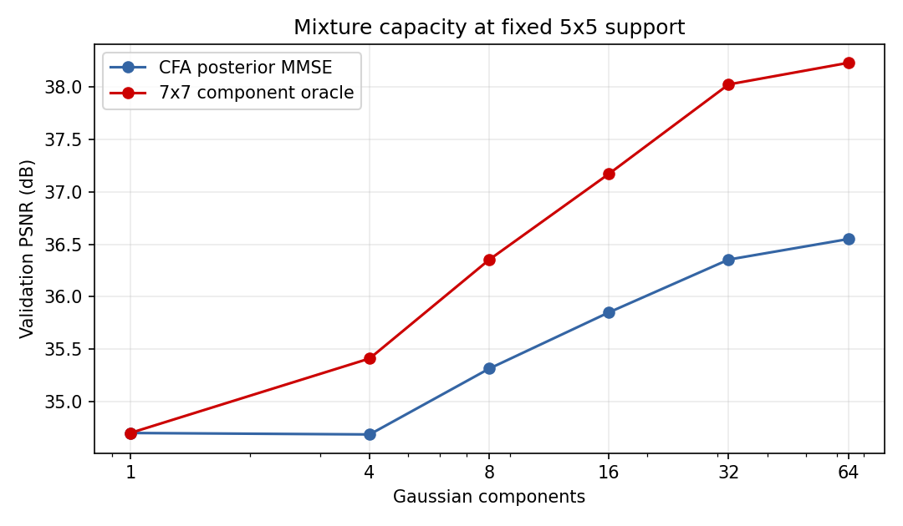
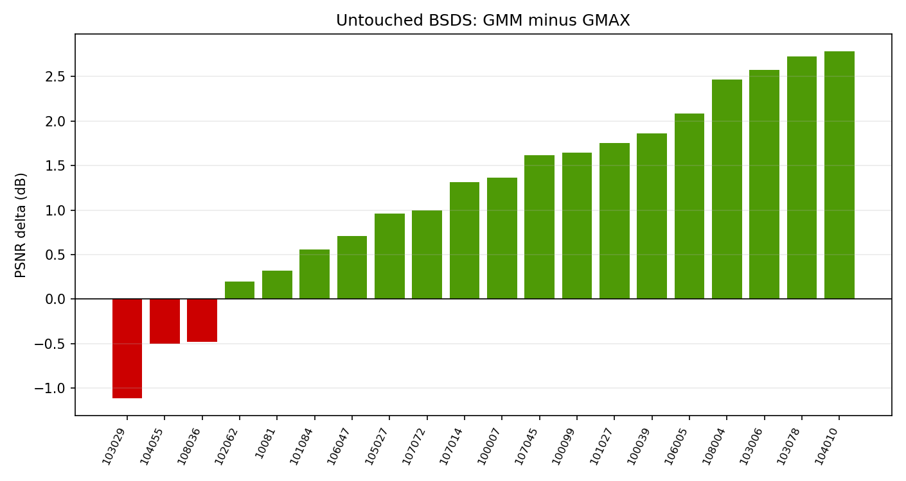
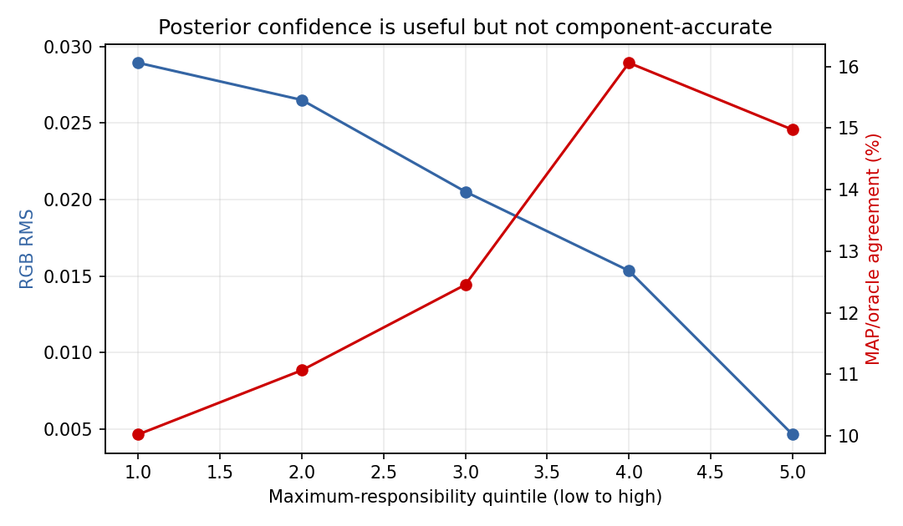
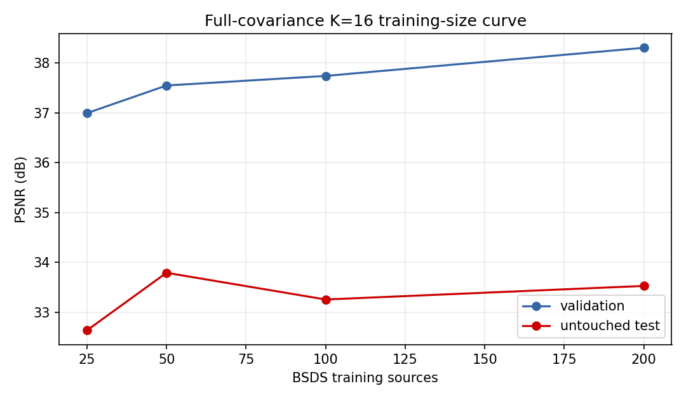
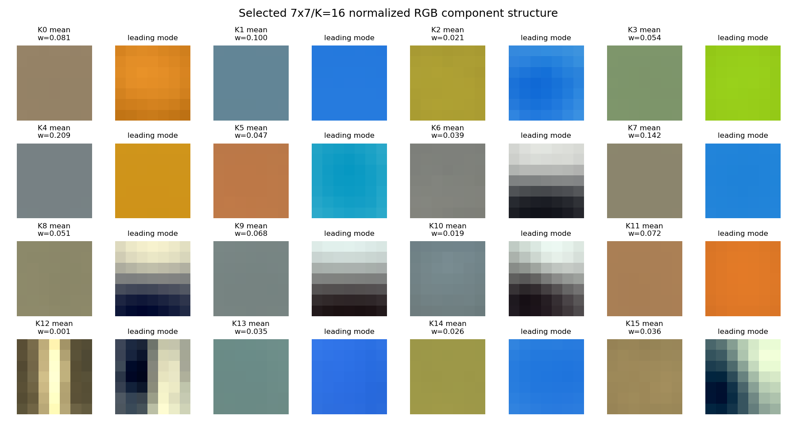
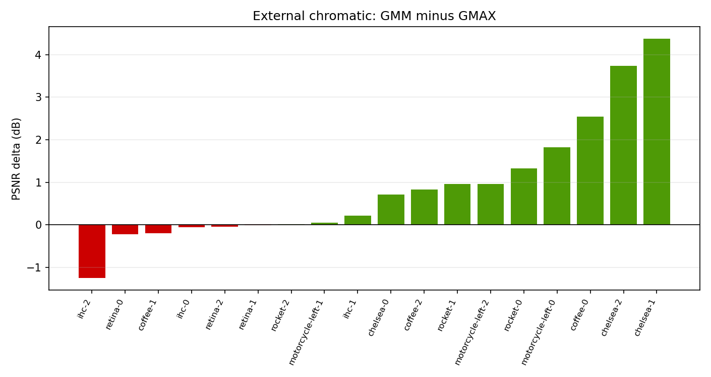
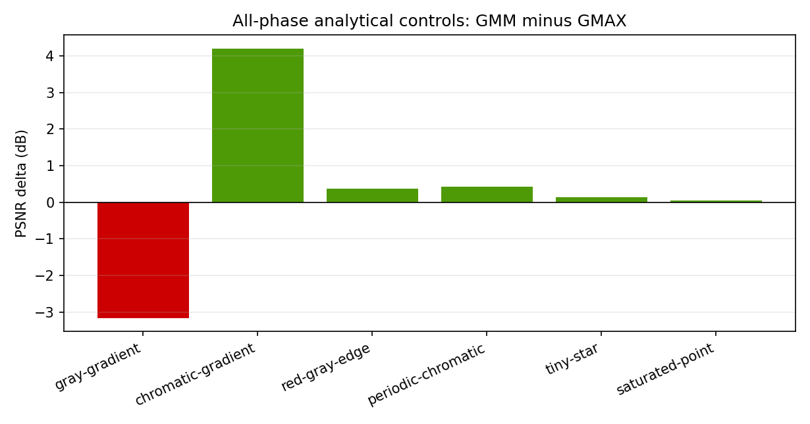

# X-Trans joint-color GMM conditional-MMSE feasibility report

## Decision

**PARTIAL — a learned population GMM is substantially stronger than global
LMMSE in-domain, but it does not pass the external/synthetic safety gate and
its training behavior is unstable. Do not implement EPLL or a production
demosaicer from this result.**

The experiment found the strongest population-statistical improvement since
the original X-Trans LMMSE study:

- the validation-selected 7x7, 16-component, full-covariance soft GMM reaches
  **33.531 dB** on untouched BSDS test coordinates;
- that is **+1.477 dB** over the equally trained GMAX LMMSE bank;
- it wins 17 of 20 test sources and lowers p99 absolute channel error by
  **18.2%**, from 0.122019 to 0.099805;
- it recovers **85.5%** of the validation K=1-to-7x7-component-oracle MSE
  headroom;
- soft posterior averaging beats hard observed-CFA MAP selection by 0.485 dB
  on validation and 0.210 dB on test;
- bright Hubble and Hydra targets both improve over GMAX.

The result is not safe enough to continue into EPLL or production:

- the worst external chromatic crop loses **1.256 dB** to GMAX;
- the all-phase gray-gradient control loses **3.165 dB**, although both errors
  remain very small in absolute terms (66.742 versus 69.907 dB);
- the 25/50/100/200-source test curve is non-monotonic;
- continuing EM improves training likelihood but lowers validation demosaic
  PSNR by 0.412 dB;
- full-RGB component MAP agrees with the reconstruction-error oracle only
  14.3% of the time, so the learned density components are not equivalent to
  demosaicing-optimal experts;
- the selected model is still below Markesteijn on bright Hubble and Hydra
  samples despite improving GMAX.

This is not a BM3D-scale hundredth-of-a-decibel negative result. The GMM adds
genuine nonlinear capacity and demonstrates that soft generative selection can
recover useful source-specific covariance structure. The unresolved problem
is generalization/stability, not lack of model capacity.

## Authenticated references and fidelity

### Sandeep and Jacob, 2019

The supplied reference is:

> Sandeep P. and Mathews Jacob, "Joint Color Space GMMs for CFA
> Demosaicking," IEEE Signal Processing Letters 26(2), 232-236, 2019.
> DOI `10.1109/LSP.2018.2886466`.

Local PDF:

- path: `/home/wilx/Downloads/LSP.2018.2886466.pdf`;
- size: 646,215 bytes;
- SHA-256:
  `4b83b2e0d1c6bc2e529c4f2c2ef065b44e2f7347f83c0163563287c4a1128b6b`;
- five pages, IEEE Signal Processing Letters 26(2), 232-236.

No author/reference source implementation was found. The paper states that
supplementary material is available, but it was not included with the supplied
PDF. No paper source was copied into RawTherapee.

The published method uses:

- a GMM over joint RGB patches;
- K=150 full-covariance Gaussian components;
- 6x6 patches;
- one million training patches from 495 Berkeley images;
- a hard component selected from observed CFA samples;
- the Gaussian conditional mean for the missing samples;
- stride-one overlapping patch estimates and averaging;
- image-adaptive GMM updates for five iterations on Kodak/LC and ten on IMAX.

The paper reports an unoptimized MATLAB time of 4.8 seconds per 10,000 pixels.

This experiment reproduces the local probabilistic core independently, but is
deliberately bounded:

| Detail | Published JCS-GMM | This X-Trans feasibility study |
|---|---|---|
| CFA | Bayer variants | actual 18-phase X-Trans observation matrices |
| Patch | 6x6 | 3x3, 5x5, 7x7 |
| Components | 150 | 1, 4, 8, 16, 32, 64 |
| Selection | hard observed-CFA MAP | hard MAP and soft posterior MMSE |
| Output | overlapping full patches | center RGB only |
| Adaptation | iterative image-specific EM | fixed population GMM only |
| Native samples | preserved | restored exactly at center |

The soft posterior is an intentional extension, not attributed to the paper.
Overlap aggregation and adaptive EM were deferred behind the local safety
gates.

### Zoran and Weiss, 2011

The EPLL reference is:

> Daniel Zoran and Yair Weiss, "From Learning Models of Natural Image Patches
> to Whole Image Restoration," ICCV 2011. DOI
> `10.1109/ICCV.2011.6126278`.

EPLL supplies the whole-image patch-prior framework considered in the prompt.
It was not implemented because the local GMM failed Gate E. This avoids
confounding local prior value with iterative overlap/global optimization.

Later papers explicitly refer to public Zoran-Weiss MATLAB EPLL code, but this
review did not locate an authoritative surviving original package with an
explicit license. Independently maintained FEPLL/GGMM-EPLL implementations
exist, but they are later methods rather than the 2011 reference. None was
downloaded, copied, or executed. The research implementation here uses
scikit-learn 1.7.2 under its BSD license; IEEE paper text and supplemental code
are not redistributed.

## Mathematical contract

For a normalized CHW RGB patch `x`, the learned prior is:

```text
p(x) = sum_k pi_k N(x; mu_k, Sigma_k).
```

For X-Trans phase `p`, physical observations are selected directly:

```text
y = M_p x.
```

No Bayer conversion or initial demosaic is used. For component `k`:

```text
S_kp = M_p Sigma_k M_p^T + tau^2 I

m_kp(y) = mu_k
          + Sigma_k M_p^T S_kp^-1 (y - M_p mu_k)

ell_k = log(pi_k)
        - 1/2 (y - M_p mu_k)^T S_kp^-1 (y - M_p mu_k)
        - 1/2 log|S_kp| + const.
```

The hard paper-like result uses:

```text
k_MAP = argmax_k ell_k.
```

The primary practical result uses:

```text
gamma_k(T) = softmax(ell_k / T)
x_hat = sum_k gamma_k(T) m_kp(y).
```

All likelihood calculations use Cholesky solves and log-sum-exp. No covariance
matrix is inverted in conditional inference. `tau` is a covariance/model-
mismatch floor, not a claim about sensor noise. The measured center CFA
component is restored exactly after MAP or MMSE inference.

## Observable DC formulations

Three validation-only controls were tested:

- `absolute`: learn absolute RGB values;
- `observed-scalar`: subtract the mean of all physically observed samples;
- `observed-rgb`: calculate local means independently from physically observed
  R, G, and B positions and subtract their common average.

The offset is added back after inference. No missing colors or initializer RGB
enter this calculation.

## Corpus and split discipline

The primary population uses the existing authenticated BSDS500 mirror at
revision `a04b7c6c3a9f0ace74bf205c72a43d32e1c72722`, under its
research/educational non-commercial terms.

- training: all 200 official training sources, 512 deterministic patches per
  source, **102,400 patches** per configuration;
- validation: 20 official validation sources, one deterministic dense 24x24
  center grid per source, **11,520 patches**;
- test: 20 official test sources with the same independent grid size,
  **11,520 patches**;
- vector order: contiguous CHW RGB;
- stored sRGB/JPEG sources are decoded to linear light before mosaicking;
- all selection uses training/validation only.

The external suite contains 18 frozen 12x12 grids from Chelsea, Coffee, IHC,
Motorcycle, Retina, and Rocket crops: 2,592 patches. Hubble and independent
NASA Hydra each contribute 576 uniform samples and 96 bright-target samples.
Synthetic controls run all 18 distinct X-Trans phase/orientation cells.

No external chromatic, star, synthetic, validation, or test patch enters EM
training.

Canonical tracked artifacts are:

| Artifact | Bytes | SHA-256 |
|---|---:|---|
| `dataset.json` | 76,868 | `2a081aeff49eb6baee1508d650961a1c9a83f146e03dd04eabfdc89ed5a09be3` |
| `results.json` | 1,467,552 | `2a1fd2c2ee2974c5760d68f107c480cb0e5312c894ab2b01f7103e219aeb654f` |
| `supplement.json` | 144,666 | `aac55ecb85f959cf51ecbe28f554a45a304202dc1217a6caf2756a1d74696452` |

`results.json` excludes wall-clock, cache-state, and native timing fields. The
fitted `.npz` models remain external under `/tmp/xtrans-gmm/models`.

## Gate A — K=1 parity

**PASS.**

The K=1 model mean and covariance exactly match an independently accumulated
same-support affine Gaussian model:

- maximum mean difference: 0;
- maximum covariance difference: 0;
- component weight: 1.

The focused unit test also compares center conditional estimates with a direct
independent `numpy.linalg.solve` formulation over all 18 X-Trans phases and
passes at absolute tolerance `2e-12`. Exact measured-center restoration passes
for all phases.

This validates CHW ordering, observation indices, phase selection, DC handling,
conditional means, and data consistency before interpreting K>1.

## Gate B — mixture capacity

**PASS.**

At fixed 5x5 support and `observed-rgb` DC:

| K | validation MAP | validation MMSE | oracle-7 |
|---:|---:|---:|---:|
| 1 | 34.703 | 34.703 | 34.703 |
| 4 | 34.668 | 34.689 | 35.412 |
| 8 | 35.227 | 35.316 | 36.353 |
| 16 | 35.454 | 35.851 | 37.171 |
| 32 | 35.908 | 36.354 | 38.021 |
| 64 | 35.881 | 36.549 | 38.227 |



Both practical posterior quality and the component oracle grow materially
beyond K=1. The selected 7x7/K=16 oracle-7 reaches 39.374 dB, **4.672 dB**
above the primary K=1 control. The 0.3 dB capacity gate passes easily.

## Support and DC selection

K=16 controls isolate patch support from the larger K curve:

| Support | DC | validation MAP | validation MMSE | oracle-7 |
|---:|---|---:|---:|---:|
| 3x3 | observed-rgb | 31.498 | 32.083 | 34.019 |
| 5x5 | observed-rgb | 35.454 | 35.851 | 37.171 |
| **7x7** | **observed-rgb** | **37.818** | **38.303** | 39.374 |
| 7x7 | absolute | 37.202 | 37.985 | **39.544** |
| 7x7 | observed-scalar | 37.468 | 38.151 | 39.459 |

Absolute RGB contains slightly greater oracle diversity, but its observed-CFA
posterior cannot exploit it as well. The validation winner is 7x7,
`observed-rgb`, K=16.

The selected mismatch floor and posterior temperature are:

```text
tau = 0.003
T   = 4
```

At fixed `tau=0.003`, validation MMSE rises from 38.108 dB at faithful `T=1`
to 38.303 dB at `T=4`. The softened posterior is less brittle than the raw
generative likelihood. Hard MAP remains 37.818 dB.

## EM behavior and model identity

The selected screen model has:

- 16 components;
- 147-dimensional patches;
- 176,415 independent full-covariance parameters;
- 102,400 training patches;
- effective component populations from 136 to 21,288;
- minimum component weight 0.001335;
- minimum covariance effective rank 133;
- maximum covariance condition number 1.38 million;
- 30 EM iterations, without formal convergence;
- artifact SHA-256
  `491c0d593934286b3fd517f2bfae03cd84964928499dab269992436775378997`.

Continuing that exact model for 70 more iterations raises average training
log likelihood from 499.117 to 501.106 but lowers selected validation PSNR:

```text
screen model:  38.303 dB
refined model: 37.890 dB
```

The refined artifact is therefore retained only as a diagnostic. Validation
conditional-MSE, not EM likelihood or convergence, selects the screen model.
This is evidence of prior/objective mismatch and/or mixture overfitting.

## Gate C — posterior usefulness

**PASS.**

The selected validation posterior reaches 38.303 dB against 39.374 dB for the
7x7 component oracle. Relative to the K=1 MSE, it recovers **85.5%** of the
available validation oracle headroom.

Soft posterior averaging consistently improves hard MAP:

| Dataset | hard MAP | posterior MMSE | Gain |
|---|---:|---:|---:|
| validation | 37.818 | **38.303** | +0.485 |
| BSDS test | 33.320 | **33.531** | +0.210 |
| external chromatic | 38.486 | **38.633** | +0.147 |

The soft mixture is therefore the headline GMM result.

## Held-out BSDS test

**Gate D PASS.**

All methods below are compared at the same 11,520 center coordinates and
34,560 RGB channel values:

| Method | PSNR | p95 abs | p99 abs | maximum abs |
|---|---:|---:|---:|---:|
| Markesteijn | 30.867 | 0.04913 | 0.13797 | 0.51151 |
| corrected-final MLRI | 30.985 | 0.04198 | 0.13480 | 0.46235 |
| GMAX LMMSE | 32.054 | 0.04732 | 0.12202 | **0.31732** |
| GMM hard MAP | 33.320 | 0.03974 | 0.10063 | 0.41668 |
| **GMM posterior MMSE** | **33.531** | **0.03848** | **0.09981** | 0.32034 |
| full-RGB component MAP diagnostic | 34.148 | 0.03688 | 0.09162 | 0.30704 |
| component oracle-7 | 35.107 | 0.03448 | 0.08333 | 0.22139 |
| component oracle-1 | 37.934 | 0.02110 | 0.05845 | 0.21458 |

The soft GMM gains **1.477 dB** over GMAX, substantially exceeding the 0.2 dB
population gate. It wins 17 of 20 sources; median source delta is about
+1.340 dB. The worst source loses 1.117 dB.

| Source | Markesteijn | corrected MLRI | GMAX | GMM MAP | GMM MMSE | oracle-7 | GMM-GMAX |
|---|---:|---:|---:|---:|---:|---:|---:|
| 100007.jpg | 37.242 | 36.753 | 36.642 | 37.881 | 38.005 | 39.778 | +1.363 |
| 100039.jpg | 23.786 | 35.352 | 28.701 | 30.354 | 30.566 | 31.548 | +1.864 |
| 100099.jpg | 47.273 | 45.370 | 46.549 | 48.149 | 48.198 | 48.439 | +1.649 |
| 10081.jpg | 31.332 | 28.046 | 31.064 | 31.323 | 31.387 | 33.138 | +0.323 |
| 101027.jpg | 49.663 | 50.017 | 47.297 | 49.020 | 49.048 | 50.769 | +1.751 |
| 101084.jpg | 22.131 | 31.540 | 26.986 | 26.847 | 27.545 | 28.565 | +0.559 |
| 102062.jpg | 34.151 | 37.818 | 39.044 | 38.996 | 39.238 | 40.599 | +0.194 |
| 103006.jpg | 49.841 | 48.987 | 51.461 | 53.944 | 54.036 | 55.121 | +2.575 |
| 103029.jpg | 60.897 | 60.254 | 60.149 | 58.927 | 59.032 | 63.623 | -1.117 |
| 103078.jpg | 40.367 | 36.910 | 42.159 | 43.648 | 44.889 | 45.303 | +2.730 |
| 104010.jpg | 39.469 | 34.785 | 37.324 | 40.139 | 40.108 | 40.541 | +2.784 |
| 104055.jpg | 44.695 | 41.679 | 42.754 | 41.628 | 42.255 | 43.363 | -0.499 |
| 105027.jpg | 33.907 | 31.698 | 34.453 | 35.479 | 35.416 | 36.274 | +0.962 |
| 106005.jpg | 53.272 | 51.726 | 52.169 | 53.987 | 54.254 | 55.278 | +2.085 |
| 106047.jpg | 54.066 | 51.790 | 53.640 | 54.221 | 54.349 | 54.687 | +0.709 |
| 107014.jpg | 37.314 | 30.575 | 35.013 | 35.710 | 36.330 | 38.646 | +1.317 |
| 107045.jpg | 42.800 | 39.702 | 44.909 | 46.121 | 46.526 | 47.242 | +1.617 |
| 107072.jpg | 36.104 | 41.832 | 38.853 | 40.194 | 39.852 | 42.075 | +0.998 |
| 108004.jpg | 26.857 | 20.941 | 22.303 | 24.854 | 24.767 | 26.878 | +2.464 |
| 108036.jpg | 28.166 | 25.925 | 30.412 | 29.570 | 29.929 | 31.559 | -0.483 |



## Generative selection and calibration

Component identities do not align cleanly with minimum reconstruction error:

| Diagnostic | Agreement |
|---|---:|
| observed-CFA MAP versus pixel reconstruction oracle | 12.92% |
| full-RGB MAP versus pixel reconstruction oracle | 14.29% |
| observed-CFA MAP versus full-RGB MAP | 67.13% |

Even access to complete RGB does not make the GMM density component a reliable
proxy for the component with smallest conditional center error. The component
bank has much more pixel-oracle capacity than either MAP rule can select.

Nevertheless posterior confidence predicts difficulty. Across increasing
maximum-responsibility quintiles, test RGB RMS falls monotonically:

```text
0.02893, 0.02650, 0.02052, 0.01535, 0.00467.
```

MAP/oracle agreement stays weak at roughly 10-16%. Confidence therefore says
"this patch is easy under the learned prior" better than it says "this is the
demosaicing-optimal expert."



The projected Gaussian components themselves are not completely collapsed by
X-Trans sampling. Across all 2,160 component-pair/phase combinations, the
Bhattacharyya distance has:

- minimum 1.059;
- p10 3.503;
- median 12.578;
- zero pairs below 1.

The practical limitation is therefore not simple equality of the projected
distributions. It is the mismatch between generative-density assignment and
conditional demosaicing error, plus off-distribution behavior.

## Full versus diagonal covariance

The required diagonal control is decisive:

| Model | Independent parameters | validation PSNR | test PSNR | p99 abs |
|---|---:|---:|---:|---:|
| diagonal K=16 | 4,719 | 23.779 | 22.347 | 0.32018 |
| full K=16 | 176,415 | **38.303** | **33.531** | **0.09981** |

The diagonal model selected the largest tested floor (`tau=0.01`) and softest
temperature (`T=4`) and still failed badly. Joint spatial/chromatic covariance
is responsible for the useful result; mixture means and marginal variances are
not sufficient.

## Training-size curve

| Training sources | validation PSNR | untouched test PSNR | EM convergence |
|---:|---:|---:|---|
| 25 | 36.993 | 32.641 | yes, 17 iterations |
| 50 | 37.547 | **33.794** | no, 30 iterations |
| 100 | 37.739 | 33.259 | no, 30 iterations |
| 200 | **38.303** | 33.531 | no, 30 iterations |



Validation improves monotonically, but test does not: 50 sources outperform
200 on the frozen test coordinates. This is unlike the much smoother global
LMMSE covariance curve. It indicates sensitivity to EM initialization/local
optima, finite iteration budget, and/or overfitting of mixture components.
More training images alone cannot be claimed to solve the problem.

## Component interpretation

The selected means and leading covariance eigenvectors show several broad
populations and a smaller explicit edge-like component. Component K12 has only
about 0.13% weight and strong vertical structure; other leading modes include
horizontal, diagonal, color, and broad low-frequency variation.



These visual labels are research interpretation only. Inference uses no manual
semantic name.

## External chromatic controls

Pooled over all 7,776 RGB channel values:

```text
GMAX:     37.237 dB
GMM MMSE: 38.633 dB  (+1.397 dB)
oracle-7: 39.889 dB
```

The GMM wins 12 of 18 crops, but the distribution has a meaningful negative
tail:

| Crop | GMAX | GMM MMSE | oracle-7 | Delta |
|---|---:|---:|---:|---:|
| chelsea-0 | 39.070 | 39.775 | 40.292 | +0.705 |
| chelsea-1 | 37.719 | 42.097 | 42.553 | +4.378 |
| chelsea-2 | 37.764 | 41.498 | 42.027 | +3.734 |
| coffee-0 | 29.655 | 32.198 | 34.054 | +2.543 |
| coffee-1 | 44.836 | 44.640 | 45.624 | -0.195 |
| coffee-2 | 42.049 | 42.872 | 43.247 | +0.824 |
| ihc-0 | 34.669 | 34.612 | 35.863 | -0.058 |
| ihc-1 | 45.797 | 46.007 | 47.433 | +0.209 |
| **ihc-2** | **40.767** | **39.511** | 41.695 | **-1.256** |
| motorcycle-left-0 | 43.299 | 45.121 | 45.763 | +1.822 |
| motorcycle-left-1 | 50.942 | 50.991 | 52.066 | +0.049 |
| motorcycle-left-2 | 35.562 | 36.520 | 38.258 | +0.958 |
| retina-0 | 49.189 | 48.964 | 50.422 | -0.226 |
| retina-1 | 46.559 | 46.550 | 48.547 | -0.009 |
| retina-2 | 51.027 | 50.976 | 52.583 | -0.051 |
| rocket-0 | 56.243 | 57.574 | 57.931 | +1.331 |
| rocket-1 | 30.297 | 31.251 | 32.151 | +0.954 |
| rocket-2 | 66.232 | 66.248 | 68.121 | +0.016 |



Mean full-RGB log evidence cannot diagnose this domain mismatch. External
chromatic patches have mean log evidence 483.55 versus 481.54 on BSDS test,
despite the IHC regression. Hubble bright targets have extremely low mean
evidence (3.83), while Hydra bright targets remain high (488.33). There is no
single useful likelihood threshold across these domains.

## Hubble and Hydra

Uniform and bright-target samples are reported separately:

| Group | Markesteijn | corrected MLRI | GMAX | GMM MAP | GMM MMSE | oracle-1 |
|---|---:|---:|---:|---:|---:|---:|
| Hubble uniform | 35.164 | 33.975 | 33.950 | **35.476** | 35.243 | 37.099 |
| Hubble bright | **17.645** | 15.959 | 15.435 | 16.083 | 16.048 | 21.593 |
| Hydra uniform | **79.628** | 77.944 | 76.078 | 76.292 | 76.292 | 80.188 |
| Hydra bright | **39.177** | 27.411 | 32.784 | 35.577 | **35.655** | 39.408 |

The soft GMM improves bright Hubble by 0.614 dB and bright Hydra by 2.871 dB
over GMAX, so the MIX3 tiny-star pathology is not repeated relative to the
statistical baseline. It still remains 1.596 dB below Markesteijn on bright
Hubble and 3.521 dB below Markesteijn on bright Hydra. Sparse stars therefore
do not block the GMM-vs-GMAX gate, but neither do they justify replacing
Markesteijn.

The one-pixel component oracle remains much better: +5.545 dB on Hubble bright
and +3.753 dB on Hydra bright relative to practical soft inference. Useful
star-like conditional predictions exist, but the posterior does not fully
identify them.

## Analytical controls and 18-phase stability

Every scene is evaluated at all 18 distinct X-Trans phase/orientation cells:

| Scene | GMAX | GMM MMSE | Delta | GMM phase PSNR range |
|---|---:|---:|---:|---:|
| gray gradient | **69.907** | 66.742 | **-3.165** | 18.366 |
| chromatic gradient | 59.401 | **63.606** | +4.206 | 16.147 |
| red/gray edge | 19.537 | **19.909** | +0.373 | 8.270 |
| periodic chromatic | 16.175 | **16.602** | +0.427 | 10.843 |
| tiny star | 8.539 | **8.677** | +0.139 | 12.102 |
| saturated point | 3.807 | **3.848** | +0.041 | 4.246 |



The GMM fixes MIX3's smooth chromatic-gradient and tiny-star regressions
relative to GMAX. It introduces a gray-gradient PSNR regression greater than
the frozen 2 dB allowance. The absolute normalized RMS remains small:

```text
GMAX gray-gradient RMS: 0.000320
GMM  gray-gradient RMS: 0.000460
```

This is not a visible catastrophic error, but it is phase-sensitive and fails
the predeclared gate. High-frequency points remain fundamentally difficult for
both population methods; the GMM gives only small gains and cannot recover
null-space information.

## Gate E and EPLL decision

The frozen safety rules require:

- no external chromatic crop worse than GMAX by more than 0.5 dB;
- no bright Hubble/Hydra group worse than GMAX by more than 0.2 dB;
- no analytical control worse than GMAX by more than 2 dB.

Results:

| Safety dimension | Worst delta | Rule | Result |
|---|---:|---:|---|
| external chromatic | -1.256 dB | >= -0.5 dB | **fail** |
| bright stars | +0.614 dB | >= -0.2 dB | pass |
| analytical controls | -3.165 dB | >= -2.0 dB | **fail** |

Gate E fails. EPLL, dense overlapping reconstruction, iterative GMM
adaptation, and a C++ implementation are not triggered. Implementing a global
optimizer around an off-distribution-unsafe and training-unstable local prior
would add complexity without resolving the identified failure.

## Complexity

The selected patch has 49 physically observed scalar values. Per component,
likelihood evaluation requires a triangular solve in the 49-dimensional
observed space; center reconstruction then applies a precomputed 3x49 gain.
At K=16 the rough center-pixel work is:

```text
likelihood solves: approximately 16 * 49^2 = 38,416 scalar multiply-add scale
center means:       approximately 16 * 3 * 49 = 2,352
```

This excludes exponentials/log-sum-exp and responsibility accumulation. It is
orders of magnitude above the approximately 242-MAC/pixel GMAX bank. The
176,415 float64 parameters occupy about 1.41 MiB before implementation
overheads (about 0.71 MiB as float32). Runtime optimization was not attempted
because Gate E failed.

The selective native test-runner mode was added because the original helper
unconditionally ran four unrelated ULRI variants before the two references
needed here. On the 3000x3000 Hydra source, corrected-final MLRI took 573.9
seconds while Markesteijn took 1.76 seconds in the single-threaded research
runner. Those are reference-generation timings, not GMM runtime measurements.

## Required questions answered

### Gaussian-mixture capacity

There is substantial conditional reconstruction capacity beyond one Gaussian:
4.672 dB validation oracle-7 headroom relative to K=1, and 5x5 oracle quality
continues improving through K=64. Capacity is not the bottleneck.

### Bayesian selection

Observed-CFA posterior MMSE is useful and materially beats GMAX. Soft averaging
beats hard MAP. It recovers 85.5% of validation oracle headroom, but only part
of test/star oracle headroom.

### Calibration

Maximum responsibility and entropy predict actual patch difficulty. They do
not identify the reconstruction-optimal component reliably; confidently easy
and correctly selected are different concepts here.

### Global LMMSE comparison

The GMM materially beats GMAX by 1.477 dB on untouched BSDS and 1.397 dB
pooled external chromatic crops. This is a real nonlinear gain, not a marginal
variation.

### Domain sensitivity

The pooled external result improves, but one IHC crop loses 1.256 dB and five
other crops lose smaller amounts. Full-RGB likelihood does not diagnose the
regression. Domain mismatch is reduced on average, not solved safely.

### Sparse points

Bright Hubble and Hydra both improve over GMAX, and the tiny-star synthetic is
slightly better. Markesteijn remains substantially better on bright stars.

### Smooth structure

The GMM improves the chromatic gradient by 4.206 dB but loses 3.165 dB on a
gray gradient at an otherwise extremely high PSNR. It does not uniformly
retain GMAX's smooth-structure behavior.

### Phase

All 18 phases are finite and deterministic, but phase PSNR ranges remain large
for several controls. Soft mixing is not phase-invariant.

### Complexity

K=16 and 7x7 support are needed for the selected result. The model is roughly
two orders of magnitude more expensive per center than GMAX before any
whole-image overlap or EPLL iteration.

### EPLL

There is enough local prior value to make EPLL scientifically interesting, but
the predeclared safety and stability gates explicitly prohibit it. EPLL is not
implemented in this experiment.

## Final conclusion

The central question was:

> Can a soft Bayesian mixture of learned joint RGB covariance models capture
> the source-specific statistical headroom of LMMSE without the brittle
> explicit content selection that defeated MIX3?

The answer is:

> **Partly.** Soft generative responsibilities recover a large in-domain gain
> and avoid MIX3's known chromatic-gradient/tiny-star failures relative to
> GMAX. The result still has source-level external regressions, non-monotonic
> training behavior, imperfect phase stability, and generative components
> whose density labels do not align with reconstruction-optimal experts.

The population GMM route is not exhausted mathematically, but this specific
fixed BSDS-trained local model is not a safe RawTherapee demosaicer. Do not
implement EPLL, dense overlap, image-adaptive EM, C++, PP3, or GUI integration
from this result. A future continuation would first need a more stable and
better-domain-matched prior with an independently demonstrated safety gain—not
another selector layered on this model.
