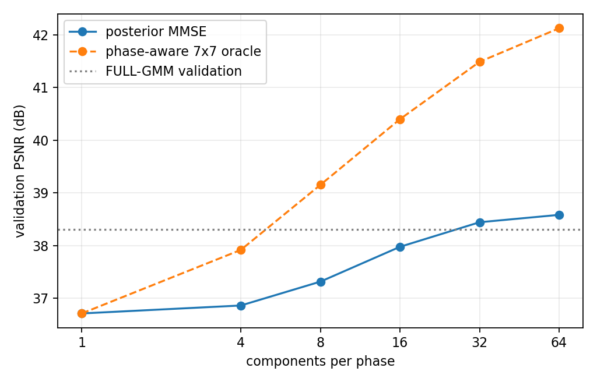
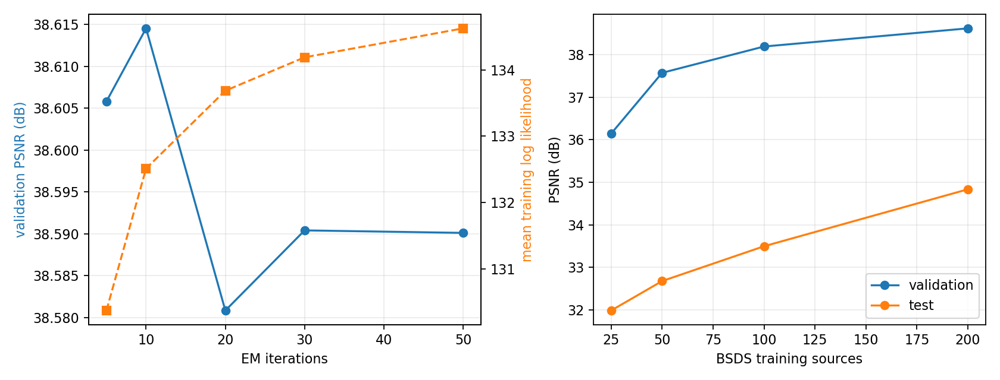
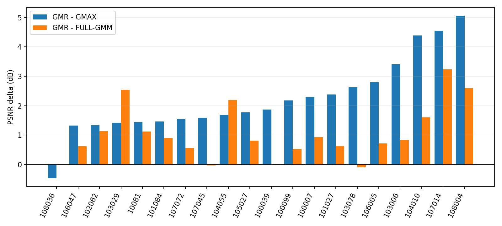
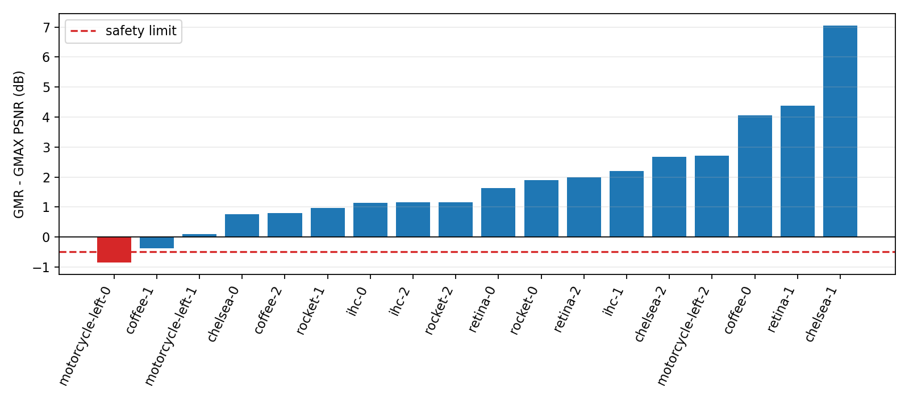

# X-Trans phase-conditioned Gaussian-mixture regression report

## Decision

**PARTIAL — safety stabilization incomplete.**

Replacing the 147-dimensional full-RGB patch GMM with 18 phase-specific
51-dimensional Gaussian-mixture regressors is a substantial improvement, not
a negative result:

- selected task GMR reaches **34.835 dB** on untouched BSDS test coordinates;
- this is **+2.781 dB over GMAX** and **+1.304 dB over FULL-GMM**;
- it wins 19/20 BSDS sources over GMAX and 18/20 over FULL-GMM;
- p99 absolute error falls 30.6% from GMAX and 15.2% from FULL-GMM;
- the old FULL-GMM IHC-2 failure changes from -1.256 dB to **+1.150 dB**
  relative to GMAX;
- the gray-gradient control changes from -3.165 dB to **+3.022 dB** relative
  to GMAX;
- bright Hubble and Hydra targets both remain above GMAX;
- K=32 seed spread is only 0.025 dB;
- training-source quality increases monotonically from 25 through 200
  sources;
- continuing EM from 10 through 50 iterations raises likelihood while
  changing validation PSNR by only 0.024 dB, rather than FULL-GMM's 0.412 dB
  reversal.

It does not pass the frozen safety gate:

- `motorcycle-left-0` loses **0.853 dB** to GMAX, beyond the allowed 0.5 dB;
- covariance shrinkage does not improve validation and therefore cannot repair
  that failure without an externally selected fallback;
- the bright Hubble gain over GMAX is only 0.127 dB, below FULL-GMM's 0.614 dB
  gain;
- phase-conditioned training does not reduce the all-phase PSNR spread on
  several analytical scenes;
- mixture-component identity is even less aligned with reconstruction-optimal
  experts than in FULL-GMM.

Therefore do not implement EPLL, a production C++ method, or a discriminative
selector from this result. The task-focused model demonstrates that most of
FULL-GMM's instability came from modeling irrelevant full-patch variables,
but the Gaussian-mixture generative decomposition still does not provide a
safe, interpretable expert selection mechanism.

## Scope and frozen parent

This study reuses, unchanged:

- the 200/validation/test BSDS source split;
- the 102,400 deterministic training patches;
- the 20-source 24x24 validation and test grids;
- the six-source, 18-crop external chromatic suite;
- authenticated Hubble and independent NASA Hydra sources;
- the six all-phase analytical controls;
- GMAX, Markesteijn, corrected-final MLRI, and FULL-GMM results.

The frozen FULL-GMM comparison is:

```text
patch       = 7x7 RGB, 147 dimensions
components  = 16
covariance  = full
DC          = observed-rgb
tau         = 0.003
temperature = 4
```

Parent artifacts remain byte-identical:

| Artifact | SHA-256 |
|---|---|
| `xtrans-gmm/dataset.json` | `2a081aeff49eb6baee1508d650961a1c9a83f146e03dd04eabfdc89ed5a09be3` |
| `xtrans-gmm/results.json` | `2a1fd2c2ee2974c5760d68f107c480cb0e5312c894ab2b01f7103e219aeb654f` |

The phase-GMR result artifact is:

| Artifact | Bytes | SHA-256 |
|---|---:|---|
| `xtrans-gmr/results.json` | 560,075 | `4e4f62c9b570d486d703d068e0a0b96a11c3da2373c4fbf92f92dcbd7abb31e4` |

Fitted `.npz` models and the decoded patch matrix remain external under
`/tmp/xtrans-gmr`.

## Statistical contract

For each of the 18 distinct X-Trans translation phases, the model contains
only:

```text
y_p = 49 physically observed scalar samples in a 7x7 patch
t_p = two missing center RGB channels
z_p = [y_p, t_p] in R^51
```

The target-channel order is fixed:

| Measured center | Target vector |
|---|---|
| R | `[G,B]` |
| G | `[R,B]` |
| B | `[R,G]` |

Each phase learns independently:

```text
p_p(y,t) = sum_k pi_pk N([y,t]; mu_pk, Sigma_pk).
```

For component `k`:

```text
S_k = Sigma_yy,k + tau^2 I

m_k(y) = mu_t,k
         + Sigma_ty,k S_k^-1 (y - mu_y,k)

ell_k = log(pi_k)
        - 1/2 (y - mu_y,k)^T S_k^-1 (y - mu_y,k)
        - 1/2 log|S_k|

gamma_k(T) = softmax(ell_k / T)

t_hat = sum_k gamma_k(T) m_k(y).
```

All solves use Cholesky factors; conditional inference does not explicitly
invert covariances. A common observable DC is calculated from phase-specific
physically observed R/G/B means and restored after inference. The measured
center CFA component is restored bit-exactly after posterior averaging.

There is no initial demosaic, content classifier, target-RGB leakage, EPLL,
overlap averaging, or image-adaptive EM.

## Implementation correction during the experiment

Two research-harness issues were found and corrected before freezing results.

First, posterior averaging perturbed the measured CFA channel by one ULP even
though responsibilities summed to one. The implementation now explicitly
restores that physical sample after averaging.

Second, an initial block-oracle implementation smoothed component-number
errors across neighboring pixels from different phase models. Component 17 in
phase A has no shared identity with component 17 in phase B. The corrected
block oracle aggregates only pixels belonging to the same phase population.
This correction changes oracle diagnostics and Gate B, but not practical GMR
output.

EM checkpoints 20 to 30 and 30 to 50 continue one saved trajectory. Precision
initialization uses Cholesky solves and explicit symmetry restoration, avoiding
rounding-induced rejection of otherwise SPD precision matrices.

## Gate A — K=1 parity

**PASS.**

For every phase, an independent same-support affine Gaussian accumulated from
the same `(y,t)` samples agrees with fitted K=1:

| Check | Maximum absolute difference |
|---|---:|
| Mean | `1.17e-15` |
| Covariance | `2.08e-17` |

Focused tests independently compare conditional prediction with a direct
linear solve, cover all 18 phases and all three center-color target orderings,
and require exact center-sample restoration.

## Component capacity and selection

All configurations use 7x7 support and observable-RGB DC. The table reports
each model's independently validation-selected `tau` and temperature. All
selected nonlinear models use `tau=0.0003`, `T=4`.

| K per phase | Posterior MMSE | Phase-aware oracle-7 | Minimum occupancy | Max condition |
|---:|---:|---:|---:|---:|
| 1 | 36.710 | 36.710 | 102,400 | 2.46e5 |
| 4 | 36.861 | 37.916 | 16,310 | 3.77e5 |
| 8 | 37.314 | 39.151 | 3,699 | 5.65e5 |
| 16 | 37.975 | 40.397 | 15 | 7.85e5 |
| 32 | 38.441 | 41.485 | 23 | 1.35e6 |
| 64 | 38.581 | 42.122 | 10 | 1.44e6 |



For the final K=64 model at its selected 10-iteration checkpoint:

- validation K=1: 36.710 dB;
- practical posterior: 38.615 dB, **+1.905 dB**;
- pixel component oracle: 49.009 dB, **+12.300 dB**;
- phase-aware 7x7 oracle: 42.216 dB, **+5.506 dB**.

Gate B passes. The component bank contains very large conditional capacity and
the soft posterior converts a meaningful part of it into practical quality.

## Selected configuration

Validation selects:

```text
patch                    7x7
phase models             18
components per phase     64
joint dimension          51
DC                        observed-rgb
covariance floor          1e-6
tau                       0.0003
posterior temperature     4
EM checkpoint             10 iterations
global shrinkage          none
```

Logical model SHA-256:

`6e8b90300dd0cdb729fd0aaaa8dbb1d37496b9a5127f793b11061a1046f53137`

The model has 1,587,438 scalar parameters. Across all phases/components its
minimum, median, and maximum effective populations are 10, 786, and 16,902.
The maximum covariance condition number is 1.34e6 and minimum effective rank
is 50/51.

## Training stability

### Seed stability

| K | Seed | Validation PSNR | Mean train likelihood | Minimum occupancy |
|---:|---:|---:|---:|---:|
| 16 | 1481067858 | 37.975 | 129.623 | 15 |
| 16 | 1481067859 | 37.923 | 129.508 | 10 |
| 16 | 1481067860 | 38.039 | 129.582 | 11 |
| 32 | 1481067858 | 38.441 | 131.866 | 23 |
| 32 | 1481067859 | 38.463 | 131.806 | 7 |
| 32 | 1481067860 | 38.438 | 131.873 | 11 |

Validation spreads are 0.116 dB at K=16 and **0.025 dB at K=32**. This is
substantially more stable than FULL-GMM's training-size/continuation behavior.

### EM checkpoints

| Iterations | Mean train likelihood | Validation PSNR | p99 abs |
|---:|---:|---:|---:|
| 5 | 130.370 | 38.606 | 0.051342 |
| **10** | **132.513** | **38.615** | 0.051780 |
| 20 | 133.687 | 38.581 | 0.051811 |
| 30 | 134.191 | 38.590 | 0.051770 |
| 50 | 134.627 | 38.590 | 0.051747 |

Likelihood rises continuously, but the maximum later PSNR reversal is only
0.024 dB. The objectives do not become perfectly aligned, but the destructive
0.412 dB FULL-GMM reversal is gone. Validation selects iteration 10.

### Training-source curve

| Sources | Validation | Frozen test | Minimum occupancy | Minimum rank |
|---:|---:|---:|---:|---:|
| 25 | 36.142 | 31.988 | 1 | 1 |
| 50 | 37.570 | 32.680 | 1 | 7 |
| 100 | 38.188 | 33.497 | 8 | 50 |
| 200 | 38.615 | 34.835 | 10 | 50 |

Both validation and untouched test quality improve monotonically with source
count. The previous anomaly in which a 50-source FULL-GMM beat its 200-source
counterpart does not recur.



Gate F passes: the task-focused model is materially more reproducible across
seeds, source counts, and EM depth.

## Untouched BSDS result

| Method | PSNR | p95 abs | p99 abs | Maximum abs |
|---|---:|---:|---:|---:|
| Markesteijn | 30.867 | 0.049135 | 0.137975 | 0.511515 |
| corrected-final MLRI | 30.985 | 0.041977 | 0.134802 | 0.462349 |
| GMAX | 32.054 | 0.047324 | 0.122019 | 0.317318 |
| FULL-GMM | 33.531 | 0.038476 | 0.099805 | 0.320341 |
| **phase GMR** | **34.835** | **0.033919** | **0.084625** | **0.251198** |

Relative to FULL-GMM, GMR lowers p95 by 11.8% and p99 by 15.2%. Relative to
GMAX, p99 falls 30.6%.

| Source | GMAX | FULL-GMM | GMR | GMR-GMAX | GMR-FULL |
|---|---:|---:|---:|---:|---:|
| 100007 | 36.642 | 38.005 | 38.935 | +2.293 | +0.930 |
| 100039 | 28.701 | 30.566 | 30.572 | +1.871 | +0.006 |
| 100099 | 46.549 | 48.198 | 48.724 | +2.175 | +0.526 |
| 10081 | 31.064 | 31.387 | 32.508 | +1.444 | +1.121 |
| 101027 | 47.297 | 49.048 | 49.682 | +2.385 | +0.634 |
| 101084 | 26.986 | 27.545 | 28.444 | +1.458 | +0.899 |
| 102062 | 39.044 | 39.238 | 40.373 | +1.330 | +1.135 |
| 103006 | 51.461 | 54.036 | 54.865 | +3.403 | +0.828 |
| 103029 | 60.149 | 59.032 | 61.573 | +1.424 | +2.541 |
| 103078 | 42.159 | 44.889 | 44.786 | +2.627 | -0.103 |
| 104010 | 37.324 | 40.108 | 41.713 | +4.388 | +1.605 |
| 104055 | 42.754 | 42.255 | 44.441 | +1.686 | +2.186 |
| 105027 | 34.453 | 35.416 | 36.222 | +1.769 | +0.806 |
| 106005 | 52.169 | 54.254 | 54.969 | +2.800 | +0.715 |
| 106047 | 53.640 | 54.349 | 54.964 | +1.323 | +0.615 |
| 107014 | 35.013 | 36.330 | 39.565 | +4.552 | +3.235 |
| 107045 | 44.909 | 46.526 | 46.496 | +1.587 | -0.031 |
| 107072 | 38.853 | 39.852 | 40.401 | +1.548 | +0.550 |
| 108004 | 22.303 | 24.767 | 27.366 | +5.063 | +2.598 |
| 108036 | 30.412 | 29.929 | 29.942 | -0.470 | +0.013 |



Gate C and Gate D pass. The population gain is large and GMR is materially
better than FULL-GMM, not merely within its 0.2 dB allowance.

## Covariance shrinkage

| Policy | Validation PSNR |
|---|---:|
| none | **38.615** |
| occupancy kappa=64 | 38.593 |
| uniform 0.05 | 38.547 |
| uniform 0.10 | 38.464 |
| occupancy kappa=256 | 38.436 |
| uniform 0.20 | 38.319 |
| uniform 0.40 | 38.089 |
| occupancy kappa=1024 | 38.009 |

Every tested backoff loses validation quality. Small occupancy shrinkage is
close, but validation gives no principled reason to select it. The final model
therefore uses no shrinkage; no external result is allowed to alter that
choice.

## External chromatic safety

Pooled external PSNR is 39.400 dB, versus 37.237 for GMAX and 38.633 for
FULL-GMM. Aggregate generalization is excellent, but the frozen rule applies
per crop.

| Crop | GMAX | FULL-GMM | GMR | GMR-GMAX |
|---|---:|---:|---:|---:|
| chelsea-0 | 39.070 | 39.775 | 39.832 | +0.762 |
| chelsea-1 | 37.719 | 42.097 | 44.772 | +7.053 |
| chelsea-2 | 37.764 | 41.498 | 40.444 | +2.679 |
| coffee-0 | 29.655 | 32.198 | 33.715 | +4.060 |
| coffee-1 | 44.836 | 44.640 | 44.453 | -0.383 |
| coffee-2 | 42.049 | 42.872 | 42.844 | +0.795 |
| ihc-0 | 34.669 | 34.612 | 35.815 | +1.145 |
| ihc-1 | 45.797 | 46.007 | 47.990 | +2.193 |
| **ihc-2** | **40.767** | **39.511** | **41.917** | **+1.150** |
| **motorcycle-left-0** | **43.299** | **45.121** | **42.446** | **-0.853** |
| motorcycle-left-1 | 50.942 | 50.991 | 51.044 | +0.102 |
| motorcycle-left-2 | 35.562 | 36.520 | 38.268 | +2.706 |
| retina-0 | 49.189 | 48.964 | 50.825 | +1.636 |
| retina-1 | 46.559 | 46.550 | 50.947 | +4.388 |
| retina-2 | 51.027 | 50.976 | 53.024 | +1.996 |
| rocket-0 | 56.243 | 57.574 | 58.140 | +1.897 |
| rocket-1 | 30.297 | 31.251 | 31.266 | +0.970 |
| rocket-2 | 66.232 | 66.248 | 67.385 | +1.152 |



Task reduction completely fixes the previous IHC-2 failure. It does not
eliminate domain-tail risk; `motorcycle-left-0` introduces a different and
larger-than-allowed regression. Gate E therefore fails.

## Hubble and Hydra

| Group | Markesteijn | MLRI | GMAX | FULL-GMM | GMR |
|---|---:|---:|---:|---:|---:|
| Hubble uniform | 35.164 | 33.975 | 33.950 | 35.243 | 34.236 |
| Hubble bright | 17.645 | 15.959 | 15.435 | 16.048 | 15.561 |
| Hydra uniform | 79.628 | 77.944 | 76.078 | 76.292 | 79.009 |
| Hydra bright | 39.177 | 27.411 | 32.784 | 35.655 | 38.203 |

Both bright-target groups remain above GMAX:

- Hubble: +0.127 dB;
- Hydra: +5.419 dB.

Hydra improves dramatically and approaches Markesteijn. Hubble retains only a
small fraction of FULL-GMM's gain and remains well below Markesteijn. Thus the
formal bright-star safety condition passes, but preservation of the prior
Hubble benefit is only partial.

## Analytical controls and phase behavior

| Scene | GMAX | FULL-GMM | GMR | GMR-GMAX | GMAX phase range | FULL range | GMR range |
|---|---:|---:|---:|---:|---:|---:|---:|
| gray gradient | 69.907 | 66.742 | 72.928 | +3.022 | 14.517 | 18.366 | 20.951 |
| chromatic gradient | 59.401 | 63.606 | 63.705 | +4.304 | 16.110 | 16.147 | 25.660 |
| red/gray edge | 19.537 | 19.909 | 23.013 | +3.477 | 6.338 | 8.270 | 16.297 |
| periodic chromatic | 16.175 | 16.602 | 18.473 | +2.298 | 29.420 | 10.843 | 24.895 |
| tiny star | 8.539 | 8.677 | 8.340 | -0.198 | 8.297 | 12.102 | 14.070 |
| saturated point | 3.807 | 3.848 | 3.861 | +0.054 | 4.518 | 4.246 | 6.206 |

All aggregate regressions remain within the frozen 2 dB allowance; the worst
is -0.198 dB on the tiny star. The original gray-gradient failure is more than
repaired, and chromatic gradients retain the nonlinear gain.

However H5 is not supported. Phase-conditioned training does not imply phase
invariance, and the PSNR range grows on gray/chromatic gradients, edges, tiny
stars, and saturated points. Some of these ranges are amplified by extremely
small absolute errors and single-center scoring, but the direction is not an
improvement and must not be described as one.

## Component alignment and conditional risk

On validation:

| Diagnostic | Agreement/correlation |
|---|---:|
| Joint-density MAP vs reconstruction oracle | 4.09% |
| Observed MAP vs reconstruction oracle | 3.72% |
| Observed MAP vs joint-density MAP | 93.72% |
| Conditional-risk Spearman correlation with component error | 0.076 |

On test, joint-MAP/oracle agreement is 4.84%, observed-MAP/oracle is 4.31%,
and risk correlation falls to 0.044.

FULL-GMM's full-RGB MAP agreed with its reconstruction oracle 14.3% of the
time. Task reduction therefore does **not** make maximum-density component
identity more demosaicing-optimal. It makes observed and joint classification
agree very strongly, but both choose components unrelated to the minimum-error
expert.

The practical gain comes from softened posterior averaging (`T=4`), not hard
expert identification. Conditional covariance trace is uncalibrated, so the
optional risk-weighted posterior is not justified and was not selected.

This is a central scientific result: removing nuisance dimensions improves
conditional estimation and stability, but it does not solve the generative
component-alignment problem.

## Complexity

The selected model contains:

- 18 phase models;
- 64 components per phase;
- 1,587,438 scalar parameters;
- 1,527,552 unique covariance values, about 5.83 MiB at float32 before means,
  weights, Cholesky factors, gains, and alignment;
- 64 posterior exponentials per output pixel.

A straightforward dense implementation requires approximately 163,072 MACs
per pixel for 49-dimensional likelihoods and two-channel conditional means,
about **674 times** the established 242-MAC/pixel GMAX estimate. This is an
order estimate, not optimized C++ timing.

A local single-threaded NumPy/SciPy batch diagnostic over 11,520 patches gave:

```text
cache preparation       0.104 s
median inference        0.543 s
per target              47.2 us
```

This diagnostic excludes whole-image patch extraction and is not a production
benchmark. Linear extrapolation to 40 MP would be roughly 31 minutes on one
thread. SIMD, blocking, reduced precision, and parallelism could improve that,
but the method is intrinsically much more expensive than GMAX and should not
be optimized before the safety problem is solved.

## Tests and reproducibility

The focused suite covers:

- all 18 phase contracts and canonical target ordering;
- 49-observation plus two-target training matrices;
- independent K=1 affine conditional parity;
- exact measured-center restoration after posterior averaging;
- normalized finite responsibilities;
- deterministic full-model EM;
- saved-checkpoint EM continuation;
- uniform and occupancy-dependent covariance shrinkage;
- rejection of invalid posterior/shrinkage controls;
- phase-aware block-oracle component identity.

The canonical result excludes wall-clock, host, cache-state, and model-path
fields. Generated model parameters remain external.

## Gate summary

| Gate | Result | Evidence |
|---|---|---|
| A — K=1 parity | PASS | means/covariances agree to 1.2e-15 / 2.1e-17 |
| B — mixture capacity | PASS | oracle-1 +12.300 dB; oracle-7 +5.506 dB; posterior +1.905 dB |
| C — nonlinear value | PASS | +2.781 dB over GMAX on test |
| D — FULL-GMM comparison | PASS | +1.304 dB over FULL-GMM |
| E — external/star/synthetic safety | **FAIL** | Motorcycle crop -0.853 dB vs -0.5 dB limit |
| F — training stability | PASS | max seed spread 0.116 dB; late EM reversal 0.024 dB |

## Required questions

### Does task reduction improve component/oracle alignment?

No. Joint-density MAP/oracle agreement falls from FULL-GMM's 14.3% to 4.1%.
Observed-data MAP closely reproduces joint-density MAP, but neither corresponds
to the best conditional expert.

### How much nonlinear headroom remains, and how much is recovered?

Pixel and phase-aware 7x7 oracles are 12.300 and 5.506 dB above K=1.
Practical posterior MMSE recovers a 1.905 dB validation gain. Large unused
headroom remains, but hard component selection is not a valid way to claim it.

### Does GMR materially beat GMAX and FULL-GMM?

Yes: +2.781 dB over GMAX and +1.304 dB over FULL-GMM on untouched BSDS, with
substantially better p95/p99 tails.

### Are seeds, training-source counts, and longer EM stable?

Yes, materially more so than FULL-GMM. K=32 seed spread is 0.025 dB, source
quality rises monotonically, and the late-EM reversal is only 0.024 dB.

### Does covariance shrinkage fix safety failures?

No. Every tested shrinkage policy reduces validation PSNR; validation selects
no shrinkage. It cannot be chosen after looking at the external failure.

### Are Hubble and Hydra gains preserved?

Both remain above GMAX, but asymmetrically. Hydra improves strongly and nearly
matches Markesteijn; Hubble retains only a small positive gain and is worse
than FULL-GMM and Markesteijn.

### Is the old IHC regression eliminated?

Yes. IHC-2 changes from -1.256 dB under FULL-GMM to +1.150 dB under GMR.

### Are all external chromatic crops safe?

No. `motorcycle-left-0` loses 0.853 dB to GMAX, violating the 0.5 dB rule.

### Does phase-conditioned training reduce phase spread?

No. Aggregate analytical quality improves strongly, but several all-phase
PSNR ranges increase.

### Is the quality gain worth the likelihood cost?

Not while the external safety gate fails. The gain is large enough to make the
model scientifically valuable, but approximately 163k dense MACs and 64
exponentials per pixel are too costly to optimize without a safe estimator.

## Final interpretation

The previous GMM was unsafe partly because it learned an unnecessarily large
full-patch density. Restricting the model to the actual conditional task:

```text
full RGB GMM
  -> phase-specific p(y,t)
  -> soft conditional GMR
```

produces a much stronger, more data-efficient, and more training-stable
population prior. It fixes the original IHC and gray-gradient regressions and
substantially improves untouched BSDS and most external sources.

Gaussian mixtures are therefore not simply the wrong prior. But their
maximum-likelihood components remain the wrong decomposition for selecting
demosaicing-optimal experts, conditional risk is not calibrated, phase spread
does not improve, and one untouched external crop still fails the frozen
safety rule.

The appropriate outcome is:

> **PARTIAL — safety stabilization incomplete.** Task-focused GMR preserves
> and exceeds the nonlinear FULL-GMM gain while making training reproducible,
> but it does not make the estimator uniformly safe. Do not add EPLL,
> discriminative gating, or production C++ from this result.
