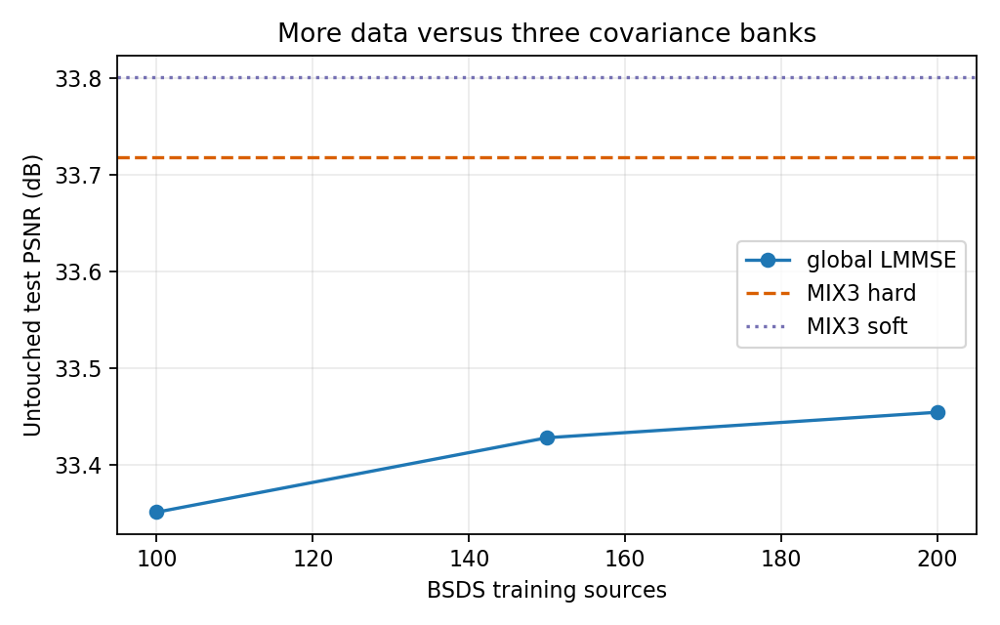
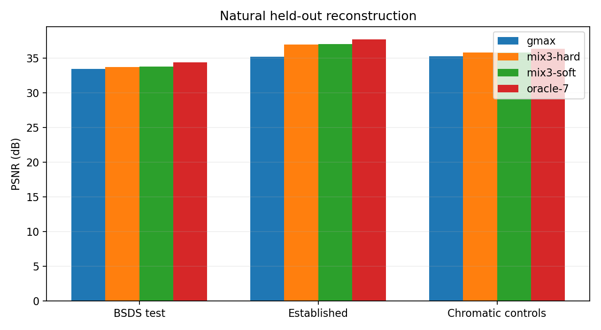
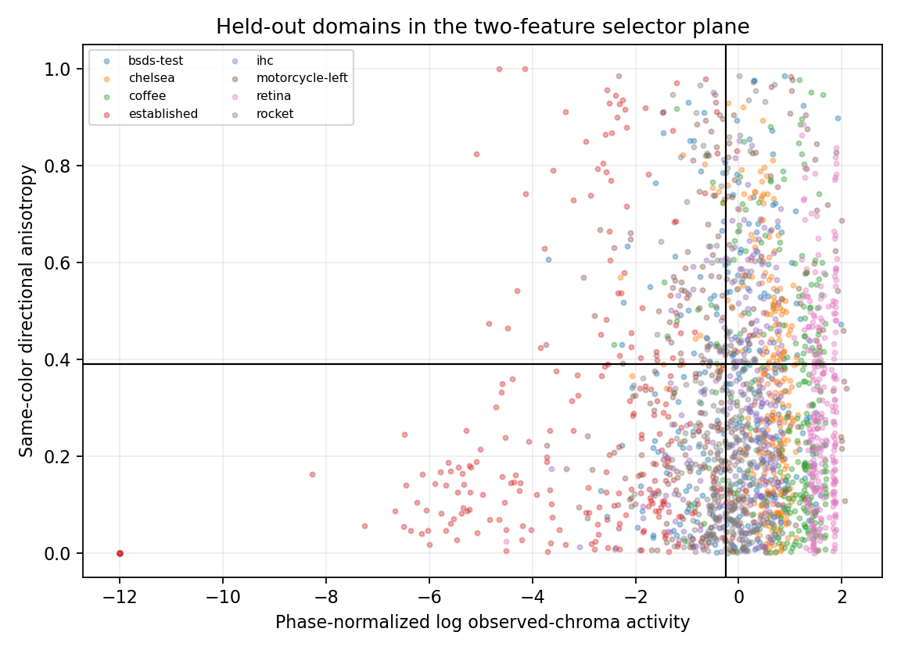
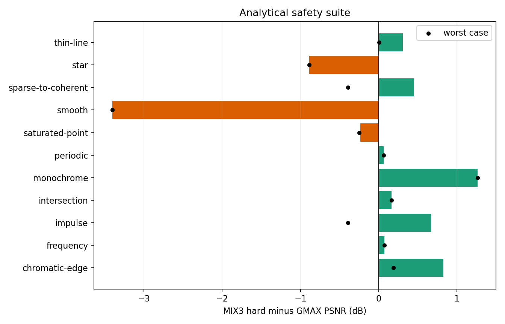

# X-Trans three-bank adaptive LMMSE covariance-mixture report

## Decision

**NO-GO — close the adaptive LMMSE covariance-mixture route.**

The experiment found real covariance diversity and useful in-domain
complementarity:

- doubling BSDS training from 100 to 200 sources improves the fixed global
  bank by only **0.104 dB**, from 33.351 to 33.454 dB;
- the validation-selected hard three-bank mixture reaches **33.719 dB** on
  untouched BSDS test data, another **0.264 dB** above the equally trained
  200-source global bank;
- its 7x7 bank oracle reaches **34.415 dB**, 0.960 dB above the global bank;
- the practical mixture also gains 1.761 dB on the established strips and
  0.545 dB on six external chromatic-texture sources;
- it recovers 38.2% of the remaining pooled global-to-source-oracle MSE gap.

Those gains do not meet the safety requirement. Two distinct failures remain:

1. **No specialized bank is safe on every simple structure.** On a smooth
   chromatic gradient, GMAX reaches 64.502 dB, but the best three-bank oracle
   reaches only 61.310 dB. The practical mixture loses **3.406 dB**. This is a
   covariance-partition failure, not a classification failure.
2. **The selector misses an available sparse-safe bank.** On the tiny colored
   star, the edge bank reaches 44.021 dB versus 43.176 dB for GMAX. The rule
   assigns 100% of pixels to the low-chroma bank in all 18 phases and reaches
   only 42.287 dB, a repeatable **0.889 dB regression**. Hubble and Hydra show
   the same weaker form: the edge bank is best, but 95–100% of the selected
   regions are sent to the low-chroma bank.

Soft threshold transitions improve average natural quality slightly, but do
not fix either failure. Adding a fourth global fallback, more features, more
classes, or a stronger classifier would violate the deliberately small scope
and repeat the selection problem already seen in the Markesteijn–MLRI hybrid.
No hidden C++ method or production implementation is justified.

## Frozen comparison

All filters use the previous experiment's fixed contract:

- 11x11 physical scalar CFA observations;
- M2 per-observed-color DC removal;
- common ridge `1e-3` times average covariance variance;
- 18 X-Trans phases and two missing-channel predictors per phase;
- float64 covariance fitting and research inference;
- exact restoration of the physically sampled target component;
- no initializer, clipping hidden inside headline values, or postprocessing.

The mandatory comparison is:

| ID | Training and inference |
|---|---|
| G100 | frozen first 100 BSDS training sources |
| G150 | first 150 BSDS training sources |
| GMAX | all 200 official BSDS training sources |
| MIX3 hard | three GMAX-sized covariance populations, one selected bank per pixel |
| MIX3 soft | fixed logistic smoothing around the same two thresholds |
| oracle-1/7/15 | ground-truth offline choice among the three specialized bank outputs |

The regenerated G100 result equals the prior canonical M2 result exactly:
`33.350776254721694` dB. This verifies that expanding the corpus did not alter
the baseline sampling, regression, or metric contract.

## Corpus and split integrity

The pinned BSDS500 mirror remains at revision
`a04b7c6c3a9f0ace74bf205c72a43d32e1c72722` under its non-commercial
research/educational terms. The experiment uses:

- first sorted 200 official training sources for covariance fitting only;
- first 20 validation sources for candidate/threshold selection;
- first 20 test sources for the primary headline;
- no source or crop crossing a split.

Six additional authenticated scikit-image 0.26.0 sources are completely
external to fitting and validation:

| Source | Role | Recorded license/provenance |
|---|---|---|
| Chelsea | fur and chromatic fine detail | CC0; Stefan van der Walt |
| Coffee | saturated objects and irregular texture | CC0; Rachel Michetti |
| IHC | fine saturated biological texture | no known copyright restrictions; CMMI |
| Motorcycle left | colored print, fabric, architecture | Middlebury 2014; local docstring has no explicit terms |
| Retina | fine biological structure | CC0 1.0; Mikael Haeggstroem |
| Rocket | architecture, smooth sky, fine detail | SpaceX public domain |

Each contributes three previously frozen deterministic 168x168 crops. The
established Astronaut, Hubble, Hydra, Brick, Grass, Gravel, and Page strips are
also untouched by threshold selection. Stored sRGB/JPEG sources are decoded to
linear light before remosaicking; this remains an algorithmic feasibility
corpus, not a camera-RAW benchmark.

The canonical dataset manifest authenticates 240 BSDS bindings and the six
external controls. Images and learned weights remain external.

## Exact observable selector

No demosaiced or ground-truth values enter selection.

For each 11x11 scalar CFA window, the implementation calculates observed color
means from actual red, green, and blue CFA samples:

```text
Cobs = (mean(Robs) - mean(Gobs))^2 + (mean(Bobs) - mean(Gobs))^2
```

It divides `Cobs` by the training-only median for the current X-Trans phase and
uses `log10(normalized + 1e-12)`. Directional energy uses only equal-CFA-color
pairs at horizontal or vertical distance 1, 2, or 3:

```text
EH = mean(((y(x+d,y) - y(x,y)) / d)^2)
EV = mean(((y(x,y+d) - y(x,y)) / d)^2)
A  = abs(EH - EV) / (EH + EV + epsilon)
```

Depending on phase, 202–238 physical same-color pairs contribute. The
validation-selected thresholds are:

```text
TC = -0.24593039811697992  (training activity quantile 0.40)
TA =  0.39033209231571490  (active-patch anisotropy quantile 0.70)
```

The hard rule is:

```text
low-chroma  if Cobs < TC
edge        if Cobs >= TC and A >= TA
high-chroma otherwise
```

The labels describe partitions, not semantic ground truth. Training patches
are assigned by this exact observable rule. No filename, source class,
algorithm winner, or target error is used.

## Candidate and threshold validation

The bounded search compares three interpretations and four neighboring
threshold controls. Hard PSNR on 276,480 validation RGB values is:

| Candidate | Activity q | Anisotropy q | Hard PSNR | Soft PSNR |
|---|---:|---:|---:|---:|
| SET1 raw variance | 0.40 | 0.60 | 34.948 | 34.987 |
| SET1 per-color high-pass | 0.40 | 0.60 | 34.962 | 35.002 |
| SET2 observed chroma | 0.40 | 0.60 | 34.967 | 35.065 |
| SET2 activity lower | 0.32 | 0.60 | 34.959 | 35.056 |
| SET2 activity higher | 0.48 | 0.60 | 34.946 | 35.064 |
| SET2 anisotropy lower | 0.40 | 0.50 | 34.939 | 35.039 |
| **SET2 anisotropy higher** | **0.40** | **0.70** | **35.001** | **35.089** |

The 0.062 dB hard-score span shows a broad rather than razor-thin validation
region. Threshold instability is not the main failure.

The selected validation assignment is 55.40% low-chroma, 14.50% edge, and
30.10% high-chroma.

## Training scale

| Training sources | Global PSNR | Gain from previous point |
|---:|---:|---:|
| 100 | 33.351 | — |
| 150 | 33.428 | +0.077 |
| 200 | 33.454 | +0.026 |

The last 50 sources add only 0.026 dB, so the global covariance is beginning to
converge on BSDS. The hard mixture's gain over GMAX is 0.264 dB: 2.55 times the
entire 100-to-200 data-scale gain. The mixture effect is therefore real and not
explained by using more training images.



## Covariance and filter diversity

All 54 class/phase combinations exceed the 1,024-sample fallback threshold.
No specialized phase falls back to GMAX.

| Bank | Total samples | Per-phase range | Effective rank | Max ridge-regularized condition | Max filter norm |
|---|---:|---:|---:|---:|---:|
| low-chroma | 276,480 | 15,290–15,464 | 118 | 24,088 | 0.999 |
| edge | 124,416 | 6,821–7,045 | 118 | 28,597 | 1.126 |
| high-chroma | 290,304 | 15,943–16,286 | 118 | 18,804 | 1.028 |

The expected rank is 118 rather than 121 because M2 removes three observable
color-mean degrees of freedom. Tiny negative unregularized eigenvalues are at
floating-point round-off scale; the recorded ridge-regularized systems are
finite and bounded.

The filters are materially distinct:

| Pair | Mean L2 difference | Maximum L2 difference | Mean cosine similarity |
|---|---:|---:|---:|
| low-chroma / edge | 0.311 | 0.669 | 0.911 |
| low-chroma / high-chroma | 0.169 | 0.346 | 0.976 |
| edge / high-chroma | 0.231 | 0.529 | 0.950 |

The canonical result records the strongest coefficient changes and mean
absolute differences by input CFA color and spatial radius. H1—different local
covariance populations—therefore passes.

## Main held-out natural results

| Dataset | Markesteijn | corrected MLRI | G100 | GMAX | MIX3 hard | MIX3 soft | oracle-7 |
|---|---:|---:|---:|---:|---:|---:|---:|
| BSDS test | 30.995 | 32.658 | 33.351 | 33.454 | **33.719** | **33.802** | 34.415 |
| Established strips | 33.154 | **38.500** | 35.317 | 35.256 | 37.017 | 37.062 | 37.705 |
| External chromatic | **36.248** | 34.885 | 35.204 | 35.277 | 35.822 | 35.857 | 36.375 |

Clipping is reported separately and never hidden:

| Dataset | GMAX clipped | MIX3 hard clipped | MIX3 soft clipped |
|---|---:|---:|---:|
| BSDS test | 33.816 | 34.067 | **34.148** |
| Established strips | 35.420 | 37.177 | **37.213** |
| External chromatic | 35.587 | 36.104 | **36.138** |

The hard mixture improves aggregate PSNR on all three groups. Soft selection
adds 0.035–0.083 dB but does not change the conclusion.



### Untouched BSDS sources

| Source | GMAX | MIX3 hard | Delta | oracle-7 |
|---|---:|---:|---:|---:|
| 100007 | 39.285 | 39.536 | +0.251 | 41.122 |
| 100039 | 31.003 | 31.118 | +0.115 | 32.378 |
| 100099 | 42.013 | 42.373 | +0.360 | 43.009 |
| 10081 | 39.642 | 39.936 | +0.294 | 40.836 |
| 101027 | 31.705 | 31.570 | -0.135 | 33.255 |
| 101084 | 30.140 | 30.858 | +0.718 | 31.227 |
| 102062 | 28.894 | 29.079 | +0.185 | 29.523 |
| 103006 | 32.075 | 32.031 | -0.043 | 32.526 |
| 103029 | 43.441 | 43.271 | -0.170 | 44.665 |
| 103078 | 33.795 | 34.532 | +0.737 | 35.794 |
| 104010 | 33.300 | 33.622 | +0.322 | 34.360 |
| 104055 | 39.716 | 40.021 | +0.304 | 40.897 |
| 105027 | 38.699 | 38.690 | -0.009 | 39.128 |
| 106005 | 40.681 | 41.237 | +0.557 | 42.092 |
| 106047 | 40.656 | 41.181 | +0.525 | 41.990 |
| 107014 | 33.445 | 33.732 | +0.287 | 34.032 |
| 107045 | 32.646 | 32.598 | -0.049 | 33.083 |
| 107072 | 32.017 | 32.215 | +0.198 | 32.440 |
| 108004 | 30.541 | 31.146 | +0.606 | 31.451 |
| 108036 | 32.676 | 32.926 | +0.250 | 34.181 |

MIX3 wins 15 of 20 sources against GMAX. The worst loss is 0.170 dB and the
best gain is 0.737 dB. This is a genuine source-held-out in-domain improvement.

## Specialized-bank behavior outside BSDS

### Established controls

| Source | GMAX | Low-chroma | Edge | High-chroma | MIX3 | oracle-7 |
|---|---:|---:|---:|---:|---:|---:|
| Astronaut | 41.486 | **42.084** | 41.741 | 40.497 | 42.013 | 42.350 |
| Brick | 44.391 | **49.344** | 44.875 | 42.465 | **49.344** | 49.347 |
| Grass | 30.828 | **33.985** | 28.747 | 30.577 | 33.931 | 33.985 |
| Gravel | 37.589 | **41.508** | 36.088 | 36.594 | **41.508** | 41.508 |
| Page | 31.442 | **35.213** | 29.742 | 30.570 | 33.136 | 35.226 |
| Hubble | 33.695 | 33.390 | **33.987** | 33.334 | 33.618 | 34.240 |
| Hydra | 66.437 | 66.273 | **66.658** | 65.002 | 66.273 | 67.147 |

The equal-channel controls strongly favor the low-chroma covariance, explaining
the large pooled gain. Hubble and Hydra favor the edge covariance, but the rule
does not select it.

### External chromatic controls

| Source | GMAX | Low-chroma | Edge | High-chroma | MIX3 | oracle-7 |
|---|---:|---:|---:|---:|---:|---:|
| Chelsea | 37.484 | 36.166 | 37.173 | 37.600 | **37.689** | 37.988 |
| Coffee | 33.921 | 32.517 | 34.006 | 33.816 | **34.352** | 34.659 |
| IHC | 38.795 | 36.902 | **39.019** | 38.271 | 38.850 | 39.642 |
| Motorcycle | 30.553 | 29.321 | 30.628 | 30.279 | **31.503** | 32.130 |
| Retina | 47.386 | 44.888 | **48.548** | 47.359 | 47.788 | 48.555 |
| Rocket | 37.813 | 37.270 | **37.941** | 37.579 | 37.490 | 38.341 |

Aggregate generalization is positive, but the smooth third Rocket crop is a
clear local counterexample: GMAX 47.798 dB, edge bank 48.201 dB, MIX3 46.747
dB. Its classifier map is 98.8% low-chroma. A useful bank exists but is not
observably selected.

## Domain separation

Pooled practical class proportions are:

| Group | Low-chroma | Edge | High-chroma |
|---|---:|---:|---:|
| BSDS test | 36.0% | 20.0% | 44.0% |
| Established strips | **96.9%** | 0.9% | 2.2% |
| External chromatic | 24.7% | 23.9% | 51.4% |

The established domain collapses almost entirely into one feature region. This
explains why a rule validated on BSDS cannot access the Hubble/Hydra edge bank.



## Error tails

| Group/method | Median | p90 | p95 | p99 | Maximum |
|---|---:|---:|---:|---:|---:|
| BSDS GMAX | 0.001999 | 0.025786 | 0.043451 | 0.095643 | 0.675816 |
| BSDS MIX3 hard | 0.002086 | 0.024860 | 0.041743 | **0.092664** | 0.678073 |
| BSDS MIX3 soft | 0.002073 | 0.024625 | 0.041363 | **0.091770** | 0.673533 |
| Established GMAX | 0.000270 | 0.019201 | 0.032337 | 0.073782 | 0.652432 |
| Established MIX3 hard | 0.000285 | 0.014159 | 0.023832 | **0.056327** | 0.650812 |
| External GMAX | 0.001226 | 0.018877 | 0.030481 | 0.072270 | 0.485325 |
| External MIX3 hard | 0.001249 | 0.018183 | 0.028956 | **0.066351** | 0.484803 |

MIX3 slightly worsens median absolute error but improves p90–p99 and leaves the
maximum essentially unchanged. Aggregate tails are not the reason for NO-GO;
structured counterexamples are.

## Oracle headroom and recovered fraction

| Group | GMAX | oracle-7 | Oracle headroom | MIX3 gain | Oracle MSE gain captured |
|---|---:|---:|---:|---:|---:|
| BSDS test | 33.454 | 34.415 | +0.960 | +0.264 | 29.8% |
| Established | 35.256 | 37.705 | +2.449 | +1.761 | 77.3% |
| External chromatic | 35.277 | 36.375 | +1.098 | +0.545 | 52.8% |

Against the earlier source-specific LMMSE oracle, practical MIX3 recovers
38.2% of the pooled remaining MSE gap. On Astronaut it recovers 59.2%; on the
equal-channel controls 32.3–68.0%. It is negative on Hubble (-3.0%) and Hydra
(-4.6%). The >20% aggregate target passes, but not on the mandatory sparse
sources.

## Phase and classification stability

| Scene | Maximum assignment change | GMAX PSNR phase range | MIX3 phase range |
|---|---:|---:|---:|
| gradient | 9.5% | ~0.000 dB | 0.264 dB |
| vertical edge | 8.6% | 0.339 dB | **1.425 dB** |
| saturated point | 0.0% | 2.028 dB | **2.787 dB** |
| periodic texture | **61.6%** | 0.694 dB | 0.570 dB |

Phase normalization helps smooth/edge assignment but does not make the
selector invariant. Periodic texture frequently crosses class boundaries, and
MIX3 increases phase spread on the vertical-edge and point controls.

## Analytical safety suite

Because MIX3 passed the aggregate natural gate, the full deterministic suite
was run: 129 cases covering all 18 phases for R/G/B/white impulses, a
saturated point, and a tiny colored star, plus larger points, lines,
intersections, chromatic edges, frequency/periodic stress, Nyquist monochrome,
and sparse-to-coherent transitions.

| Category | Cases | Mean MIX3–GMAX | Worst MIX3–GMAX |
|---|---:|---:|---:|
| smooth gradient | 1 | **-3.406 dB** | **-3.406 dB** |
| tiny colored star | 18 | **-0.889 dB** | **-0.889 dB** |
| saturated point | 20 | -0.233 dB | -0.247 dB |
| impulses | 72 | +0.667 dB | -0.392 dB |
| thin lines | 3 | +0.311 dB | +0.005 dB |
| line intersection | 1 | +0.164 dB | +0.164 dB |
| chromatic edges | 3 | +0.828 dB | +0.188 dB |
| frequency sweep | 1 | +0.071 dB | +0.071 dB |
| periodic chromatic | 1 | +0.065 dB | +0.065 dB |
| Nyquist monochrome | 1 | +1.266 dB | +1.266 dB |
| sparse-to-coherent | 8 | +0.451 dB | -0.393 dB |

Key absolute results are:

| Case | GMAX | Low-chroma | Edge | High-chroma | MIX3 | oracle-7 |
|---|---:|---:|---:|---:|---:|---:|
| smooth gradient | **64.502** | 59.765 | 61.310 | 59.885 | 61.097 | 61.310 |
| tiny colored star | 43.176 | 42.287 | **44.021** | 42.847 | 42.287 | 44.022 |
| saturated 1-pixel point | 35.045 | 34.798 | 34.790 | **35.097** | 34.798 | 35.539 |
| periodic chromatic | 8.313 | 8.353 | 7.835 | **8.401** | 8.378 | 8.426 |
| Nyquist monochrome | 11.248 | **16.191** | 5.722 | 11.541 | 12.515 | 16.191 |

The gradient demonstrates that the three-bank oracle is not a safety envelope
around GMAX. The star demonstrates that even when a safer specialized bank
exists, chroma/anisotropy cannot identify it.

The sparse-to-coherent transition is not monotonic enough for a safe rule:

| Structure | MIX3–GMAX |
|---|---:|
| points spacing 16 | +0.361 dB |
| spacing 8 | +0.303 dB |
| spacing 4 | -0.003 dB |
| spacing 2 | -0.090 dB |
| line width 1 | -0.393 dB |
| width 2 | +1.356 dB |
| width 4 | +0.986 dB |
| width 8 | +1.089 dB |



## Hypotheses and gates

| Hypothesis/gate | Result |
|---|---|
| H1 / Gate A: covariance populations differ | **PASS.** Filter cosine similarities are 0.911–0.976 and oracle headroom is substantial. |
| H2: two CFA observables identify a useful bank | **PARTIAL in-domain.** BSDS improves, but stars and smooth Rocket are misclassified. |
| Gate B: 7x7/15x15 oracle mixture | **PASS on natural corpora.** 7x7 headroom is 0.96–2.45 dB. |
| H3: reduce domain sensitivity | **PARTIAL.** Aggregate external scores improve; established data collapse 96.9% into low-chroma. |
| H4 / Gate D: sparse safety | **FAIL.** Hubble/Hydra regress, every tiny-star phase loses 0.889 dB, and the safer edge bank is not selected. |
| H5: value beyond more data | **PASS.** MIX3 +0.264 dB versus only +0.104 dB from 100 additional sources. |
| Synthetic safety | **FAIL.** Smooth gradient -3.406 dB and increased phase dependence. |

The natural-only artifact recorded the early external gate as NO-GO after the
smooth Rocket crop exceeded a 1 dB regression. The subsequent mandatory
synthetic suite independently confirms and strengthens that decision.

## Complexity

A hypothetical implementation would store:

- 13,068 coefficients plus 108 folded intercepts;
- 52,704 bytes (51.5 KiB) at float32;
- 242 filter MACs per pixel when only the selected bank is evaluated;
- 202–238 same-color directional pairs plus color means for classification;
- no iterative state or full-frame feature buffers.

Storage is modest, but feature calculation is not free: the classifier roughly
doubles the arithmetic around the selected filter. The observed quality is not
worth this complexity because it cannot be made safe within the two-feature,
three-bank constraint.

## Required final answers

- **How much does more data help?** G100 to G200 adds 0.104 dB; the last 50
  sources add 0.026 dB. BSDS covariance fitting is approaching convergence.
- **Are the banks genuinely different?** Yes. Filters, covariance spectra,
  source preferences, and oracle results all differ materially.
- **Can variance/anisotropy choose a bank?** Only partially. Validation chose
  observed chroma plus anisotropy, but the rule misroutes sparse stars and
  smooth chromatic content.
- **Is classification phase-stable?** No. Periodic assignment changes reach
  61.6%; edge/point output spread is worse than GMAX.
- **Does MIX3 beat GMAX on BSDS?** Yes, by 0.264 dB hard and 0.347 dB soft.
- **Astronaut?** Yes, by 0.526 dB hard.
- **Hubble/Hydra?** No: -0.077 and -0.164 dB. The edge bank is better, but is
  not selected.
- **External chromatic textures?** +0.545 dB pooled, but one Rocket crop loses
  1.052 dB.
- **Does the mixture reduce the star/coherent-detail tradeoff?** No. It helps
  equal-channel/coherent controls while retaining the sparse-star failure.
- **How much oracle headroom exists?** 0.960 dB on BSDS, 2.449 dB established,
  and 1.098 dB external at 7x7.
- **How much does the rule recover?** 29.8%, 77.3%, and 52.8% of those MSE gains
  respectively, but negative source-oracle recovery on both star fields.
- **Does it reduce the global-to-source-oracle gap?** 38.2% pooled, driven by
  Astronaut and equal-channel sources; not on Hubble/Hydra.
- **Is ~3x storage worthwhile?** No. Average gains coexist with simple,
  repeatable safety failures.

Most importantly:

> A three-bank covariance mixture does contain useful information beyond a
> better global Wiener filter, but two simple CFA statistics cannot select it
> safely, and the three specialized banks do not retain the global bank's
> behavior on all simple structures. Close this route rather than adding more
> covariance classes or a larger classifier.

## Reproducibility artifacts

- `tools/xtrans_lmmse_mixture/` — features, training, evaluation, synthetic
  suite, rendering, and tests;
- `images/xtrans-lmmse-mixture/dataset.json` — SHA-256
  `b3567b4db1b733b2044648b04b631ad73f604d574e5619cd3f2bafc52e58cc2c`;
- `images/xtrans-lmmse-mixture/mixture.json` — SHA-256
  `d025baef340fb4a0dc0464468b31af6fdc0998f4e5f4fca1726f9ee78e78ad60`;
- `images/xtrans-lmmse-mixture/synthetic.json` — SHA-256
  `0e4a11b7ca2763cbbf1a0610a0279ec10ddacc0d61696540c89efc6c5fa1f270`.

The main natural run took 1,104.8 seconds and the synthetic run 349.1 seconds
with single-threaded BLAS under `nice -n 10`. Filter weights, BSDS images,
source images, and temporary native arrays remain external.
