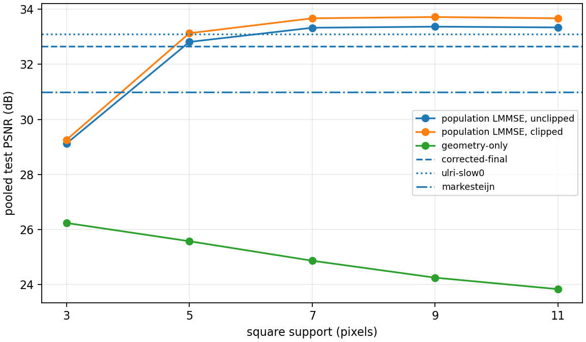
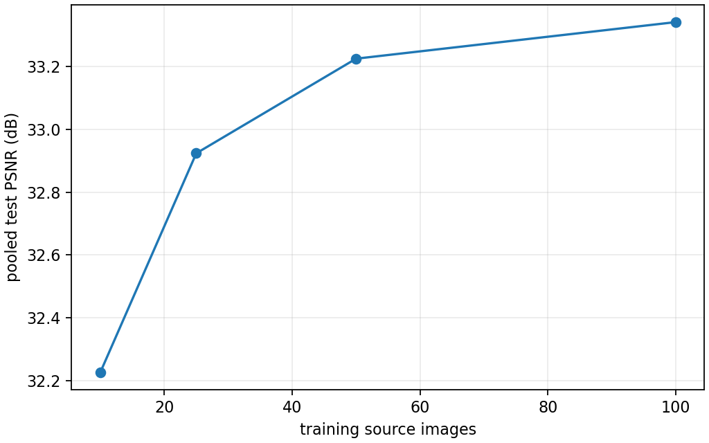

# X-Trans joint spatial-chromatic LMMSE / Wiener feasibility report

## Decision

**PARTIAL - covariance/domain adaptation problem. Do not implement a fixed
population bank in RawTherapee yet.**

The linear model class itself is strong. A deliberately generous source-specific
oracle, trained on a spatially disjoint part of each source, reaches **44.200 dB**
pooled. It beats geometry-only interpolation by **17.750 dB** and corrected-final
MLRI by **5.700 dB** on the same distant test strips. Gate 1 therefore passes.

The independent population result is also useful rather than negative. A bank
trained on 100 BSDS500 sources reaches **33.351 dB** on 20 untouched sources,
or **33.696 dB** after clipping. The unclipped result is 0.693 dB above
corrected-final MLRI and 2.356 dB above Markesteijn on that corpus.

It does not generalize uniformly. On the seven established Astronaut,
Brick/Grass/Gravel/Page, Hubble, and Hydra strips, the same population bank
reaches 35.317 dB versus 44.200 dB for the source oracle and 38.500 dB for
corrected-final MLRI. It retains **49.95%** of the source-oracle gain over
geometry, missing the predeclared 50% Gate 2 rule by 0.05 percentage point.
That numerical miss is not meaningful by itself; the 3.18 dB cross-domain gap
to corrected MLRI is. The training-size curve is still rising at 100 sources.

The result justifies a later, tightly bounded covariance-mixture experiment,
but not a production or hidden C++ demosaicer from one global bank.

## Scope and early-stop sequence

The prompt required early termination when a gate fails:

1. reproduce the generic localized joint spatial-chromatic estimator;
2. test the source-specific model-class oracle;
3. only after Gate 1 passes, build an independent population corpus;
4. test source-level held-out generalization;
5. stop at Gate 2 if the population covariance loses most of the oracle gain.

The experiment stopped at the boundary Gate 2 result. It did not add a
covariance mixture, directional filters, a C++ engine method, PP3/GUI exposure,
or a practical hybrid selector. Synthetic phase sweeps, filter symmetry tying,
noise-aware banks, and full frequency-response analysis remain follow-ups only
if a covariance-mixture study is approved.

## Reference analysis

### Authenticated papers

| Work | Identity | Local evidence |
|---|---|---|
| Portilla, Otaduy, Dorronsoro, ICIP 2005 | [DOI 10.1109/ICIP.2005.1529687](https://doi.org/10.1109/ICIP.2005.1529687) | user-supplied `Low-complexity-linear-demosaicing-using-joint-spatial-chromatic-image-statistics.pdf.pdf`, 4 pages, 861,105 bytes, SHA-256 `78d32398151b88666f1a4cc253858c0932cb98b2e24ce8668426df8e3c005079` |
| Chaix de Lavarene, Alleysson, Herault, CVIU 2007 | [DOI 10.1016/j.cviu.2006.11.016](https://doi.org/10.1016/j.cviu.2006.11.016), [HAL preprint](https://hal.science/hal-00157708) | 860,407 bytes, SHA-256 `0731ed722f1e560af37133b7a494d85038cf7608521543ad9eb38c75d999318e` |
| Amba, Alleysson, CIC 2018 | [DOI 10.2352/ISSN.2169-2629.2018.26.151](https://doi.org/10.2352/ISSN.2169-2629.2018.26.151), [open paper](https://library.imaging.org/cic/articles/26/1/art00026) | 5,270,348 bytes, SHA-256 `3165a4267c4a698865990989f0d2bb8f11cf7f8622574f27bcbe36d5734b18b9` |

No reference source code was found or copied. The implementation is independent.

### Operation-by-operation comparison

| Property | Portilla et al. 2005 | Chaix de Lavarene et al. 2007 | Amba and Alleysson 2018 | This experiment |
|---|---|---|---|---|
| Statistics | global joint spatial-chromatic correlation from natural RGB images | database-trained stacked-superpixel correlation | database RGB correlation matrix | source-specific oracle, then external BSDS500 population |
| Geometry | one predictor per local Bayer mosaic; stated to apply to any periodic CFA | four Bayer superpixel positions | arbitrary periodic/random multicolor CFA through sampling matrices | 18 distinct X-Trans phase cells |
| Observation | all scalar CFA samples in an odd square support | neighborhood of stacked Bayer superpixels | unfolded CFA basis pattern plus neighborhood | row-major scalar samples only; no interpolated inputs |
| Target | the two missing colors | RGB superpixel | central RGB basis pattern | RGB target; measured component restored exactly |
| Estimator | `D_j = E[X_j Xtilde_j^T] E[Xtilde_j Xtilde_j^T]^-1` | `D = E[Y X^T] E[X X^T]^-1` | matrix form using sampling/color matrices and database correlation | centered affine covariance with validation-selected ridge |
| DC handling | uncentered second moments in the published equation | uncentered second moments | uncentered correlation | M0 phase mean, M1 local mosaic mean, M2 observable per-color means |
| Color basis | direct missing colors | direct RGB and a factored luminance/chrominance implementation | direct RGB recovery from arbitrary linear filter colors | direct RGB; orthogonal `L,C1,C2` control |
| Support | 7, 9, 11, 15 pixels; 9 reported as quality/speed corner | 9x9 and 7x7 direct; luma 9x9/7x7, chroma 3x3 | neighborhood 10 in reported tests | 3, 5, 7, 9, 11 pixels |
| Regularization | no ridge specified | no ridge specified | no ridge specified | `1e-8` through `1e-2` times average covariance variance |
| Clipping | not the primary formulation | visual linear result | reports both; clipping improves Bayer 38.90 to 39.13 dB | both reported; no clipping hidden |

Portilla's formulation is the closest direct precedent: compact spatial kernels,
one per local CFA arrangement, learned from joint natural-image statistics. The
2007 luma/chroma method is not just an RGB coordinate rotation; it factors Bayer
sampling into a low-pass luminance estimator and chrominance demultiplexing to
reduce implementation cost. Amba generalizes the stacked matrix construction to
filters that are arbitrary linear combinations of RGB and arbitrary CFA layouts.

## Mathematical and implementation contract

For target phase `p`, the observation is the actual scalar mosaic neighborhood:

```text
y_p = [m(x+dx_0,y+dy_0), ..., m(x+dx_N,y+dy_N)]
```

No missing values are filled before regression. For every phase and target
component, the affine ridge estimator is:

```text
W_p = Sigma_cy (Sigma_yy + lambda I)^-1
c_hat = mu_c + W_p (y_p - mu_y)
```

Covariance derivation, merging, eigenanalysis, solving, and research inference
use float64. Each phase is trained independently. A linear solve is used rather
than forming an inverse. The native target sample is then copied from the mosaic
bit-exactly.

The training accumulator uses the parallel covariance merge formula. A unit test
requires it to reproduce direct covariance and cross-covariance. Other tests cover:

- all 18 phase cells and translated phase lookup;
- native-sample retention;
- finite/range behavior;
- RGB/orthogonal-basis equivalence;
- constant fields under M0/M1/M2;
- geometry control behavior.

## Corpus and split integrity

The population corpus is a pinned checkout of the
[BSDS500 mirror](https://github.com/BIDS/BSDS500) at revision
`a04b7c6c3a9f0ace74bf205c72a43d32e1c72722`. The
[official Berkeley page](https://www2.eecs.berkeley.edu/Research/Projects/CS/vision/bsds/)
permits non-commercial research and educational use and asks users to cite
Martin et al., ICCV 2001. Images and learned filters are not committed.

The selection is deterministic:

- lexicographically first 100 official training images;
- first 20 official validation images;
- first 20 official test images;
- no crop or source crosses a split;
- each file has a SHA-256 in the canonical dataset manifest;
- JPEG samples are decoded with the inverse IEC 61966-2-1 sRGB EOTF;
- 100% of the selected 140 sources exceed normalized opponent-chroma RMS 0.005.

The source archive contains 200/100/200 train/validation/test images. The unused
sources remain untouched. Hubble and the separately authenticated NASA Hydra
field are absent from population fitting and validation.

Each training source contributes 192 deterministic samples per phase, or 19,200
samples per phase and 345,600 total samples for each support. The 20 validation
sources select support/ridge/DC behavior. Headline quality uses only the 20
untouched test sources.

## Gate 1 - source-specific model capacity

Each source is divided horizontally into a left training strip, disjoint center
validation strip, and distant right test strip, with support-sized gaps. Metrics
exclude a 12-pixel output border. Support and ridge are selected on the source's
validation strip only.

| Source | Geometry | Population | Source oracle | Markesteijn | corrected MLRI | selected oracle support |
|---|---:|---:|---:|---:|---:|---:|
| Astronaut | 33.279 | 41.483 | 42.416 | 42.252 | 43.169 | 7 |
| Brick | 35.504 | 44.495 | 157.022 | 46.996 | 59.676 | 3 |
| Grass | 22.604 | 30.828 | 169.491 | 28.034 | 40.257 | 3 |
| Gravel | 27.938 | 37.753 | 166.158 | 35.077 | 46.575 | 3 |
| Page | 20.002 | 31.545 | 159.913 | 27.679 | 41.115 | 3 |
| Hubble | 29.272 | 33.785 | 37.589 | 35.891 | 31.935 | 9 |
| Hydra | 56.617 | 66.372 | 74.482 | 73.365 | 63.951 | 11 |
| **Pooled** | **26.451** | **35.317** | **44.200** | **33.154** | **38.500** | per-source |

Brick, Grass, Gravel, and Page are equal-channel controls. A source-specific
linear bank can learn the exact identity `R=G=B`, hence the 157-169 dB values.
They are valid model-capacity controls but not evidence about chromatic recovery.
The chromatic Astronaut, Hubble, and Hydra results independently show real
linear-model headroom.

**Gate 1: PASS.**

## Population support and regularization

Validation selects 11x11 by 0.002 dB over 9x9. The untouched test happens to
favor 9x9 by 0.028 dB; no method choice was changed after seeing test data.

| Support | selected ridge | validation PSNR | test PSNR | clipped test | geometry |
|---:|---:|---:|---:|---:|---:|
| 3 | `1e-4` | 30.599 | 29.125 | 29.259 | 26.239 |
| 5 | `1e-4` | 34.303 | 32.815 | 33.133 | 25.576 |
| 7 | `1e-4` | 34.862 | 33.330 | 33.674 | 24.867 |
| 9 | `1e-4` | 34.906 | **33.370** | **33.721** | 24.251 |
| 11 | `1e-3` | **34.907** | 33.342 | 33.674 | 23.835 |

The geometry control gets worse with large support because it averages across
more structure. The learned bank uses that same support productively. The
validation-selected 11x11 covariance has minimum eigenvalue `3.11e-4`, maximum
regularized condition number 12,821, and maximum filter norm 1.011. With M2,
the condition number is 24,345. Ridge selection therefore avoids the most
ill-conditioned filters rather than simply maximizing training fit.

## DC and color representation

| Formulation, 11x11 | test PSNR | selected ridge |
|---|---:|---:|
| M0 phase-specific affine mean | 33.342 | `1e-3` |
| M1 observable local mosaic mean | 33.350 | `1e-3` |
| M2 observable per-color means | **33.351** | `1e-3` |

M3, an explicit constant column with an unregularized intercept, is
mathematically the same affine model as centered M0. M1 and M2 improve only
0.008-0.009 dB. DC handling is not the remaining limitation.

For an unconstrained linear predictor with a common ridge, rotating the target
from RGB to the orthogonal `L,C1,C2` basis and rotating back is algebraically
identical to RGB regression. The measured maximum difference is
`5.21e-13`. A distinct luma/chroma result would require the structured Bayer
factorization of the 2007 paper, different supports/regularization per component,
or another constraint. Merely relabeling the target does not create a new model.

## Untouched natural test sources

The LMMSE column is the validation-selected **M2 11x11 unclipped** bank.

| Source | LMMSE | Markesteijn | corrected MLRI | slow0 | slow3 | LMMSE p99 abs. |
|---|---:|---:|---:|---:|---:|---:|
| 100007 | 39.267 | 37.392 | 42.685 | 41.123 | 42.138 | 0.0444 |
| 100039 | 30.960 | 27.753 | 31.397 | 30.835 | 30.665 | 0.1191 |
| 100099 | 41.946 | 40.477 | 40.126 | 41.200 | 39.097 | 0.0334 |
| 10081 | 39.624 | 39.507 | 39.663 | 40.450 | 38.118 | 0.0450 |
| 101027 | 31.769 | 27.257 | 33.602 | 31.146 | 33.894 | 0.1114 |
| 101084 | 30.085 | 29.789 | 32.149 | 31.863 | 31.229 | 0.1306 |
| 102062 | 28.852 | 25.641 | 27.521 | 27.522 | 26.851 | 0.1523 |
| 103006 | 31.942 | 28.071 | 30.311 | 30.580 | 29.421 | 0.1047 |
| 103029 | 43.430 | 44.534 | 43.200 | 44.528 | 41.809 | 0.0270 |
| 103078 | 33.857 | 30.657 | 36.739 | 35.268 | 36.295 | 0.0883 |
| 104010 | 33.027 | 34.415 | 29.639 | 32.026 | 28.068 | 0.0926 |
| 104055 | 39.702 | 40.913 | 39.133 | 40.758 | 37.851 | 0.0434 |
| 105027 | 38.446 | 35.667 | 36.882 | 37.766 | 35.781 | 0.0470 |
| 106005 | 40.754 | 40.297 | 42.815 | 42.600 | 42.093 | 0.0399 |
| 106047 | 40.685 | 39.435 | 40.468 | 41.237 | 39.129 | 0.0395 |
| 107014 | 33.254 | 32.536 | 31.226 | 33.073 | 30.151 | 0.0944 |
| 107045 | 32.437 | 30.046 | 31.427 | 32.420 | 30.514 | 0.1025 |
| 107072 | 31.821 | 29.390 | 30.043 | 31.071 | 29.172 | 0.1043 |
| 108004 | 30.259 | 29.900 | 28.825 | 30.020 | 27.474 | 0.1386 |
| 108036 | 32.617 | 29.631 | 32.814 | 33.065 | 31.741 | 0.1072 |
| **Pooled** | **33.351** | **30.995** | **32.658** | **33.094** | **31.687** | **0.0967** |

LMMSE wins 17/20 sources against Markesteijn, 12/20 against corrected-final,
11/20 against slow0, and 15/20 against slow3. Its worst per-source loss to
corrected-final is 3.418 dB and best win is 3.388 dB. That spread is direct
evidence of domain/content sensitivity despite a positive pooled result.

## Clipping and error tails

The selected M2 bank produces a pre-clipping range of `-0.4144` to `1.3350`.
Clipping improves pooled PSNR from 33.351 to **33.696 dB**. Native samples are
already in range and remain exact.

Unclipped absolute-error distribution over 8,143,740 evaluated RGB samples:

| Metric | value |
|---|---:|
| median | 0.00203 |
| p90 | 0.02623 |
| p95 | 0.04408 |
| p99 | 0.09675 |
| maximum | 0.66214 |

Clipping improves average error but does not remove the 0.662 maximum interior
error. The linear bank is not tail-safe merely because its PSNR is competitive.

## Sparse stars and coherent detail

The population prior changes the MLRI sparse-star tradeoff but does not solve it:

| Source | Population | Markesteijn | corrected MLRI | slow0 | source oracle |
|---|---:|---:|---:|---:|---:|
| Hubble | 33.785 | **35.891** | 31.935 | 33.907 | 37.589 |
| Hydra | 66.372 | **73.365** | 63.951 | 66.696 | 74.482 |

It improves materially over corrected-final MLRI and almost matches slow0, so it
does not reproduce MLRI's deepest refinement failure. It remains 2.11 dB below
Markesteijn on Hubble and 6.99 dB below on Hydra. The fixed bank therefore does
not pass a production sparse-safety claim.

On the coherent equal-channel controls the population model substantially beats
simple geometry and often Markesteijn, but remains far below corrected/high-pass
MLRI. On the genuinely chromatic BSDS test set it is competitive in aggregate,
yet the individual-source spread above shows that this is not simply a safe
smooth-versus-texture solution.

## Training-set-size curve

| Training sources | untouched test PSNR |
|---:|---:|
| 10 | 32.226 |
| 25 | 32.924 |
| 50 | 33.225 |
| 100 | 33.342 |

The last doubling still adds 0.116 dB; the covariance estimate has not fully
converged. This independently supports the **PARTIAL - dataset/covariance
stability** interpretation.





## Complexity and interpretability

An eventual canonical 11x11 implementation needs two missing-channel predictors
for each of 18 phases:

- 4,356 filter coefficients;
- 36 folded affine intercepts;
- about 17.2 KiB at float32 after folding means;
- 242 coefficient multiply-accumulates per pixel;
- no iterative state or full-frame workspace.

The research artifact records the six strongest coefficients for every
phase/output. Full coefficient and frequency-response figures were not promoted
because Gate 2 did not cleanly pass and the trained weights are not yet stable.

## Gate interpretation

### Gate 1 - model-class oracle

**PASS.** Source-specific linear prediction is highly capable and not just a
blurred geometry filter.

### Gate 2 - population generalization

**BOUNDARY FAIL / PARTIAL.** The fixed bank retains 49.95% of the oracle gain,
versus the declared 50% rule. More importantly, it loses 3.18 dB to corrected
MLRI on the established cross-domain strips even though it wins by 0.69 dB on
BSDS. This is a covariance/domain-adaptation problem.

### Gate 3 - sparse/coherent safety

**NOT PASSED.** The available held-out checks show useful behavior, but stars
remain below Markesteijn and individual BSDS regressions reach 3.42 dB versus
corrected MLRI. The full synthetic phase/safety suite was not justified after
Gate 2.

### Gate 4 - held-out benefit

**PASS on BSDS only.** The result is source-held-out and materially beats
geometry, corrected MLRI, and Markesteijn in pooled PSNR. That does not override
the domain sensitivity.

## Required final answers

- **Do population statistics add useful information?** Yes. The population
  bank gains 9.52 dB over its 11x11 geometry control and beats corrected-final
  MLRI by 0.69 dB on untouched BSDS sources.
- **Is linear capacity sufficient?** Yes. The source oracle reaches 44.20 dB.
- **Does one covariance generalize?** Only partially. BSDS and the established
  source strips give materially different rankings.
- **Does luma/chroma help?** A mere orthogonal target rotation cannot; it is the
  same estimator to `5.21e-13`. The structured 2007 factorization was analyzed
  but not implemented as a separate X-Trans constraint.
- **What is the dominant remaining problem?** Covariance/content/domain
  selection, not filter support, DC handling, or lack of linear headroom.
- **Does it fix sparse stars?** It avoids corrected MLRI's worst regression but
  remains below Markesteijn on both Hubble and Hydra.
- **Is it practical?** The eventual filter bank would be tiny and fast, but the
  current statistical model is not stable or safe enough to ship.

## Reproducibility artifacts

- `tools/xtrans_lmmse/` - model, corpus binding, experiments, rendering, tests;
- `images/xtrans-lmmse/source-oracle.json` - Gate 1, SHA-256
  `9cf6c5e30d243b92700f0265ae5969eb9fc2269c2decfd28529a227f483919cb`;
- `images/xtrans-lmmse/dataset.json` - 140 authenticated source bindings,
  SHA-256 `051d3d83dfdc7fae82ad13efcd690420e80c057dff91a116534932d41a355c16`;
- `images/xtrans-lmmse/population.json` - support/DC/convergence/oracle results,
  SHA-256 `83ca1c55922edc8fb636a9d3681f7b5026591d45570d948f903371ec13623963`;
- `images/xtrans-lmmse/selected-details.json` - exact M2 per-source/tail results,
  SHA-256 `c80fadd56478690109d3e97df1673fe22d1ec0ff41f5c245fbaa29a897ee1683`.

External papers, BSDS images, Hydra TIFF, temporary mosaics, learned filter
weights, and native baseline planes remain outside Git.

## Recommended next experiment

If this route continues, do exactly the optional small covariance-mixture study
from the prompt—not a large classifier:

1. freeze the current 11x11 M2 bank as the population baseline;
2. train at most three banks: smooth/achromatic, structured edge, and chromatic
   high-frequency;
3. select with one or two CFA-observable variance/anisotropy measures;
4. require source-held-out improvement on both BSDS and the established
   Astronaut/Hubble/Hydra/coherent controls;
5. rerun the full phase and synthetic safety suite only if that gate passes.

If the small mixture cannot recover a meaningful part of the 8.88 dB remaining
source-oracle gap without hurting stars or chromatic texture, close the LMMSE
route. Do not add dozens of content classes or another learned selector.
