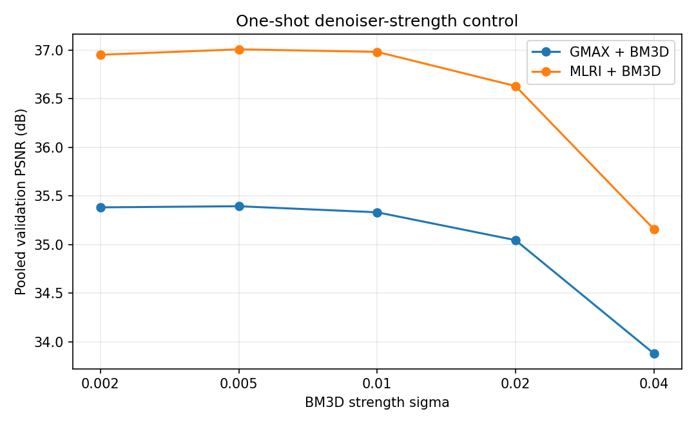
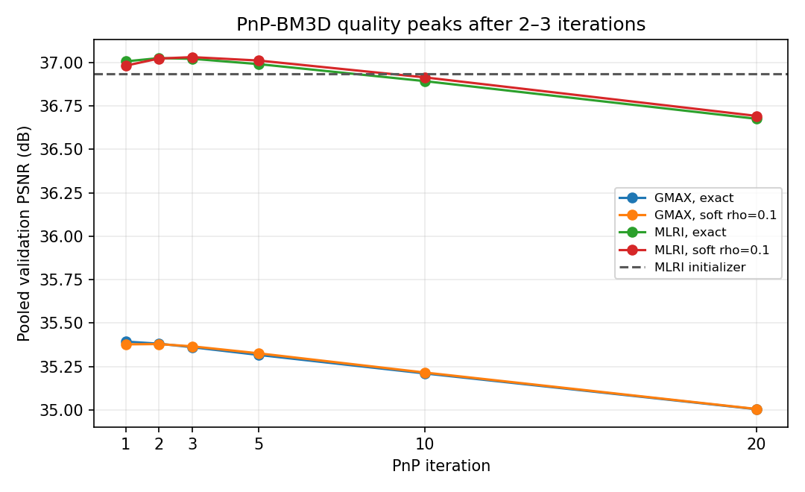
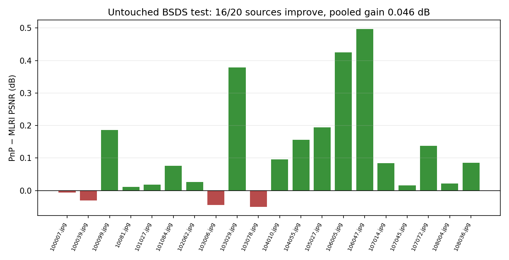

# X-Trans plug-and-play BM3D feasibility report

## Decision

**NO-GO — quality.**

The experiment finds a real but very small benefit from coupling BM3D to the
X-Trans measurement operator:

- on six held-out BSDS validation crops, the selected PnP result improves
  corrected-final MLRI by **0.095 dB** and improves the mandatory one-shot BM3D
  control by **0.0245 dB**;
- on 20 untouched BSDS test crops, the validation-selected method improves
  corrected-final MLRI by **0.0463 dB**, wins 16 of 20 sources, and improves
  one-shot BM3D by **0.0257 dB**;
- mean p99 error improves by only **0.62%**;
- the exact-sample alternative gains only **0.0344 dB** on test.

The best-case soft result misses the predeclared Gate C requirement of either
0.05 dB population gain or 5% p99 reduction. It also changes the native CFA
samples. The exact-projection result is smaller still. The requested external
chromatic, Hubble/Hydra, synthetic, and 18-phase safety suites were therefore
not run: the staged protocol stops after the population gate fails.

This is not a failure of the PnP implementation. A matched public Bayer control
improves from 35.987 dB to 37.129 dB. It is specifically a finding that BM3D's
prior supplies too little additional information beyond corrected-final MLRI
for this noiseless X-Trans problem.

## Scope

This is an offline Python experiment only. It adds no engine, PP3, CLI method,
GUI entry, runtime dependency, or bundled third-party code.

The implementation is under `tools/xtrans_pnp/`. The full generated metrics
remain external under `/tmp/xtrans-pnp-bm3d`; only this report, three compact
plots, and deterministic tooling/tests are tracked.

## References and authenticated software

### Plug-and-play

The formulation follows:

- Singanallur V. Venkatakrishnan, Charles A. Bouman, and Brendt Wohlberg,
  *Plug-and-Play Priors for Model Based Reconstruction*, GlobalSIP 2013,
  pp. 945–948, DOI
  [10.1109/GlobalSIP.2013.6737048](https://doi.org/10.1109/GlobalSIP.2013.6737048).
- Purdue's [official PnP software page](https://engineering.purdue.edu/~bouman/Plug-and-Play/)
  and `PlugandPlayPackage-v1.1.zip`: 16,334,064 bytes, SHA-256
  `a367d31d6340911002c92834da159a39ed03ccc50dd9b3f2566358dcba7f1add`.

The Purdue package's inpainting code confirms the scaled ADMM sequence
data update → denoiser → dual update, and its noiseless data update is a hard
sample projection. It was inspected externally and not copied into this tree.

### BM3D

The denoising prior is the official
[Tampere University BM3D Python package](https://webpages.tuni.fi/foi/GCF-BM3D/index.html),
based on:

- Kostadin Dabov, Alessandro Foi, Vladimir Katkovnik, and Karen Egiazarian,
  *Image Denoising by Sparse 3-D Transform-Domain Collaborative Filtering*,
  IEEE TIP 16(8), 2007, DOI
  [10.1109/TIP.2007.901238](https://doi.org/10.1109/TIP.2007.901238);
- Ymir Mäkinen, Lucio Azzari, and Alessandro Foi, *Collaborative Filtering of
  Correlated Noise: Exact Transform-Domain Variance for Improved Shrinkage and
  Patch Matching*, IEEE TIP 29, 2020.

Authenticated external packages:

| Package | Version | Wheel bytes | Wheel SHA-256 |
|---|---:|---:|---|
| `bm3d` | 4.0.3 | 10,148 | `fc4dfc0de0cd810fcb6ad198e1d0c6f99cf19d41f2ec69ff867674cfb9f2a775` |
| `bm4d` | 4.2.5 | 862,033 | `601338bbd54bcbd971d70b5a6961583a9ccaa564c982389cf3f82bd0a6d5bad5` |

The adapter also authenticates the installed Python sources, parameter data,
and Linux `libbm4d.so` before invocation. BM3D 4.0.3 performs joint
multichannel filtering with block matching on channel zero; it is not three
independent grayscale calls.

The software license allows non-commercial informational/research use only and
prohibits ordinary redistribution without consent. It is therefore unsuitable
as a RawTherapee runtime dependency independently of the negative quality
result. No BM3D source or binary is tracked.

### Bayer reference control

The public control reproduces the architecture of SCICO's
[BM3D PnP demosaicing example](https://scico.readthedocs.io/en/latest/examples/demosaic_ppp_bm3d_admm.html):

- SCICO commit `b082d7b5ee37b5d3dcbb3a7136f4c8628042b8ea`;
- SCICO data commit `0f5afcfcabb99b4af10fe5d94edceed5369ad5ac`;
- `kodim23.png`: 560,948 bytes, SHA-256
  `34d8f029d2eae3ed37b65e2f94fd2c319923ebfae0fa8bff5f001e2565b7d80f`;
- crop `[160:416, 60:316]`, BGGR Bayer;
- Gaussian measurement sigma 0.02;
- Menon 2007 initializer followed by BM3D sigma 0.06;
- PnP rho 0.18, BM3D sigma 0.061, 12 iterations.

The Menon dependency is external `colour-demosaicing==0.2.6`, wheel SHA-256
`0dc47f732867fb218ee75be108ed8988716563cc5ea4ceb8967bc41a98495bef`.

SCICO uses an older `bm3d_rgb` API and JAX RNG. The reproduction uses the
authenticated current BM3D 4.0.3 package and NumPy RNG, so it validates the
equations, operator, denoiser interface, and convergence behavior rather than
claiming pixel-identical output.

| Bayer result | PSNR |
|---|---:|
| Menon + BM3D initializer | 35.987 dB |
| PnP iteration 1 | 35.106 dB |
| PnP iteration 5 | 36.778 dB |
| PnP iteration 10, peak | **37.129 dB** |
| PnP iteration 12 | 37.116 dB |

This 1.142 dB improvement over the initializer is the positive equation and
integration control.

## Exact X-Trans operator

For RGB image `x` and scalar mosaic `y`, `A` selects the actual R, G, or B
component at every X-Trans pixel. `A^T` puts every scalar back into its physical
RGB plane and writes zero to the two missing components.

The tests verify for all 18 unique X-Trans phase representations:

\[
\langle Ax,y\rangle=\langle x,A^Ty\rangle.
\]

Because every location observes exactly one component, `A^T A` is a diagonal
binary RGB mask. For `v=z-u`, the soft ADMM data update is therefore exact:

\[
x_c=\begin{cases}
v_c, & c\text{ unmeasured},\\
\dfrac{y+\rho v_c}{1+\rho}, & c\text{ measured}.
\end{cases}
\]

The denoiser and dual steps are:

\[
z^{k+1}=D_\sigma(x^{k+1}+u^k),\qquad
u^{k+1}=u^k+x^{k+1}-z^{k+1}.
\]

Two data modes were measured:

- **soft**: use the quadratic update above;
- **exact**: project both the data update and denoiser output onto `Ax=y`.

In exact mode rho cancels mathematically; repeating the five rho values would
execute identical iterations, so it is recorded once rather than misleadingly
reported as five independent settings.

The implementation correctly describes BM3D PnP as a fixed-point/consensus
iteration. It does not claim BM3D is the proximal map of a known convex energy.

## Corpus and selection discipline

The frozen population setup reuses the previous LMMSE experiment:

- first sorted 200 BSDS500 training images for the GMAX covariance only;
- first six sorted BSDS validation images for parameter and initializer
  selection;
- first 20 sorted BSDS test images untouched until Gate C;
- normalized camera-linear RGB obtained by inverse sRGB EOTF;
- one deterministic 96×96 crop per source;
- crop origins aligned to six pixels;
- a 12-pixel metric border;
- corrected-final MLRI and Markesteijn generated by the native C++ runner;
- no selection from external chromatic, Hubble/Hydra, or analytical cases.

The experiment evaluates RGB values without gamma encoding or clipping and
restores native samples explicitly in one-shot controls.

## Denoiser feasibility and clean bias

BM3D sigma is a PnP regularization strength, not a claimed sensor-noise level.

| Sigma | Clean bias PSNR | GMAX + one shot | MLRI + one shot |
|---:|---:|---:|---:|
| 0.002 | 69.908 | 35.382 | 36.951 |
| **0.005** | 55.306 | **35.394** | **37.007** |
| 0.010 | 46.573 | 35.331 | 36.981 |
| 0.020 | 40.697 | 35.045 | 36.629 |
| 0.040 | 35.613 | 33.880 | 35.158 |

At the selected sigma 0.005, clean-image BM3D bias has RMS equivalent to
55.306 dB, p99 absolute error 0.00547, and maximum error 0.0291. The same call
improves MLRI by 0.0705 dB on validation. Thus Gate A passes: the prior can
remove some demosaicing error without only erasing equivalent clean detail.
Stronger values quickly exchange error removal for unacceptable clean bias.



## Parameter and iteration study

Sigma was selected by the projected one-shot GMAX result. Rho was then swept
conditionally at that sigma. This staged sweep tests all requested values while
avoiding a needlessly repeated Cartesian grid after the sigma trend is known.

### GMAX short soft sweep

| Rho | Iteration 1 | Iteration 2 | Iteration 3 | Iteration 5 |
|---:|---:|---:|---:|---:|
| 0.1 | 35.377 | 35.379 | 35.366 | 35.326 |
| 0.3 | 35.377 | 35.374 | 35.360 | 35.320 |
| 1.0 | 35.377 | 35.361 | 35.339 | 35.291 |
| 3.0 | 35.377 | 35.347 | 35.310 | 35.236 |
| 10.0 | 35.377 | 35.338 | 35.287 | 35.184 |

### Full trajectories

| Initializer/mode | i1 | i2 | i3 | i5 | i10 | i20 |
|---|---:|---:|---:|---:|---:|---:|
| GMAX exact | 35.394 | 35.381 | 35.361 | 35.317 | 35.210 | 35.004 |
| GMAX soft rho 0.1 | 35.377 | 35.379 | 35.366 | 35.326 | 35.215 | 35.005 |
| MLRI exact | 37.007 | **37.025** | 37.022 | 36.991 | 36.893 | 36.676 |
| MLRI soft rho 0.1 | 36.982 | 37.023 | **37.031** | 37.012 | 36.915 | 36.693 |

Quality peaks very early and then declines while the numerical fixed point
continues stabilizing. More convergence is not better reconstruction.



The validation-selected configuration is:

- initializer: corrected-final MLRI;
- direct linear RGB BM3D;
- sigma 0.005;
- soft rho 0.1;
- iteration 3.

It reaches 37.031 dB, versus 36.936 dB for MLRI and 37.007 dB for one-shot
MLRI+BM3D. The +0.0245 dB iterative gain passes the predeclared 0.01 dB Gate B.

## Initialization dependence

PnP retains substantial dependence on its complete RGB initializer:

| Initializer | Baseline | Best measured PnP | Gain |
|---|---:|---:|---:|
| zero/samples only | 9.063 | 9.063 at i5 | negligible |
| Markesteijn | 33.177 | 33.205 at i2 | +0.028 |
| GMAX | 35.375 | 35.394 at i1 | +0.018 |
| corrected MLRI | 36.936 | **37.031 at i3** | **+0.095** |

The denoiser cannot bootstrap a weak measured-samples estimate into a useful
demosaic. It can only make a small correction to a reconstruction that is
already strong. Pairwise final differences therefore remain dominated by the
initializer rather than a common PnP equilibrium.

## Validation source table

| Source | Markesteijn | MLRI | GMAX | MLRI + BM3D once | Selected PnP |
|---|---:|---:|---:|---:|---:|
| 101085.jpg | 33.696 | **38.344** | 38.205 | 38.371 | 38.276 |
| 101087.jpg | 34.281 | 34.598 | 35.004 | 34.648 | **34.687** |
| 102061.jpg | 31.061 | 35.235 | 34.878 | 35.284 | **35.317** |
| 103070.jpg | 34.259 | 37.645 | 33.026 | 37.697 | **37.756** |
| 105025.jpg | 30.573 | 36.908 | 34.862 | 36.960 | **36.994** |
| 106024.jpg | 42.812 | 43.353 | 39.094 | 44.051 | **44.136** |
| **Pooled** | 33.177 | 36.936 | 35.375 | 37.007 | **37.031** |

The one regression on 101085 is already present despite aggregate validation
improvement. This is another reason not to interpret the small pooled gain as a
robust new demosaicer.

## Solver and color controls

At the MLRI-selected parameters:

| Control | Validation PSNR |
|---|---:|
| PnP-ADMM, direct linear RGB | **37.031** |
| PnP-ADMM, orthonormal luminance-first transform | 36.986 |
| PnP-PGM, step 1 | 36.987 |

Direct RGB and ADMM are better by about 0.045 dB. No nonlinear/gamma domain was
introduced because linear RGB does not exhibit a gross denoiser failure and
the experiment fails before such a secondary domain would be justified.

## Native-sample behavior

Exact projection has identically zero CFA RMS and maximum error after every
completed iteration.

The selected soft MLRI trajectory instead reports:

| Iteration | Mean CFA RMS | Maximum CFA error | Mean primal RMS |
|---:|---:|---:|---:|
| 1 | 0.001684 | 0.02988 | 0.001650 |
| 2 | 0.000932 | 0.01744 | 0.000837 |
| **3** | **0.000716** | **0.01723** | **0.000508** |
| 5 | 0.000516 | 0.01085 | 0.000339 |
| 10 | 0.000323 | 0.00352 | 0.000191 |
| 20 | 0.000277 | 0.00452 | 0.000109 |

The best-PSNR soft output therefore violates the desired noiseless native-sample
contract. The exact alternative loses only 0.0059 dB on validation, but its
population gain is lower, as shown below.

## Untouched BSDS test (Gate C)

The frozen soft configuration was applied without retuning.

| Method | Pooled PSNR | Mean p99 | Maximum error |
|---|---:|---:|---:|
| Markesteijn | 29.150 | 0.11921 | 0.6802 |
| GMAX | 31.563 | 0.08752 | 0.3718 |
| corrected MLRI | 31.880 | 0.08635 | 0.4894 |
| MLRI + BM3D once | 31.900 | 0.08616 | 0.4893 |
| selected soft PnP | **31.926** | **0.08581** | **0.4891** |

Relative to corrected MLRI:

- pooled PSNR gain: **0.0463 dB**;
- one-shot-to-PnP iterative gain: **0.0257 dB**;
- mean p99 reduction: **0.62%**;
- source wins: 16/20;
- worst source regression: -0.0497 dB;
- best source gain: +0.4974 dB.



| Source | MLRI | BM3D once | PnP | PnP − MLRI |
|---|---:|---:|---:|---:|
| 100007.jpg | 40.740 | 40.862 | 40.734 | -0.006 |
| 100039.jpg | 32.330 | 32.323 | 32.300 | -0.030 |
| 100099.jpg | 35.773 | 35.839 | 35.959 | +0.186 |
| 10081.jpg | 38.529 | 38.584 | 38.540 | +0.011 |
| 101027.jpg | 30.188 | 30.195 | 30.206 | +0.019 |
| 101084.jpg | 38.491 | 38.522 | 38.567 | +0.077 |
| 102062.jpg | 27.356 | 27.365 | 27.382 | +0.026 |
| 103006.jpg | 34.208 | 34.191 | 34.164 | -0.045 |
| 103029.jpg | 36.264 | 36.428 | 36.642 | +0.379 |
| 103078.jpg | 39.129 | 39.142 | 39.079 | -0.050 |
| 104010.jpg | 33.030 | 33.063 | 33.125 | +0.095 |
| 104055.jpg | 33.702 | 33.767 | 33.859 | +0.157 |
| 105027.jpg | 37.884 | 37.966 | 38.079 | +0.195 |
| 106005.jpg | 41.577 | 41.822 | 42.002 | +0.425 |
| 106047.jpg | 40.654 | 40.893 | 41.151 | +0.497 |
| 107014.jpg | 31.828 | 31.859 | 31.912 | +0.085 |
| 107045.jpg | 28.604 | 28.611 | 28.620 | +0.016 |
| 107072.jpg | 40.564 | 40.621 | 40.702 | +0.138 |
| 108004.jpg | 23.431 | 23.439 | 23.453 | +0.022 |
| 108036.jpg | 34.949 | 34.987 | 35.035 | +0.086 |

The test gain is positive but is not material against the strongest practical
baseline and does not meaningfully improve the error tail. Gate C fails.

### Exact-projection population control

The preplanned exact mode (MLRI, sigma 0.005, iteration 2) gives:

- 31.914 dB test PSNR;
- +0.0344 dB over MLRI;
- +0.0138 dB over one-shot BM3D;
- 0.48% p99 reduction;
- exactly zero native-sample error.

Thus the small benefit does not disappear when native samples are protected,
but it becomes even smaller. Sample drift is not the sole reason the soft mode
improves, and exact projection does not rescue Gate C.

## Not-run safety stages

The following required safety questions remain deliberately unanswered because
the staged plan stops after Gate C:

- **Hubble/Hydra and bright targets:** not run; no safety claim.
- **External chromatic texture:** not run; no safety claim.
- **Smooth gradients and edges:** not run after Gate C; no artifact claim.
- **18 X-Trans phases:** operator identities pass for all phases, but image
  quality/phase spread was not run after Gate C.
- **Synthetic impulses, points, frequency sweeps:** not run after Gate C.

Running these would characterize a method that has already failed its
population usefulness requirement and could tempt post-hoc selection on the
safety set.

## Runtime and memory

Measured on this host:

- one 96×96 joint-color BM3D call: about 1.08 seconds;
- selected three-call PnP: about 3.25 seconds per 96×96 crop;
- 256×256 call: 1.76 seconds inside the adapter;
- 512×512 call: 4.39 seconds;
- 512×512 process peak RSS: about 367 MiB;
- complete staged validation experiment: 593 seconds, 386 MiB peak RSS;
- untouched soft population run: 148 seconds, 159 MiB peak RSS;
- untouched exact population run: 127 seconds, 159 MiB peak RSS.

A naive area extrapolation from the 512×512 measurement is roughly 20 minutes
for three BM3D calls at 24 MP and 34 minutes at 40 MP, before accounting for
whole-image memory constraints. This is not a production benchmark, but it is
already orders of magnitude beyond the desired demosaicing cost. External
tiling was intentionally not investigated after the quality gate failed.

## Relationship to earlier experiments

This is not direct nonlocal means and not the sparse RGB dictionary failure.
BM3D operates on a complete current RGB estimate using block matching,
collaborative transform shrinkage, and aggregation; the inverse step then
returns toward the physical CFA measurements. It therefore avoids selecting
RGB dictionary atoms directly from an incomplete local vector.

It is also not the previous global quadratic/Charbonnier reconstruction. BM3D
provides a nonlinear repeated-patch prior rather than an explicit smoothness
penalty.

The new information is that this materially different prior **does** add a
small, repeatable correction—but not enough to justify its complexity or
license burden.

## Required questions

### Can BM3D suppress actual X-Trans demosaicing error without erasing equal detail?

Yes, weakly. Sigma 0.005 improves one-shot MLRI by 0.0705 dB on validation with
55.3 dB clean-image bias. Stronger settings erase too much detail.

### Does repeated CFA-consistent PnP improve over one-shot BM3D?

Yes, but only by 0.0245 dB on validation and 0.0257 dB on test for the selected
soft mode. Exact projection gains 0.0138 dB over one-shot on test.

### Does initialization matter?

Strongly. MLRI is the only useful initializer. Measured samples alone remain at
9.063 dB; PnP does not create a demosaic from them.

### Does PnP beat the strongest current baseline?

Only numerically, not materially: +0.0463 dB over MLRI on untouched BSDS test,
below the 0.05 dB gate and far below the roughly 0.3 dB compelling target.

### Are sparse stars, chromatic texture, gradients, and phases safe?

Unknown by design. Gate C failed before those untouched safety tests.

### Are native samples preserved?

Exactly in P1. The best soft P0 result does not preserve them; its selected
iteration has normalized CFA RMS 0.000716.

### How many calls are useful?

Two exact or three soft calls from MLRI. More iterations monotonically reduce
quality despite smaller consensus residuals.

## Final answer

> **NO-GO — quality:** authenticated BM3D and exact X-Trans PnP are implemented
> correctly, and inverse coupling has measurable value. Starting from MLRI,
> the validation-selected three-call soft method improves untouched BSDS test
> PSNR by 0.046 dB and one-shot BM3D by 0.026 dB, but improves mean p99 by only
> 0.62%, regresses four sources, changes native samples, is research-only
> licensed, and is prohibitively slow. Exact projection reduces the gain to
> 0.034 dB. The population gate fails, so the route should close without a
> RawTherapee implementation.

## Reproducibility

External result identities:

| Artifact | SHA-256 |
|---|---|
| Bayer reference JSON | `2f82146a5138c2bd80533e867f1a08a21aaa263700ff644279f66c7facf2b9bf` |
| Original GMAX validation JSON | `b28535077429ad43936e7f1a6c8086149e643a226ad8542c119c3b5f9cc7c6eb` |
| Initialization controls | `8a8fe604cb2c56bd7ddc6747c966ec5f3073798b4828d4316247a6dba210a864` |
| Soft population | `c40c8e05025141035509d47f45f94f91937229d3162be8aa0d31d2e77a1ca531` |
| Exact population | `d648c2646373893c66b475aba17afd3a7bceed4503462978b2c8a9a6c6dacf61` |
| Selected controls | `44ada629136b52dd2f53e356caa83886ef9d292c8ae8edaace2b687fbd20c90f` |
| Combined final results | `05f614e6c55258c103c6d0bf0b21abb64a74fb600f25d7879410e0f7a8ad05f1` |

Tests:

```text
31 passed in 2.65s
```

Coverage includes all 18 X-Trans forward/adjoint identities, diagonal data
updates, exact projection, soft convergence, continuation scheduling, PGM,
external BM3D authentication, finite-output enforcement, metric pooling, and
deterministic crop geometry.
