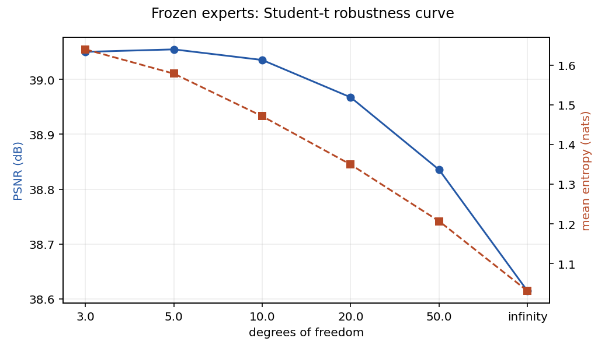
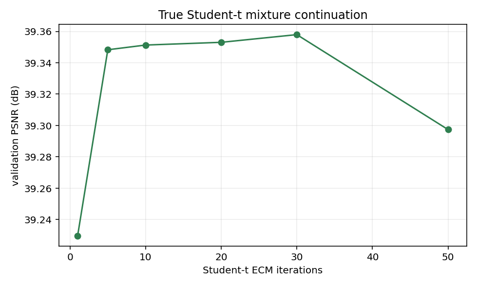
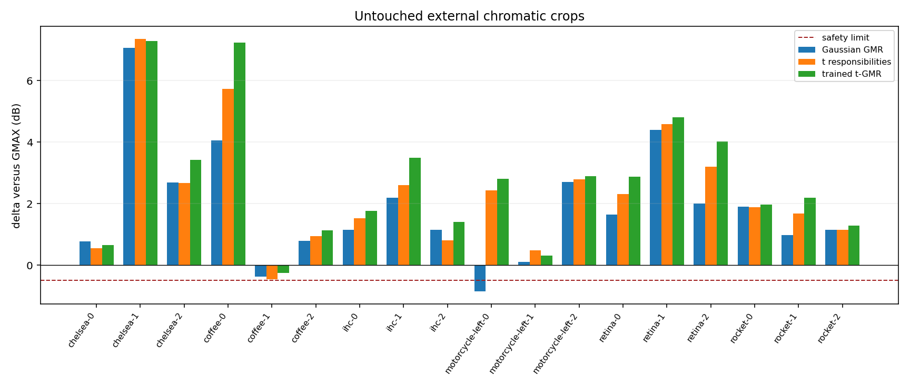
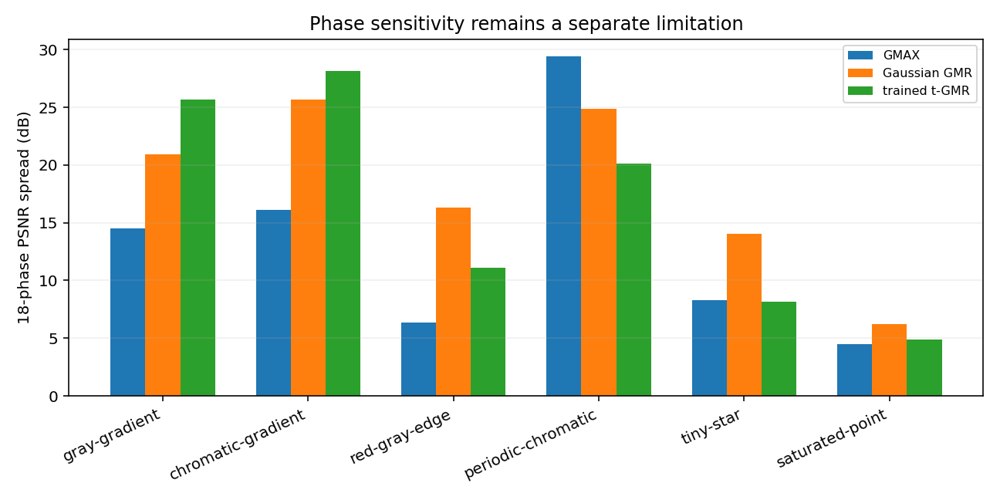

# X-Trans phase-conditioned Student-t mixture-regression report

## Decision

**GO — robust Student-t GMR.**

Replacing the Gaussian component tails in the frozen phase-conditioned GMR
with Student-t tails resolves the experiment's safety failure while increasing,
rather than sacrificing, held-out population quality:

- trained Student-t GMR reaches **35.518 dB** on untouched BSDS test
  coordinates;
- that is **+3.464 dB over GMAX**, **+1.987 dB over FULL-GMM**, and
  **+0.683 dB over the frozen Gaussian phase GMR**;
- changing only the frozen Gaussian responsibilities to Student-t already
  reaches 35.404 dB; true Student-t fitting adds another **0.114 dB**;
- p99 absolute channel error falls from 0.084625 for Gaussian GMR to 0.077291,
  an **8.67% reduction**;
- the former `motorcycle-left-0` failure changes from -0.853 dB to
  **+2.811 dB relative to GMAX**;
- no external crop falls more than 0.251 dB below GMAX;
- bright Hubble and Hydra remain above GMAX by 0.272 and 7.380 dB;
- every analytical control remains within the frozen 2 dB limit;
- validation quality increases as 25, 50, 100, and 200 training sources are
  supplied, and the 5--50-iteration curve is stable.

This is a research GO, not authorization for a production demosaicer. The
selected K=64 architecture still costs approximately 163,072 dense MACs per
pixel, hundreds of times more than GMAX, and its phase dependence is improved
on only four of six analytical controls. The next justified experiment is
therefore inference/model reduction, not another selector, EPLL, image-specific
EM, or GUI integration.

## Frozen setup and artifacts

Everything except the component distribution was inherited unchanged from the
phase-conditioned Gaussian GMR:

```text
patch support             7x7
phase models              18
observations per patch    49 physical X-Trans CFA values
targets                   two missing center channels
components per phase      64
DC handling               observed-rgb
covariance floor          1e-6
inference tau              0.0003
posterior temperature     4
training population       200 BSDS training sources
patches per phase         102,400
Gaussian initialization   checkpoint 10
```

The validation, untouched test, external chromatic, Hubble/Hydra, and
18-phase analytical coordinates are identical to the parent experiment. No
external crop or safety result entered model selection.

| Artifact | Bytes | SHA-256 |
|---|---:|---|
| `xtrans-gmr/results.json` | 560,075 | `4e4f62c9b570d486d703d068e0a0b96a11c3da2373c4fbf92f92dcbd7abb31e4` |
| `xtrans-gmm/results.json` | 1,467,552 | `2a1fd2c2ee2974c5760d68f107c480cb0e5312c894ab2b01f7103e219aeb654f` |
| `xtrans-tgmr/stage-a.json` | 148,663 | `40fd2b65cd93fc7f7f74b58ca05dc30bf2be4fb75ca3d3af30092305ca181b48` |
| `xtrans-tgmr/results.json` | 516,401 | `cd8156286cbd7f7f0135cdf11b1caa6ba060f7ea068db35ee54c6516512d5c4a` |

The result JSON was independently regenerated after the final oracle addition
and is byte-identical. Fitted checkpoints, decoded training vectors, BSDS,
Hubble/Hydra source images, and temporary output remain external under `/tmp`.

## Reference fidelity

The conditional distribution follows Peng Ding, [*On the Conditional
Distribution of the Multivariate t Distribution*](https://arxiv.org/abs/1604.00561),
arXiv:1604.00561. Fixed-degree-of-freedom mixture fitting follows the latent
scale updates in Peel and McLachlan, [*Robust mixture modelling using the t
distribution*](https://people.smp.uq.edu.au/GeoffMcLachlan/pm_sc00.pdf),
Statistics and Computing 10 (2000), DOI `10.1023/A:1008981510081`.

The implementation is independent; no reference source was copied.

For a component partitioned into observed values `y` and missing center values
`t`, let the observed dimension be `d=49` and

```text
delta_y = (y - mu_y)^T Sigma_yy^-1 (y - mu_y).
```

The observed Student-t likelihood is evaluated in the log domain:

```text
log p(y | k) = log Gamma((nu+d)/2) - log Gamma(nu/2)
               - d/2 log(nu*pi) - 1/2 log|Sigma_yy|
               - (nu+d)/2 log1p(delta_y/nu).
```

The exact conditional is

```text
t | y,k ~ Student-t(
    nu + d,
    mu_t + Sigma_ty Sigma_yy^-1 (y-mu_y),
    ((nu + delta_y)/(nu + d)) Sigma_t|y)
```

where `Sigma_t|y` is the Schur complement. Its finite predictive covariance
uses the additional `(nu+d)/(nu+d-2)` factor. All factorizations use Cholesky
solves and all posterior normalization uses log-sum-exp.

The component conditional location is the same affine predictor as in the
Gaussian GMR. Stage A therefore isolates the hypothesis cleanly: only the
responsibilities and predictive uncertainty change. The observed center CFA
sample is restored exactly after posterior averaging.

## Verification of the mathematical core

Focused tests establish:

- Student-t log-density parity with SciPy on deterministic multivariate cases;
- exact agreement of the implemented conditional location, scale, degrees of
  freedom, and predictive covariance with direct formulas;
- posterior weights summing to one under extreme likelihood ratios;
- exact measured-center CFA restoration;
- coverage of all 18 phases and all three center colors;
- deterministic fixed-`nu` ECM;
- bounded learned shared-`nu` updates;
- positive-definite regularized covariances;
- bit-identical Gaussian-limit output and responsibilities.

For `nu=infinity`, all 18 phases reproduce the frozen Gaussian GMR with a
maximum output and responsibility difference of exactly zero.

## Stage A — fixed Gaussian experts, Student-t responsibilities

The following sweep uses only frozen validation coordinates. Means,
covariances, weights, conditional component predictions, `tau`, and
temperature remain those of the Gaussian checkpoint.

| Degrees of freedom | Validation PSNR | Mean entropy | Mean max responsibility | Risk/error Spearman |
|---:|---:|---:|---:|---:|
| 3 | 39.050 | 1.639 | 0.474 | 0.794 |
| **5** | **39.055** | **1.578** | **0.494** | **0.792** |
| 10 | 39.035 | 1.471 | 0.526 | 0.789 |
| 20 | 38.967 | 1.349 | 0.562 | 0.786 |
| 50 | 38.835 | 1.207 | 0.603 | 0.783 |
| infinity / Gaussian | 38.615 | 1.031 | 0.653 | 0.778 |



The optimum is broad at `nu=3..10`, not a fragile single value. Validation
selects `nu=5`, **+0.440 dB** over the Gaussian likelihood. It raises the
effective component count from 3.55 to 6.59 and reduces the mean maximum
responsibility from 0.653 to 0.494.

Without retraining or external tuning, the responsibility-only model already
puts every external crop within the -0.5 dB limit. In particular,
`motorcycle-left-0` moves from -0.853 to **+2.435 dB** versus GMAX. The worst
remaining Stage-A crop is `coffee-1` at -0.461 dB.

This answers the first causal question: Gaussian posterior overconfidence was
a material part of the external failure. Heavy tails improve validation at the
same time, so this is not merely a robustness/accuracy trade.

## Stage B — true Student-t mixture fitting

The fixed-`nu` ECM starts from the frozen Gaussian parameters. For each sample
and component it estimates the standard latent robustness weight and uses it
in the location/scale updates; the mixing probability update remains based on
responsibilities. A fixed covariance floor prevents singular fits.

### Fixed degrees of freedom

One ECM continuation pass selected `nu=3` on validation:

| `nu` | Validation PSNR | p99 absolute error |
|---:|---:|---:|
| **3** | **39.229** | **0.047883** |
| 5 | 39.212 | 0.048105 |
| 10 | 39.150 | 0.048520 |
| 20 | 39.039 | 0.049013 |

The selected true mixture is therefore slightly heavier-tailed than the
responsibility-only optimum.

### ECM checkpoint stability

| Student-t continuation iterations | Mean training lower bound | Validation PSNR | p99 absolute |
|---:|---:|---:|---:|
| 1 | 137.136 | 39.229 | 0.047883 |
| 5 | 137.679 | 39.348 | 0.047490 |
| 10 | 137.984 | 39.351 | 0.047469 |
| 20 | 138.354 | 39.353 | 0.047558 |
| **30** | **138.587** | **39.358** | **0.047269** |
| 50 | 138.857 | 39.297 | 0.047135 |



The likelihood rises monotonically. Validation is essentially flat from 5 to
30 iterations and reverses only 0.061 dB by iteration 50, far inside the 0.3
dB stability bound. Validation selects the 30-iteration continuation.

The selected logical model identity is:

`8c93e89fd46aafe24fc193a4dbdd0d05efbb0b87300e879c03903a494eabdd87`

It contains 1,587,438 inherited mixture parameters plus one shared fixed
degree of freedom. Minimum component effective population is 10; median is
992; maximum covariance condition number is 9.16e6; minimum effective rank is
9/51. The lower ranks and increased condition number are reasons to preserve
the covariance floor and to avoid claiming that fitting is production-ready.

### Latent-scale evidence

On 256 evenly spaced training patches per phase, the posterior-expected latent
weight has median:

- **1.565** for ordinary patches;
- **0.439** for the top 1% reconstruction-error patches.

The model is therefore genuinely downweighting unusual samples during scale
estimation. It is not merely changing the likelihood normalization.

### Learned shared degree of freedom

The bounded generalized-ECM diagnostic drives the single learned value to its
lower bound, `nu=2.000001`, by iteration 5. It obtains 39.356 dB validation and
35.534 dB test, nearly identical to fixed `nu=3`, but has a worse minimum
external delta (-0.353 versus -0.251 dB). The boundary solution is not a stable
estimate of tail shape, so fixed `nu=3` remains the reviewed result.

Component-specific degrees of freedom were not attempted. Component labels
have phase-local meaning, and 18x64 independently learned tail parameters
would create precisely the overfit channel this experiment was intended to
avoid.

### Training population

| BSDS training sources | Validation PSNR | Frozen test PSNR |
|---:|---:|---:|
| 25 | 38.384 | 34.141 |
| 50 | 38.708 | 34.852 |
| 100 | 39.010 | 34.829 |
| **200** | **39.358** | **35.518** |

Validation rises monotonically. The 100-source test value is 0.023 dB below
the 50-source value, but the 200-source model is substantially best on both
validation and test. ECM contains no random initialization after the frozen
Gaussian checkpoint, so a nominal seed sweep would duplicate the same
calculation. Repeated four-thread training produced the same logical digest;
two independent two-thread runs matched one another but differed from the
four-thread result through BLAS reduction order. The reviewed policy fixes
four training threads and one evaluation thread.

## Untouched BSDS test

| Method | Pooled PSNR | p99 absolute |
|---|---:|---:|
| Markesteijn | 30.867 | 0.137975 |
| corrected-final MLRI | 30.985 | 0.134802 |
| GMAX | 32.054 | 0.122019 |
| FULL-GMM | 33.531 | 0.099805 |
| Gaussian phase GMR | 34.835 | 0.084625 |
| fixed Gaussian experts + Student-t responsibilities | 35.404 | 0.078690 |
| **trained Student-t GMR** | **35.518** | **0.077291** |
| trained Student-t component oracle, 7x7 | 38.684 | 0.051954 |
| trained Student-t component oracle, pixel | 45.239 | 0.024673 |

True Student-t fitting adds 0.114 dB beyond responsibility-only inference,
showing that both robust responsibilities and robust parameter estimation
matter. Responsibilities supply most of the gain.

The selected model wins 18 of 20 sources over Gaussian GMR. The two losses are
`101084.jpg` (-0.296 dB) and `107014.jpg` (-0.043 dB); the largest gain is
`108004.jpg` (+1.853 dB).

| Source | Gaussian GMR | Responsibility only | Trained t-GMR | t-GMR delta |
|---|---:|---:|---:|---:|
| `100007.jpg` | 38.935 | 39.724 | 39.584 | +0.649 |
| `100039.jpg` | 30.572 | 30.689 | 30.724 | +0.153 |
| `100099.jpg` | 48.724 | 48.763 | 49.111 | +0.387 |
| `10081.jpg` | 32.508 | 33.126 | 32.859 | +0.351 |
| `101027.jpg` | 49.682 | 49.947 | 50.450 | +0.768 |
| `101084.jpg` | 28.444 | 28.076 | 28.148 | -0.296 |
| `102062.jpg` | 40.373 | 40.739 | 40.601 | +0.228 |
| `103006.jpg` | 54.865 | 55.353 | 55.685 | +0.821 |
| `103029.jpg` | 61.573 | 61.823 | 62.435 | +0.863 |
| `103078.jpg` | 44.786 | 45.034 | 45.271 | +0.485 |
| `104010.jpg` | 41.713 | 42.298 | 42.583 | +0.871 |
| `104055.jpg` | 44.441 | 44.471 | 45.114 | +0.673 |
| `105027.jpg` | 36.222 | 36.573 | 36.478 | +0.255 |
| `106005.jpg` | 54.969 | 55.004 | 55.313 | +0.344 |
| `106047.jpg` | 54.964 | 54.955 | 55.024 | +0.061 |
| `107014.jpg` | 39.565 | 39.669 | 39.522 | -0.043 |
| `107045.jpg` | 46.496 | 47.046 | 47.608 | +1.112 |
| `107072.jpg` | 40.401 | 40.289 | 40.916 | +0.515 |
| `108004.jpg` | 27.366 | 28.830 | 29.219 | +1.853 |
| `108036.jpg` | 29.942 | 31.168 | 31.294 | +1.352 |

The 7x7 oracle still supplies 3.166 dB over the practical posterior. This is
capacity headroom, not permission to reopen hard expert selection: component
identities are phase-local and previous experiments showed that explicit
selection is unsafe.

## External chromatic safety

No external image participates in selection. The final `Delta` column is
trained t-GMR minus GMAX.

| Crop | GMAX | Gaussian GMR | Trained t-GMR | Delta |
|---|---:|---:|---:|---:|
| `chelsea-0` | 39.070 | 39.832 | 39.715 | +0.646 |
| `chelsea-1` | 37.719 | 44.772 | 45.002 | +7.283 |
| `chelsea-2` | 37.764 | 40.444 | 41.182 | +3.418 |
| `coffee-0` | 29.655 | 33.715 | 36.890 | +7.235 |
| `coffee-1` | 44.836 | 44.453 | 44.585 | **-0.251** |
| `coffee-2` | 42.049 | 42.844 | 43.177 | +1.128 |
| `ihc-0` | 34.669 | 35.815 | 36.428 | +1.759 |
| `ihc-1` | 45.797 | 47.990 | 49.278 | +3.481 |
| `ihc-2` | 40.767 | 41.917 | 42.164 | +1.397 |
| `motorcycle-left-0` | 43.299 | 42.446 | 46.110 | **+2.811** |
| `motorcycle-left-1` | 50.942 | 51.044 | 51.258 | +0.315 |
| `motorcycle-left-2` | 35.562 | 38.268 | 38.447 | +2.885 |
| `retina-0` | 49.189 | 50.825 | 52.070 | +2.880 |
| `retina-1` | 46.559 | 50.947 | 51.365 | +4.806 |
| `retina-2` | 51.027 | 53.024 | 55.052 | +4.025 |
| `rocket-0` | 56.243 | 58.140 | 58.210 | +1.968 |
| `rocket-1` | 30.297 | 31.266 | 32.492 | +2.195 |
| `rocket-2` | 66.232 | 67.385 | 67.523 | +1.291 |



The model repairs the named Motorcycle failure without tuning on it and does
not move the problem elsewhere. `coffee-1` remains a small regression but is
comfortably within the frozen -0.5 dB safety bound.

## Hubble and Hydra

| Sample | Markesteijn | MLRI | GMAX | Gaussian GMR | Responsibility only | Trained t-GMR | t-GMR vs GMAX |
|---|---:|---:|---:|---:|---:|---:|---:|
| Hubble uniform | 35.164 | 33.975 | 33.950 | 34.236 | 34.442 | 34.428 | +0.478 |
| Hubble bright | 17.645 | 15.959 | 15.435 | 15.561 | 15.810 | 15.707 | +0.272 |
| Hydra uniform | 79.628 | 77.944 | 76.078 | 79.009 | 79.010 | 78.392 | +2.314 |
| Hydra bright | 39.177 | 27.411 | 32.784 | 38.203 | 38.893 | 40.165 | +7.380 |

Both bright-target safety cases remain above GMAX. Trained t-GMR improves
Hydra bright by 1.962 dB over Gaussian GMR. It remains below Markesteijn on
Hubble bright and slightly below it on Hydra bright; the GO conclusion is
about stabilizing the statistical-prior branch, not claiming universal
superiority over Markesteijn.

## Analytical safety and phase behavior

| Scene | GMAX | Gaussian GMR | Responsibility only | Trained t-GMR | t-GMR - GMAX | Phase spread: GMAX / Gaussian / t-GMR |
|---|---:|---:|---:|---:|---:|---:|
| gray gradient | 69.907 | 72.928 | 72.239 | 76.609 | +6.702 | 14.517 / 20.951 / 25.695 |
| chromatic gradient | 59.401 | 63.705 | 65.193 | 70.101 | +10.701 | 16.110 / 25.660 / 28.112 |
| red/gray edge | 19.537 | 23.013 | 24.885 | 27.890 | +8.354 | 6.338 / 16.297 / 11.077 |
| periodic chromatic | 16.175 | 18.473 | 18.025 | 18.574 | +2.399 | 29.420 / 24.895 / 20.098 |
| tiny star | 8.539 | 8.340 | 8.492 | 8.224 | **-0.315** | 8.297 / 14.070 / 8.166 |
| saturated point | 3.807 | 3.861 | 3.925 | 3.984 | +0.176 | 4.518 / 6.206 / 4.858 |



The analytical gate passes: the worst aggregate delta is only -0.315 dB on
the tiny star. Phase spread improves over Gaussian GMR for the edge, periodic
texture, tiny star, and saturated point, but worsens on both gradients.
Student-t responsibilities therefore reduce some phase brittleness, especially
for sparse/high-frequency structures, but do not solve phase invariance in
general.

## Posterior confidence and calibration

On validation, the trained model has:

- mean entropy 1.461;
- mean maximum responsibility 0.546;
- effective component count 5.85;
- median top-two ratio 2.55;
- predictive-risk/error Spearman correlation **0.804**, versus 0.778 for the
  frozen Gaussian model.

The predictive-risk deciles are monotonic in actual RGB RMS, rising from
0.001095 in the lowest-risk decile to 0.025354 in the highest. This is better
calibration, not perfect calibration. Stage-A inspection shows that finite
tails make the formerly failing Motorcycle patch appropriately less certain
and reduce its RGB error. On `coffee-1`, however, the posterior becomes
slightly more confident while remaining slightly worse than GMAX. Entropy
alone is therefore not a safe fallback signal, and no confidence gate is
proposed.

## Cost

The selected model has 1,587,439 scalar parameters including `nu`, with the
same approximately 5.83 MiB float32 covariance cache as Gaussian GMR. Center
inference retains the estimated **163,072 dense MACs per pixel** and 64
component exponentials. Student-t adds roughly one `log1p` and scalar tail
expression per component plus predictive-scale arithmetic.

An unoptimized one-thread NumPy microbenchmark over 11,520 patches measured:

| Model | Median | Per patch | Relative to Gaussian |
|---|---:|---:|---:|
| Gaussian GMR | 0.5766 s | 50.05 us | baseline |
| responsibility-only t | 0.6772 s | 58.79 us | +17.5% |
| trained t-GMR | 0.6642 s | 57.66 us | +15.2% |

One four-thread full Student-t ECM pass took approximately 2 minutes 56
seconds and peaked near 2.02 GiB RSS on this host. These are research Python
measurements, not projected optimized C++ throughput.

The quality/safety gain is large enough to justify a separate optimization
study. It is not small enough to dismiss like the earlier BM3D increment, but
the current architecture is not yet a practical RawTherapee method.

## Gate summary

| Gate | Result | Evidence |
|---|---|---|
| A — Gaussian parity | PASS | bit-identical output and responsibilities over all 18 phases |
| B — robust likelihood | PASS | Stage A +0.440 dB validation versus Gaussian |
| C — BSDS | PASS | +3.464 dB versus GMAX and +0.683 dB versus Gaussian GMR |
| D — external safety | PASS | worst crop -0.251 dB; Motorcycle +2.811 dB |
| E — bright stars | PASS | Hubble +0.272 dB; Hydra +7.380 dB versus GMAX |
| F — analytical | PASS | worst control -0.315 dB versus GMAX |
| G — stability | PASS | monotonic validation/source curve; only 0.061 dB late reversal |

## Answers to the required questions

### Does Student-t preserve the GMR gain?

Yes. It increases the gain: trained t-GMR is +3.464 dB over GMAX and +0.683
dB over Gaussian GMR on untouched BSDS.

### Was the external failure caused by Gaussian posterior overconfidence?

Materially, yes. Changing only the likelihood repairs Motorcycle before any
Student-t parameter fitting, while raising validation by 0.440 dB. The fitted
scale model adds further quality. It would be too strong to claim Gaussian
tails were the *only* model mismatch because one external crop remains mildly
below GMAX and phase behavior is mixed.

### Is posterior uncertainty better calibrated?

Yes, modestly. Risk/error Spearman rises from 0.778 to 0.804 and validation
risk deciles are monotonic. The remaining `coffee-1` behavior proves that
confidence is not reliable enough for a fallback gate.

### Is `motorcycle-left-0` repaired without tuning to it?

Yes: -0.853 dB becomes +2.811 dB versus GMAX. Validation alone selected all
hyperparameters.

### Are Hubble and Hydra bright targets preserved?

Yes relative to the frozen GMAX gate: +0.272 and +7.380 dB. Hubble remains
below Markesteijn, which must remain visible in any later comparison.

### Does phase spread improve?

Partly. Four of six analytical controls improve versus Gaussian GMR, including
the tiny star, but both gradient spreads worsen. Heavy tails are not a general
phase-invariance solution.

### Is training stable?

Yes under the frozen continuation policy. Validation improves monotonically
with source count, checkpoint behavior is flat after iteration 5, repeated
fixed-thread runs are deterministic, and the full 200-source model is best.
Cross-thread BLAS order changes the logical bytes, so thread count remains part
of the reproduction contract.

### Does true Student-t fitting outperform responsibility reinterpretation?

Yes, by 0.114 dB on test, with lower p99 error. Most of the improvement comes
from the heavy-tailed responsibilities; fitted robust locations/scales add a
smaller but measurable amount.

### Which degrees of freedom are selected?

Stage A selects `nu=5`; true fixed-`nu` fitting selects `nu=3`. Learned shared
`nu` hits the lower bound near 2 and is not retained.

### Is the gain worth the expensive architecture?

It is large enough to justify one optimization/reduction experiment, because
it combines a 0.683 dB test improvement with repair of the sole external gate
failure. It is not yet practical enough to justify production C++, PP3/GUI
exposure, or whole-image integration.

## Final interpretation and boundary

The central hypothesis is supported:

> **Gaussian tail brittleness was the last demonstrated safety failure in the
> frozen phase-conditioned GMR experiment. A moderate Student-t model preserves
> and enlarges its nonlinear population gain, repairs the external Motorcycle
> regression, retains sparse-star safety, and improves several phase-sensitive
> controls without an external selector.**

The following remain out of scope and unjustified by this experiment:

- EPLL or overlap reconstruction;
- discriminative fallback or content classification;
- image-specific EM;
- component-specific `nu`;
- broader-corpus retuning;
- production C++ and RawTherapee method integration;
- GUI, PP3, defaults, translations, or packaging.

The next admissible question is whether component pruning, smaller K,
low-rank/structured covariance, batching, and native vectorization can retain
the safety result at practical cost.
