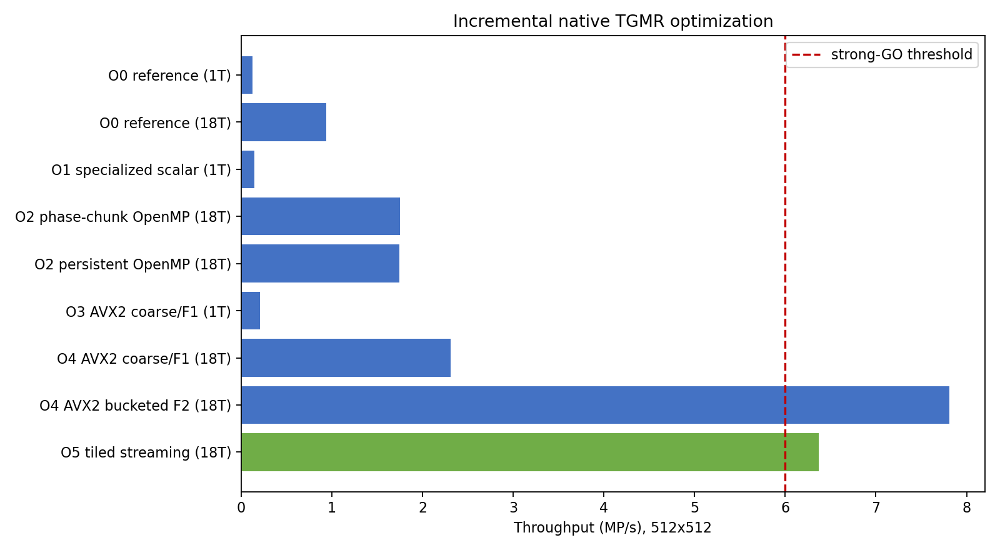
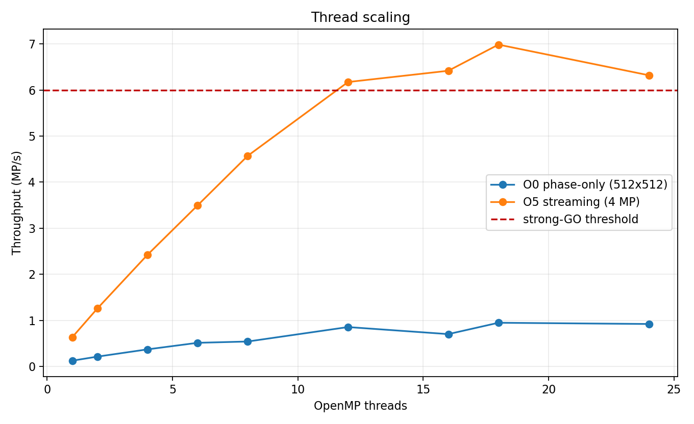
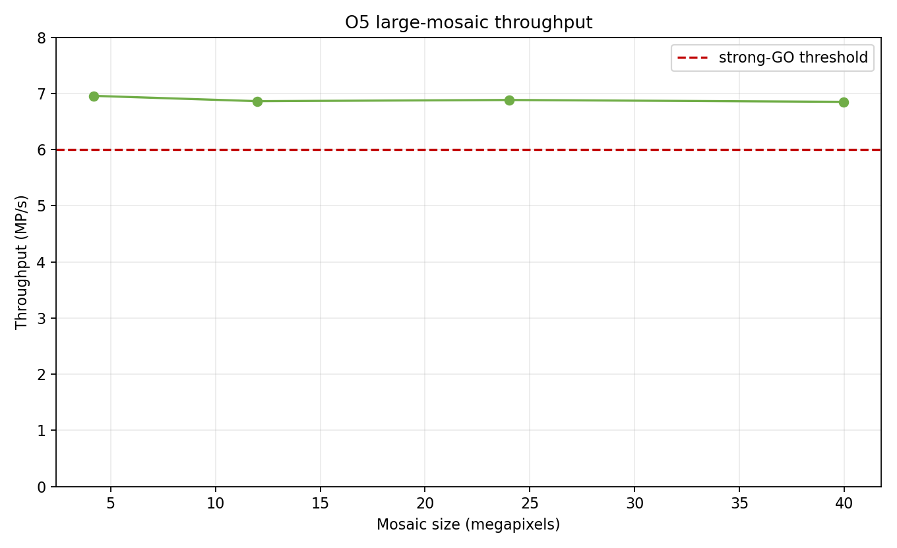

# X-Trans K32/S9/q8 Student-t GMR native optimization report

Historical research record at `0043c7d9c15588022614066402b26fc2d8f20c3e` on
`xtrans-neural-demosaic`, retained for the native arithmetic/optimization
contract. Research programs and weights are not part of this focused branch.
Its timing and quality figures must not be attributed to the new corpus-v1
model; see the [productization report](xtrans-tgmr-productization-report.md)
for the current candidate and clean-branch verification.

## Decision

**STRONG GO — the frozen statistical algorithm is CPU-viable after AVX2,
fine-grained OpenMP, and bounded streaming.**

The selected implementation processes a directly generated scalar X-Trans
mosaic at **6.85 MP/s** on the Ryzen 9 5900X. The measured 39,959,032-pixel
run takes **5.833 seconds** (median of five after one warm-up), compared with
the previous 0.984 MP/s matrix-input implementation and its 40.7-second
extrapolation. Throughput is stable from 4 to 40 MP, not a small-cache result.

This is an implementation result only. It does not resolve model-data
redistribution, add a RawTherapee demosaicing method, or establish complete
pipeline/preview performance. It justifies a separate hidden engine-integration
experiment.



## Frozen contract

No statistical parameter changed:

| Property | Value |
| --- | ---: |
| Phase models | 18 |
| Support | 7x7, 49 physical CFA values |
| Coarse marginal | central 3x3 / S9 |
| Components | 32 per phase |
| Full shortlist | 8 |
| Student-t degrees of freedom | 3 |
| Posterior temperature | 4 |
| Mismatch floor | 0.0003 |
| DC | observed-rgb |
| Arithmetic/model precision | float32 |

The external native artifact remains 6,073,164 bytes with SHA-256
`6279b6a593ef4b595b1aff246182682b60c7eea701373ee2eb9f80cfcb50485c`.
The fitted K32 source model remains external. Neither is tracked.

The implementation retains the old scalar executor as O0 by including the
existing source into the optimized research translation unit. It therefore
uses exactly the same parser, model representation, and scalar `predict()`
function for its correctness oracle.

## Baseline profile

Linux denies this user access to performance events because
`kernel.perf_event_paranoid=4`. Consequently, cycles, instructions, IPC,
branch misses, and hardware cache misses could not be recorded without a
system-wide privilege/configuration change. The experiment did not alter that
setting and does not invent counter values.

An independent `gprof` build (`-O2 -pg -fno-inline`) on 168x168 attributed the
sampled scalar cost as follows. The deliberately disabled inlining makes the
standard-library accessor row an instrumentation artifact; the important
result is the dominance of the two triangular-solve families.

| Sampled function/category | CPU time |
| --- | ---: |
| Eight 49-D triangular/Mahalanobis solves | 54.94% |
| Thirty-two 9-D triangular/Mahalanobis solves | 11.73% |
| `std::array` accessor overhead exposed by `-fno-inline` | 16.06% |
| Remaining `predict()` work: DC, residuals, selection, prediction, normalization | 9.88% |
| `logDensity()` directly sampled | 0.62% |
| `exp()` | below the 0.62% sampling resolution |

The 49-D solves were already dominant before optimization. `log1p`/`exp` were
not the main explanation for 0.984 MP/s, although eliminating them produced a
useful scalar gain and simplified SIMD posterior evaluation.

The old OpenMP decomposition also capped top-level concurrency at 18 phase
jobs. Its 512x512 scaling peaked at 18 threads:

| Threads | MP/s | Speedup | Efficiency |
| ---: | ---: | ---: | ---: |
| 1 | 0.125 | 1.00x | 100% |
| 2 | 0.213 | 1.70x | 85.0% |
| 4 | 0.371 | 2.96x | 74.0% |
| 6 | 0.513 | 4.10x | 68.3% |
| 8 | 0.541 | 4.32x | 54.0% |
| 12 | 0.855 | 6.83x | 56.9% |
| 16 | 0.702 | 5.61x | 35.0% |
| 18 | 0.948 | 7.57x | 42.1% |
| 24 | 0.921 | 7.36x | 30.7% |

The irregular 16-thread result and the lack of work beyond 18 threads are
consistent with coarse phase-level scheduling rather than a clean scalable
pixel kernel.

## Exact fixed-Student-t specialization

For S9, with `nu=3`, the scalar log score is

\[
C_k-6\log(1+\delta_k/3).
\]

Shortlist ordering is therefore evaluated with

\[
\frac{\exp((C_k-C_{\max})/6)}{1+\delta_k/3}.
\]

The phase-common subtraction prevents overflow and cancels from ranking. For
the full 49-D likelihood at temperature four, the positive weight is

\[
\exp((C_k-C_{\max})/4)
\left(1+\delta_k/3\right)^{-6.5}
=
\frac{B_k}{s^6\sqrt{s}}.
\]

This removes all per-pixel `log1p` and `exp` calls. It is an algebraic rewrite,
not a likelihood approximation. Across 1,152 deterministic phase probes the
specialized scalar and AVX2 passes both produced zero shortlist mismatches
against the logarithmic reference.

O1 reaches 0.149 MP/s versus O0's 0.127 MP/s at one thread: **1.17x** from
specialization and fixed-size insertion selection alone. This confirms that
transcendentals mattered, but were not the primary bottleneck.

The final SIMD path additionally precomputes correctly rounded float
reciprocals of fixed Cholesky diagonals and multiplies by them. This removed 58
vector divisions per expert evaluation. The complete scientific parity suite
shows that the one-rounding-order change remains far below the frozen bound.
No approximate reciprocal, reciprocal-square-root, `-ffast-math`, clamp, or
weight fallback is used.

## OpenMP decomposition

P1 flattens `(phase, chunk)` jobs and uses static scheduling. P2 enters one
persistent region and applies an intra-phase `omp for`, incurring a barrier for
each phase. At 512x512 and 18 threads:

| Decomposition | MP/s |
| --- | ---: |
| P1 phase x chunk | **1.753** |
| P2 persistent phase-major | 1.744 |

P1 is selected. It is only about 0.5% faster here, but it does not impose 18
global barriers and maps naturally onto later component-bucket chunks.

The matrix-input F2 chunk sweep at 1024x1024 was:

| Chunk | MP/s |
| ---: | ---: |
| 128 | 6.781 |
| 256 | 7.465 |
| 512 | 7.836 |
| 1024 | **7.973** |
| 2048 | 7.958 |
| 4096 | 7.738 |

The streaming executor uses 512 as a bounded compromise because most
phase-local populations inside a 128x128 tile are already below 1024.

## SIMD architecture and attribution

The coarse model is transposed to coefficient-major AoSoA in four groups of
eight components. One pixel's observation is broadcast, and AVX2 lanes solve
eight independent S9 component systems. Stable scalar insertion then selects
the top eight IDs.

The full stage uses F2, not gathers across unrelated shortlisted components.
For every phase/chunk it:

1. computes each pixel's shortlist;
2. buckets `(component, pixel, slot)` requests locally;
3. processes eight pixels sharing one component per AVX2 group;
4. broadcasts that component's Cholesky coefficients and conditional gains;
5. performs 49-D solves and two target predictions with FMA;
6. writes slot results back and normalizes each pixel's eight weights.

No global bucket, lock, or cross-pixel reduction exists. The scalar F1 tail is
retained for incomplete groups and as an attribution control.

| Variant | Threads | SIMD | Input | MP/s | Incremental interpretation |
| --- | ---: | --- | --- | ---: | --- |
| O0 reference | 1 | no | matrix | 0.127 | scalar baseline |
| O0 reference | 18 | no | matrix | 0.938 | phase-only OpenMP |
| O1 specialized scalar | 1 | no | matrix | 0.149 | 1.17x over O0/1T |
| O2 chunked OpenMP | 18 | no | matrix | 1.753 | 1.87x over O0/18T |
| O3 coarse AVX2/F1 | 1 | yes | matrix | 0.208 | 1.40x over O1 |
| O4 coarse AVX2/F1 | 18 | yes | matrix | 2.313 | 1.32x over O2 |
| O4 bucketed full F2 | 18 | yes | matrix | **7.812** | 3.38x over F1 |
| O5 tiled streaming | 18 | yes | mosaic | **6.367** | bounded end-to-end input |

The decisive optimization is same-component full-likelihood SIMD, not coarse
S9 SIMD. The extra transposed/inverse-diagonal cache is 343,296 bytes
(335.25 KiB), 5.65% of the 5.79 MiB native model artifact.

GCC's vectorization report confirms 32-byte-vector loops, and disassembly
contains `vfmadd*`, `vfnmadd*`, `vdivps`, and `vsqrtps`. A separate
`-march=znver3` build reached 6.815 MP/s versus 6.985 MP/s for the explicit
`-mavx2 -mfma` measurement; it supplied no reproducible advantage. Explicit
intrinsics remain necessary for F2's SIMD axis and request layout.

## Streaming executor and memory

O5 accepts one scalar CFA mosaic and writes RGB. It derives a fixed
`(x mod 6, y mod 6) -> model phase` table by matching each model observation
pattern to RawTherapee's canonical X-Trans matrix. A 7x7 neighborhood is
gathered with reflect-without-edge-repetition boundaries.

Tiles keep phase-coordinate lists, but observations are materialized only for
the current phase/chunk and immediately discarded. There is no whole-image
49-float matrix. The selected 128x128 tile balances task count and bucket
population:

| Tile | MP/s at 1024x1024 |
| ---: | ---: |
| 64 | 6.642 |
| 128 | **6.832** |
| 256 | 6.428 |
| 512 | 2.364 |

Large tiles expose too few top-level tile jobs; very small tiles shorten
same-component buckets. On a profiled 4 MP run, accumulated worker time was
0.984 seconds gathering and 8.866 seconds in inference: **9.99% gather,
90.01% inference** within those measured stages. The remaining optimization
target is still the exact full solve, not CFA packing.

At 4 MP, matrix input reaches 7.326 MP/s with 888 MiB peak RSS. Streaming
reaches 6.957 MP/s with 85 MiB peak RSS. Thus eliminating the unrealistic
matrix costs only 4.7% throughput at representative size while removing about
824 MiB of transient storage.

For the 39.96 MP case, peak RSS is 645,896 KiB (630.8 MiB). This is explained
by approximately 160 MiB scalar input plus 480 MiB RGB output and bounded
tile/thread scratch. It is not a full-frame feature/observation cache.

## Final scaling and affinity



O5 scaling on 2048x2048, with one warm-up and five timed runs:

| Threads | MP/s | Speedup | Efficiency |
| ---: | ---: | ---: | ---: |
| 1 | 0.633 | 1.00x | 100.0% |
| 2 | 1.256 | 1.98x | 99.2% |
| 4 | 2.423 | 3.82x | 95.6% |
| 6 | 3.496 | 5.52x | 92.0% |
| 8 | 4.572 | 7.22x | 90.2% |
| 12 | 6.173 | 9.75x | 81.2% |
| 16 | 6.418 | 10.13x | 63.3% |
| 18 | **6.985** | **11.03x** | 61.3% |
| 24 | 6.320 | 9.98x | 41.6% |

SMT helps through 18 threads but regresses at 24. Eighteen is selected for
this host. The four 18-thread affinity combinations ranged from 6.46 to 7.19
MP/s on 4 MP; their ordering did not remain meaningful on 40 MP. The reported
large runs use `OMP_PLACES=cores,OMP_PROC_BIND=spread`, which delivered stable
near-linear size scaling. Affinity tuning is a small secondary effect, not the
source of the result.

The 168x168 case reaches only 3.39 MP/s because nine 64x64 tiles cannot occupy
18 threads consistently. The 512 and 1024 cases reach 6.50 and 6.99 MP/s.

## Direct large-mosaic measurements



| Geometry | Pixels | Median | MP/s | Peak RSS |
| --- | ---: | ---: | ---: | ---: |
| 2048x2048 | 4.19 MP | 0.603 s | 6.957 | 85 MiB |
| 4000x3000 | 12.00 MP | 1.749 s | 6.862 | 204 MiB |
| 6000x4000 | 24.00 MP | **3.487 s** | 6.883 | 387 MiB |
| 7738x5164 | 39.96 MP | **5.833 s** | 6.850 | 631 MiB |

The measured 24 MP and 40 MP results are therefore approximately 3.49 and
5.83 seconds, not extrapolations. The old 0.984 MP/s implementation implied
24.4 and 40.7 seconds. O4 matrix input was not run at 24/40 MP because it would
require roughly 4.7/7.8 GiB just for the 49-float matrix; its 1 MP and 4 MP
measurements (7.97 and 7.33 MP/s) establish the expected near-linear range.

## Numerical and safety parity

The final reciprocal/AVX2/F2 kernel was run over every sample used by the
frozen scientific gate: 11,520 untouched BSDS pixels, 2,592 external
chromatic pixels, Hubble/Hydra uniform and bright subsets, and all 18 phases
of the six analytical scenes.

| Check | Result |
| --- | ---: |
| Complete evaluation RMS versus frozen float32 | `4.2939e-8` |
| Complete evaluation maximum | `4.7684e-7` |
| Streaming versus scalar streaming RMS | `6.4176e-8` |
| Streaming versus scalar streaming maximum | `5.3644e-7` |
| Top-8 mismatches, scalar specialization / 1,152 | 0 |
| Top-8 mismatches, AVX2 / 1,152 | 0 |
| Non-finite values | 0 |
| Native center samples | exact |
| Output hashes at 1/12/18/24 threads | identical |

The selected output is vastly inside the requested `1e-6` RMS and `1e-5`
maximum bounds. The previous frozen safety results consequently remain
unchanged to reported precision:

- untouched BSDS remains 35.056 dB, +3.002 dB over GMAX;
- all 18 external crops retain their gate, worst -0.314 dB from GMAX;
- Hubble-bright and Hydra-bright remain above GMAX;
- all analytical cases retain the -2 dB gate;
- phase spreads are numerically unchanged;
- physical center samples are bit-exact.

## Answers to the experiment questions

- **Original bottleneck:** principally the eight 49-D triangular solves, then
  the 32 S9 solves. Generic logs were secondary; coarse phase-only OpenMP also
  left substantial parallel capacity unused.
- **Specialization:** yes. Fixed `nu=3,T=4` removes per-pixel log/exp while
  preserving shortlist identity and output within sub-micro-unit error. Alone
  it gives 1.17x.
- **OpenMP:** phase/chunk jobs give 1.87x over the old 18-job path at the same
  thread count. P1 narrowly beats P2. Eighteen threads are optimal; full SMT
  is harmful.
- **SIMD:** S9 across components helps by about 1.40x at one thread. The major
  gain is full F2 SIMD across eight pixels sharing one component: 3.38x over
  scalar full evaluation after the other optimizations.
- **Layout:** coefficient-major S9 AoSoA plus component-bucketed full data is
  best. It costs 335 KiB beyond the native artifact.
- **Streaming:** direct mosaic gathering costs about 10.5% of measured worker
  stages and only 4.7% throughput at 4 MP; it removes the unrealistic matrix
  and scales at roughly 6.9 MP/s through 40 MP.
- **Numerical parity:** maximum `4.77e-7`, RMS `4.29e-8` over the full frozen
  set; top-eight audits are identical and native samples exact.
- **Safety:** all frozen quality, star, external, analytical, and phase gates
  reproduce.
- **Runtime:** 6.85 MP/s at 39.96 MP; 24 MP takes 3.49 s and 39.96 MP takes
  5.83 s.
- **Remaining bottleneck:** exact 49-D same-component triangular solves and
  conditional prediction remain about 90% of measured gather/inference worker
  time. Further improvement would require more aggressive kernel packing or a
  changed statistical model; neither is necessary to pass this viability gate.

The original 0.984 MP/s result was primarily an implementation limitation.
The exact successful K32/S9/q8 model is not intrinsically too expensive for a
high-quality CPU demosaicer on this machine.

## Reproduction and scope

The optimized research executor is built with:

```sh
g++ -O3 -DNDEBUG -std=c++11 -fopenmp -mavx2 -mfma \
  -Wall -Wextra -Wpedantic -Werror \
  tools/xtrans_tgmr_reduce/native/tgmr_optimized_benchmark.cc \
  -o /tmp/xtrans-tgmr-reduce/tgmr_optimized_benchmark
```

The complete native parity suite is:

```sh
nice -n 10 env OPENBLAS_NUM_THREADS=1 OMP_NUM_THREADS=1 \
  .venv/bin/python -m tools.xtrans_tgmr_reduce.native_optimized_check \
    --executable /tmp/xtrans-tgmr-reduce/tgmr_optimized_benchmark \
    --native-artifact /tmp/xtrans-tgmr-reduce/tgmr32-native.bin \
    --model /tmp/xtrans-tgmr-reduce/models/k32-nu3-i30.npz \
    --full --threads 12
```

The tracked measurements are in
[results.json](images/xtrans-tgmr-native-opt/results.json). The renderer and
all native code are development-only. No learned model, corpus image, native
output, production method, or GUI setting is committed.
