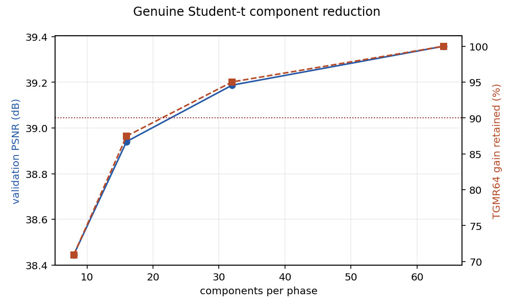
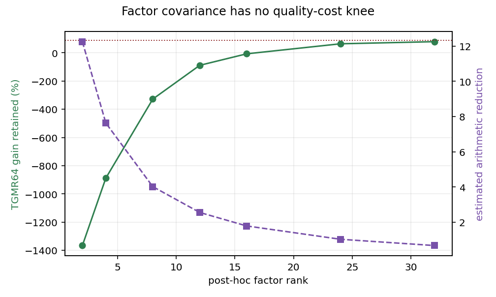
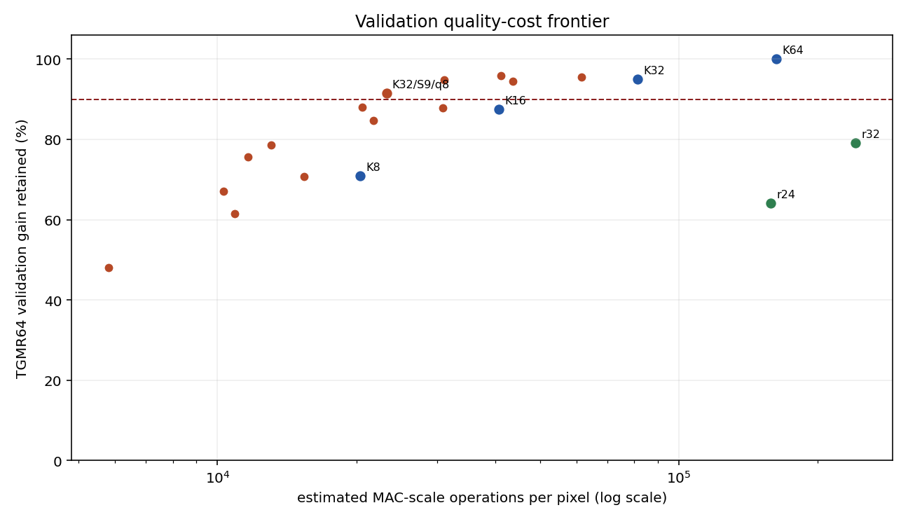
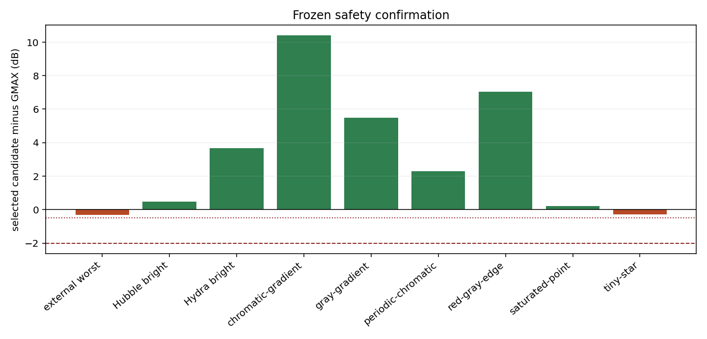

# X-Trans Student-t GMR model-reduction and inference report

Historical research record, retained to document the K32/S9/q8 architecture.
Its experiments and commands refer to the original `xtrans-neural-demosaic`
branch at `0043c7d9c15588022614066402b26fc2d8f20c3e`, not this focused product
branch. The figures and cited compact result JSON remain available here;
research programs and BSDS-trained weights are intentionally omitted. For the
current 5,000-source model and accepted limitations, read the
[productization report](xtrans-tgmr-productization-report.md).

## Decision

**PARTIAL — the validated model can be reduced safely, but not enough to make
it a practical RawTherapee demosaicer.**

Validation selected a genuine 32-component Student-t GMR followed by a central
3x3 (`S9`) marginal likelihood and an eight-component full-likelihood
shortlist. This candidate:

- retains 91.45% of the frozen `TGMR64-FULL` MSE gain on validation;
- retains 90.81% on untouched BSDS test;
- remains 3.002 dB above GMAX on test;
- passes every unchanged external, star, analytical, and native-sample safety
  gate;
- is effectively lossless in float32;
- reduces the estimated arithmetic from 163,072 to 23,264 MAC-scale
  operations per pixel, only 7.01x.

That reduction does not reach the experiment's 10x quality-first fallback
target. A research C++11/OpenMP implementation reaches 0.984 MP/s on a Ryzen 9
5900X at 1024x1024, extrapolating to approximately 40.7 seconds for 40 MP
before the rest of RawTherapee's pipeline. It is therefore not a plausible
drop-in demosaicer yet.

This experiment adds no engine method, PP3 identifier, GUI entry, or production
model. The fitted models and native model binary remain external.

## Frozen contract and separation

The immutable research reference is the model from
`devnotes/xtrans-student-t-gmr-report.md` in the archived research revision:

| Property | Frozen value |
| --- | ---: |
| Support | 7x7 |
| X-Trans phase banks | 18 |
| Observed variables | 49 physical CFA samples |
| Targets | two missing center channels |
| Components per phase | 64 |
| Student-t degrees of freedom | 3 |
| Inference mismatch floor | 0.0003 |
| Posterior temperature | 4 |
| DC mode | observed-rgb |
| Training | 200 BSDS sources, 30 t-ECM iterations |

`TGMR64-FULL` reproduced the frozen validation result exactly at 39.357946 dB
before any selection. K, pruning policy, factor rank, support, and shortlist
size were selected only from the frozen validation samples. Untouched BSDS,
external chromatic crops, Hubble/Hydra, and analytical controls were opened
only after validation froze K32/S9/q8.

The genuine K8, K16, and K32 Student-t models were continued independently
from their corresponding Gaussian checkpoints. They were not sliced from K64.
Their logical identities are:

| K | Logical SHA-256 | t-ECM time |
| ---: | --- | ---: |
| 8 | `f0cef4c98c04b9077f7046c48c82a46abb60a6a60872194ec5fa32e25c00e030` | 311.81 s |
| 16 | `f341ea5a9672ed65e7914bc1ead36d3d3fc867eec0cb725f8b9e883d3ea46ed8` | 614.31 s |
| 32 | `4a81bb00b9ca4839d6f581d1aa4f57e85aefe270d1d7191395d91aa5adbb574c` | 1165.92 s |

## Baseline context

All methods below use the same 34,560 untouched BSDS center-channel values.

| Method | PSNR | p99 absolute error |
| --- | ---: | ---: |
| Markesteijn | 30.867 dB | 0.13797 |
| corrected-final MLRI | 30.985 dB | 0.13480 |
| GMAX | 32.054 dB | 0.12202 |
| Gaussian phase GMR | 34.835 dB | 0.08462 |
| `TGMR64-FULL` | 35.518 dB | 0.07729 |
| selected K32/S9/q8 | **35.056 dB** | **0.08149** |

The reduced candidate's p99 remains 3.70% below Gaussian GMR and 33.21% below
GMAX, although it is 5.44% above `TGMR64-FULL`.

## Phase A: genuine component reduction

| K | Validation | Test | Test benefit retained | Test p99 | External | Dense cost |
| ---: | ---: | ---: | ---: | ---: | ---: | ---: |
| 8 | 38.445 dB | 34.301 dB | 73.49% | 0.09329 | 39.671 dB | 0.125x |
| 16 | 38.941 dB | 34.863 dB | 86.65% | 0.08637 | 39.925 dB | 0.25x |
| 32 | 39.188 dB | 35.450 dB | 98.71% | 0.07785 | 40.283 dB | 0.50x |
| 64 | 39.358 dB | 35.518 dB | 100.00% | 0.07729 | 40.624 dB | 1.00x |

K32 is the smallest genuine model satisfying the 90% validation rule. K16 is
still 2.809 dB above GMAX, but misses both the 90% retained-benefit rule and
the requested +3 dB test target. K8 also makes Hubble-bright 0.081 dB worse
than GMAX. K64 is therefore not necessary for aggregate quality or safety,
but reducing below K32 loses too much of the breakthrough.

## Post-hoc component removal

Post-hoc pruning answers a different question from genuine smaller-model
training. Results below are validation-only because the policy was not chosen
as the final candidate.

| Policy | Kept | Validation | Gain retained |
| --- | ---: | ---: | ---: |
| weight | 8 | 37.577 dB | 37.03% |
| weight | 16 | 38.419 dB | 70.02% |
| weight | 24 | 38.939 dB | 87.42% |
| weight | 32 | 39.111 dB | 92.73% |
| weight | 48 | 39.305 dB | 98.47% |
| training responsibility | 8 | 37.577 dB | 37.03% |
| training responsibility | 16 | 38.441 dB | 70.79% |
| training responsibility | 24 | 38.919 dB | 86.79% |
| training responsibility | 32 | 39.124 dB | 93.11% |
| training responsibility | 48 | 39.305 dB | 98.47% |

K64 contains removable experts, but retraining at K32 is slightly better than
keeping the 32 most-used K64 experts at identical dense cost. Low mixture
weight is not a sufficient rare-structure argument, so the post-hoc model was
not promoted over genuine K32.

## Phase B: factor-plus-diagonal covariance

The implementation uses Woodbury and the matrix-determinant lemma. It was
numerically checked against a dense reconstruction of the same approximate
covariance, so the poor result is not caused by a dense/factor inference
mismatch.

| Rank | Validation | Gain retained | Mean observed-block Frobenius error | MAC estimate | Parameters |
| ---: | ---: | ---: | ---: | ---: | ---: |
| 2 | 28.285 dB | -1366.10% | 0.3231 | 13,312 | 236,142 |
| 4 | 29.838 dB | -887.93% | 0.1948 | 21,376 | 353,646 |
| 8 | 32.880 dB | -327.86% | 0.0982 | 40,576 | 588,654 |
| 12 | 35.347 dB | -88.63% | 0.0597 | 63,872 | 823,662 |
| 16 | 36.660 dB | -6.98% | 0.0392 | 91,264 | 1,058,670 |
| 24 | 38.257 dB | 64.14% | 0.0186 | 158,336 | 1,528,686 |
| 32 | 38.684 dB | 79.14% | 0.0088 | 241,792 | 1,998,702 |

Even rank 24 fails the 90% trigger while costing almost as much arithmetic as
the dense full model. Rank 32 remains below 80% retained gain and costs more
than dense inference under the counted implementation. The useful conditional
covariances are not low-rank enough for this factorization. In accordance with
the prompt's early-stop rule, genuine Student-t mixture-of-factor-analyzers
training was not implemented.

## Phase D/E: posterior sparsity and observable shortlist

Exact K64 posterior truncation is encouraging in isolation:

| Exact top q | Validation | Gain retained | Mean mass | p05 mass |
| ---: | ---: | ---: | ---: | ---: |
| 1 | 38.110 dB | 58.63% | 0.5460 | 0.1910 |
| 2 | 39.001 dB | 89.35% | 0.7090 | 0.3387 |
| 4 | 39.341 dB | 99.50% | 0.8419 | 0.5358 |
| 8 | 39.410 dB | 101.48% | 0.9329 | 0.7540 |
| 16 | 39.392 dB | 100.97% | 0.9828 | 0.9242 |
| 32 | 39.361 dB | 100.10% | 0.9990 | 0.9946 |

Top eight remains similarly concentrated on untouched test (mean mass 0.9332,
p05 0.7785), external chromatic (0.9553/0.7842), Hubble bright
(0.8821/0.7058), and Hydra bright (0.9829/0.9489). Exact truncation can even
remove weak tail experts that slightly harm the mean. It has no runtime value
until the important experts can be found cheaply.

The coarse physical CFA marginals give the following results. `S9`/`S25`
refer to the likelihood dimensions; the frozen `observed-rgb` DC is still
calculated from all 49 physical observations, because changing that transform
would change the statistical model rather than merely accelerate it.

| Coarse support | Full shortlist | Validation | Gain retained | Exact-top inclusion | Mean exact mass |
| ---: | ---: | ---: | ---: | ---: | ---: |
| S9 | 4 | 38.532 dB | 73.99% | 70.50% | 0.5898 |
| S9 | 8 | 39.159 dB | 94.18% | 85.64% | 0.7563 |
| S9 | 16 | 39.328 dB | 99.14% | 95.63% | 0.8978 |
| S25 | 4 | 39.201 dB | 95.42% | 92.47% | 0.7636 |
| S25 | 8 | 39.388 dB | 100.85% | 97.91% | 0.8846 |
| S25 | 16 | 39.397 dB | 101.12% | 99.66% | 0.9631 |

S9 is less reliable than S25, but its much cheaper marginal makes K32/S9/q8
the predefined minimum-cost validation candidate above 90%. On untouched test
it includes K32's exact top expert 90.53% of the time and retains 83.31% mean
exact posterior mass. That is sufficient for reconstruction, but it leaves no
large cost margin.

## Combined validation frontier

| Candidate | Validation | Gain retained | MAC estimate | Reduction |
| --- | ---: | ---: | ---: | ---: |
| K16/S25/q4 | 38.958 dB | 88.03% | 20,592 | 7.92x |
| **K32/S9/q8** | **39.069 dB** | **91.45%** | **23,264** | **7.01x** |
| K32/S9/q16 | 39.168 dB | 94.44% | 43,648 | 3.74x |
| K32/S25/q4 | 39.179 dB | 94.77% | 30,992 | 5.26x |
| K32/S25/q8 | 39.217 dB | 95.91% | 41,184 | 3.96x |
| K32 dense | 39.188 dB | 95.03% | 81,536 | 2.00x |
| K64 dense | 39.358 dB | 100.00% | 163,072 | 1.00x |

The selected arithmetic count includes scoring all 32 components in the S9
marginal and evaluating eight 49-D likelihoods/predictors. It still requires
40 Student-t tail/log operations per pixel. The source K32 model contains
793,710 parameters, 3.03 MiB at float32. The standalone native inference-cache
artifact is 6,073,164 bytes (5.79 MiB) because it stores full and coarse
Cholesky factors plus conditional gains.

## Frozen safety confirmation

| Group | GMAX | TGMR64 | K32/S9/q8 | Delta from TGMR64 | Gate |
| --- | ---: | ---: | ---: | ---: | --- |
| Untouched BSDS | 32.054 dB | 35.518 dB | 35.056 dB | -0.462 dB | pass; +3.002 dB over GMAX |
| External pooled | 37.237 dB | 40.624 dB | 39.389 dB | -1.236 dB | pass; worst crop -0.314 dB from GMAX |
| Hubble bright | 15.435 dB | 15.707 dB | 15.921 dB | +0.214 dB | pass |
| Hydra bright | 32.784 dB | 40.165 dB | 36.447 dB | -3.717 dB | pass; +3.663 dB over GMAX |
| Tiny star | 8.539 dB | 8.224 dB | 8.267 dB | +0.044 dB | pass; -0.271 dB from GMAX |
| Saturated point | 3.807 dB | 3.984 dB | 4.018 dB | +0.034 dB | pass |

All 18 external crops pass; `coffee-1` is the worst at -0.314 dB from GMAX.
Every analytical scene remains above the -2 dB bound. Exact native-center
sample restoration passes for every group.

Compression does not worsen phase spread systematically. Compared with
TGMR64, the selected model reduces the range on gray gradient
(25.70 to 19.38 dB), chromatic gradient (28.11 to 27.34), red/gray edge
(11.08 to 9.36), periodic chromatic (20.10 to 13.14), and tiny star
(8.17 to 7.55). Saturated point changes only from 4.86 to 4.90 dB.

For dense K32, predictive-risk/error Spearman is 0.840, versus 0.838 for K64,
so component reduction does not recreate posterior overconfidence. The
shortlisted research predictor does not define a full-posterior predictive
risk because excluded experts are never evaluated; its mean effective count is
2.87 and mean maximum responsibility is 0.647.

## Float32

Across untouched BSDS, all external crops, both star selections, and all
analytical scenes, float32 parameters plus float32 inference differ from the
selected float64 result by:

| Statistic | Difference |
| --- | ---: |
| RMS | `2.5943e-8` |
| p99 absolute | `1.0946e-7` |
| maximum absolute | `3.1777e-7` |

The C++ kernel independently matches the Python float32 contract with RMS
`9.3378e-8` and maximum `2.9802e-7`. Float32 is not the limiting reduction.

## Native phase-batched execution

The research-only C++11 program stores phase-major, component-major float32
caches and performs no factorization per pixel. It uses the compiler's normal
`-O3` optimization and OpenMP across the 18 deterministic phase batches; no
architecture-specific SIMD was written.

Hardware: AMD Ryzen 9 5900X, 12 cores/24 hardware threads. Compiler: GCC 13.3.
Reported times are medians after one warm-up.

| Size | Threads | MP/s | 24 MP estimate | 40 MP estimate | Peak RSS |
| --- | ---: | ---: | ---: | ---: | ---: |
| 168x168 | 1 | 0.133 | 180.1 s | 300.2 s | 16 MiB |
| 168x168 | 24 | 0.709 | 33.9 s | 56.4 s | 16 MiB |
| 512x512 | 1 | 0.130 | 184.9 s | 308.1 s | 64 MiB |
| 512x512 | 24 | 0.943 | 25.4 s | 42.4 s | 64 MiB |
| 1024x1024 | 1 | 0.130 | 184.2 s | 307.0 s | 227 MiB |
| 1024x1024 | 24 | **0.984** | **24.4 s** | **40.7 s** | **227 MiB** |

The RSS increase is dominated by the deliberately prebuilt benchmark input
matrix (49 floats per target), not model storage; a tiled engine wrapper would
bound that memory. Throughput saturates once per-phase batches reach a few
hundred targets. Batch sizes 16, 64, 256, and 1024 per phase measured 0.667,
0.669, 0.754, and 0.696 MP/s with 16 threads.

This proves Python is not the dominant runtime problem. The scalar triangular
solves and 40 component likelihood/tail evaluations per pixel remain expensive.
A better batched SIMD layout may improve this baseline, but the current model
is not close enough to interactive processing to justify engine integration.

## Required questions

### Is K=64 necessary?

No. Genuine K32 preserves 95.03% of validation gain and 98.71% on untouched
test, with all safety gates intact. K16 is too small under the predefined
quality rules.

### Can covariance rank be reduced?

Not usefully by factor-plus-diagonal approximation. Rank 24 retains only
64.14% of validation gain at nearly full dense cost. The trigger for genuine
Student-t factor-analyzer fitting therefore failed.

### How sparse is the posterior?

The exact K64 top eight carries about 93% mean mass on validation/test and
essentially reproduces the output. Top four already retains 99.50% of the
validation gain. The posterior mean is sparse enough; finding its experts is
the costly part.

### Does a cheap shortlist work?

Partly. S9/top-8 on K32 is safe and retains 90.81% of test benefit, including
rare-star safety. But scoring 32 coarse marginals plus eight full experts still
costs 23,264 MAC-scale operations and 40 nonlinear likelihood evaluations per
pixel, limiting the reduction to 7.01x.

### Which candidate is best?

K32/S9/q8 is the validation-frozen quality/cost knee. Smaller candidates miss
the 90% rule; higher-quality candidates are substantially more expensive.

### Is float32 safe?

Yes. Its maximum observed normalized RGB difference is `3.18e-7` and native
sample identity remains exact.

### Does native batching make it plausible?

Not yet. The baseline native executor reaches 0.984 MP/s and projects to 40.7
seconds for 40 MP before pipeline overhead. It establishes an optimization
baseline, not a usable demosaicer.

### Is safety preserved?

Yes, narrowly but completely under the frozen criteria. Untouched test is
3.002 dB above GMAX; the worst external crop is -0.314 dB; both bright-star
groups remain above GMAX; all analytical cases remain within -2 dB; measured
samples are exact.

## Conclusion

The robust Student-t GMR does admit a meaningful, safe reduction, so K64 dense
inference is not fundamental. However, full conditional covariances resist
low-rank compression, and observable shortlisting still requires too much
likelihood work. The best candidate achieves 7.01x theoretical reduction and
about 0.98 MP/s native throughput—short of both the 10x fallback target and a
practical RawTherapee runtime.

The appropriate outcome is **PARTIAL**, not production integration. Keep
K32/S9/q8 as the reduced research reference. A future continuation would need
a materially faster exact phase-batched/SIMD likelihood implementation or a
new shortlist architecture that does not weaken safety; additional statistical
model research, MtFA training, EPLL, fallback classification, and GUI work are
not justified by this experiment.

## Reproducibility artifacts

- [validation screen](images/xtrans-tgmr-reduce/screen.json), SHA-256
  `53006451f737b698aca1e469a0cb3a2d887cfdb0e7286c3b623f393cd737a354`
- [frozen safety result](images/xtrans-tgmr-reduce/results.json), SHA-256
  `daca02cdd66da7706a18be7fe4ce7ab649b006c555cfca9b94b465c0a606babc`
- [precision result](images/xtrans-tgmr-reduce/precision.json), SHA-256
  `4ac3bfb5e5250b19bb73c8edd898c2ca0d539c68f880d25362db5e7a04b084e7`
- [native benchmark](images/xtrans-tgmr-reduce/native-benchmark.json), SHA-256
  `cafe3a213d1ed22fe0032a85bae622ae814a3afd0dd369aae1abd0fbc0409b5e`

The external float32 native model is 6,073,164 bytes with SHA-256
`6279b6a593ef4b595b1aff246182682b60c7eea701373ee2eb9f80cfcb50485c`.
It contains model parameters and is intentionally not committed.
